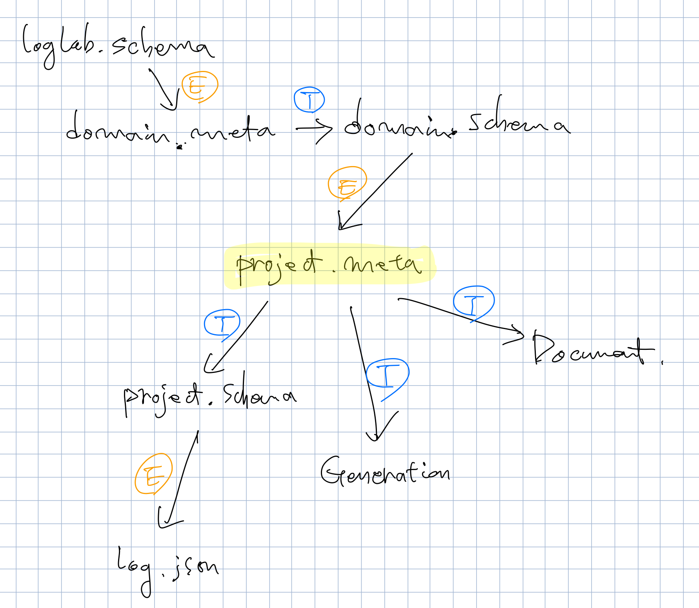

# loglab
Design &amp; Apply Log Schema.



LogLab은 로그를 쉽고 효율적으로 설계하고 활용할 수 있는 툴이다.

- LogLab은 **메타파일**로 불리는 파일에 로그의 구성을 기술한다.
- 메타파일은 확장자가 `.meta.json`이다.

## 빠르게 시작하기

`애크미`라는 가상의 게임회사에서, `foo`라고 하는 모바일 게임 프로젝트를 위한 로그를 설계하려고 한다고 하자. 아래와 같은 메타파일로 간단히 설계할 수 있다.

```json
{
    "info": {
        "name": "프로젝트 foo",
        "desc": "foo 모바일 게임 로그 형식."
    },
    "events": {
        "Login": {
            "desc": "로그인"
        },
        "Logout": {
            "desc": "로그아웃"
        }
    }
}
```
앞으로 json 요소의 설명은 `/info/name` 식의 경로 형태로 지정해서 하겠다:

- `/info` 로그 메타파일 정보
- `/info/name` 메타파일 이름
- `/info/desc` 메타파일 설명
- `/events` 이 아래 *이벤트 이름* + *정보 객체* 식으로 로그 이벤트를 선언한다.
- `/events/Login` 로그인 이벤트 이름
- `/events/Login/desc` 로그인 이벤트의 설명


위 내용을 `foo.meta.json` 파일로 저장하면, 다음처럼 이 메타파일에 기반한 **샘플 로그**를 생성할 수 있다.
```bash
$ loglab sample foo.meta.json

{
    "Logout": {
        "datetime": "20191109-11-13T20:17:39+00:00"
    }
}
{
    "Login": {
        "datetime": "20191109-11-13T20:17:40+00:00"
    }
}
{
    "Login": {
        "datetime": "20191109-11-13T20:17:41+00:00"
    }
}
{
    "Logout": {
        "datetime": "20191109-11-13T20:17:42+00:00"
    }
}
```
샘플 로그는 로그의 모습을 확인하기 위해 메타파일 기반으로 생성하는 가짜 로그이다. 4개의 임의 이벤트가 기본 형식인 `json`으로 출력되고 있다.

출력 형식은 `csv`나 `tsv`로도 가능한다.

```bash
$ loglab sample foo.meta.json --format csv

"20191109-11-13T20:17:39+00:00", "Logout"
"20191109-11-13T20:17:40+00:00", "Login"
"20191109-11-13T20:17:41+00:00", "Login"
"20191109-11-13T20:17:42+00:00", "Logout"
```

### 이벤트에 속성 추가하기

로그 이벤트별로 다양한 속성(property)를 추가할 수 있다. 메타파일을 아래처럼 수정해 서버번호 속성을 추가한다.

```json
{
    "info": {
        "name": "프로젝트 foo",
        "desc": "foo 모바일 게임 로그 형식."
    },
    "events": {
        "Login": {
            "desc": "로그인",
            "props": [
                ["ServerNo", "number", "서버 번호"]
            ]
        },
        "Logout": {
            "desc": "로그아웃",
            "props": [
                ["ServerNo", "number", "서버 번호"]
            ]
        }
    }
}
```
예제에서는 이벤트와 속성이름은 각 단어를 대문자로 시작하는 `PascalCase` 표기를 따르나, 원하는대로 자유롭게 선택할 수 있다.

- 가능한 속성의 타입은 `string`, `number`, `boolean`, `array`의 네 가지이다.
- `/events/Login/props` 이 아래 로그인 이벤트의 속성을 기술한다.
- 각 속성은 `[속성_이름, 속성_타입, 속성_설명]` 형태의 리스트로 선언한다.
- 샘플 로그에서 출력된 이벤트 일시와 이름도 사실 속성이며, 이것은 LogLab에 의해 기본으로 추가되었습니다.

샘플 로그를 출력해보면:
```bash
$ loglab sample foo.meta.json

{
    "Logout": {
        "datetime": "20191109-11-13T20:17:39+00:00",
        "ServerNo": 394801
    }
}
{
    "Login": {
        "datetime": "20191109-11-13T20:17:40+00:00",
        "ServerNo": -9849
    }
}
{
    "Login": {
        "datetime": "20191109-11-13T20:17:41+00:00",
        "ServerNo": 10390
    }
}
{
    "Logout": {
        "datetime": "20191109-11-13T20:17:42+00:00",
        "ServerNo": 791
    }
}
```

`ServerNo`가 추가된 것이 보이다. 샘플로그의 속성 값은 속성 정의에 따른 임의 값이 나오게 된다.

### 이벤트 속성 값의 범위 지정하기

서버의 번호 속성에 - 값이 나오고 있어 좀 이상한다. 속성 값의 범위를 지정하면 로그의 엄격한 검증이 가능하고, 샘플 생성도 자연스러워집니다. 위에서 사용한 **리스트형 속성 선언**은 간략해서 보기가 좋지만, 기술 내용에 한계가 있다. 범위 지정을 위해서는 **객체형 속성 선언**이 필요하다.

```json
{
    "info": {
        "name": "프로젝트 foo",
        "desc": "foo 모바일 게임 로그 형식."
    },
    "events": {
        "Login": {
            "desc": "로그인",
            "props": [
                {
                    "name": "ServerNo",
                    "desc": "서버 번호",
                    "type": "number",
                    "minimum": 1,
                    "exclusiveMaximum": 10
                }
            ]
        },
        "Logout": {
            "desc": "로그아웃",
            "props": [
                {
                    "name": "ServerNo",
                    "desc": "서버 번호",
                    "type": "number",
                    "minimum": 1,
                    "exclusiveMaximum": 10
                }
            ]
        }
    }
}
```

좀 더 복잡해졌지만, 이렇게 하면 서버 번호 속성을 1 이상, 10 이하로 제한할 수 있다. 다시 샘플을 출력해보면:

```bash
$ loglab sample foo.meta.json

{
    "Logout": {
        "datetime": "20191109-11-13T20:17:39+00:00",
        "ServerNo": 7
    }
}
{
    "Login": {
        "datetime": "20191109-11-13T20:17:40+00:00",
        "ServerNo": 3
    }
}
{
    "Login": {
        "datetime": "20191109-11-13T20:17:41+00:00",
        "ServerNo": 1
    }
}
{
    "Logout": {
        "datetime": "20191109-11-13T20:17:42+00:00",
        "ServerNo": 10
    }
}
```
범위가 잘 적용되었습니다.

### 중복되는 선언 공유하기

예제에서 `Login`과 `Logout` 는 이벤트 이름이 다를 뿐, 같은 `ServerNo` 속성을 공유하고 있다. 이것을 공유(리팩토링)하면 깔끔하고 유지보수에도 용이할 것이다. 다음과 같이 할 수 있다:

```json
{
    "info": {
        "name": "프로젝트 foo",
        "desc": "foo 모바일 게임 로그 형식."
    },
    "bases": {
        "Common": {
            "props": [
                {
                    "name": "ServerNo",
                    "desc": "서버 번호",
                    "type": "number",
                    "minimum": 1,
                    "exclusiveMaximum": 10
                }
            ]
        }
    },
    "events": {
        "Login": {
            "desc": "로그인",
            "mixins": ["bases.Common"]
        },
        "Logout": {
            "desc": "로그아웃",
            "mixins": ["bases.Common"]
        }
    }
}
```
공통 속성을 이용하니 훨씬 깔끔해진 것 같습니다.

이벤트는 아니지만, 다른 이벤트에 공유될 수 있는 객체를 **베이스**라고 하며, `/bases` 아래에 선언한다. 베이스와 이벤트의 차이점은 나중에 자세히 다루겠다.

- `/bases/Common` Common 객체를 선언한다.
- `/bases/Common/props` Common 객체를 통해 다른 이벤트나 베이스에 공유될 속성을 선언한다.

이것을 `mixin`을 통해 하나 이상의 베이스나 다른 이벤트에서 공유할 수 있다.

- `/events/Login/mixins` 공유할 베이스나 이벤트를 리스트로 기술한다.
- 참조할 객체는 `bases.Common`식으로 기입한다.

공통 속성을 공유한 후, 이벤트별로 다른 속성은 따로 추가할 수 있다.
```json
{
    "info": {
        "name": "프로젝트 foo",
        "desc": "foo 모바일 게임 로그 형식."
    },
    "bases": {
        "Common": {
            "props": [
                {
                    "name": "ServerNo",
                    "type": "number",
                    "minimum": 1,
                    "exclusiveMaximum": 10
                }
            ]
        }
    },
    "events": {
        "Login": {
            "desc": "로그인",
            "mixins": ["bases.Common"],
            "props": [
                {
                    "name": "Platform",
                    "desc": "플랫폼 구분 (ios 또는 aos)",
                    "type": "string",
                    "enum": ["ios", "aos"]
                }
            ]
        },
        "Logout": {
            "desc": "로그아웃",
            "mixins": ["bases.Common"],
            "props": [
                ["SessionTime", "number", "세션 시간"]
            ]
        }
    }
}```
로그인에는 *플랫폼 정보*를, 로그아웃에는 *세션 시간*을 각각 추가하였다. `foo`는 모바일 게임이기에, 특히 플랫폼 정보는 `enum`을 사용하여 `ios` 또는 `aos` 중 선택하도록 하였다.

샘플 로그를 출력해보면:
```bash
$ loglab sample foo.meta.json

{
    "Logout": {
        "datetime": "20191109-11-13T20:17:39+00:00",
        "ServerNo": 394801,
        "SessionTime": , -1029
    }
}
{
    "Login": {
        "datetime": "20191109-11-13T20:17:40+00:00",
        "ServerNo": -9849,
        "Platform": "aos"
    }
}
{
    "Login": {
        "datetime": "20191109-11-13T20:17:41+00:00",
        "ServerNo": 10390,
        "Platform": "ios"
    }
}
{
    "Logout": {
        "datetime": "20191109-11-13T20:17:42+00:00",
        "ServerNo": 791,
        "SessionTime": , 97309
    }
}
```
공통 속성 + 이벤트별 개별 속성이 나오는 것을 확인할 수 있다.

## 조직의 표준 로그 만들기

회사나 조직에서는 다양한 프로젝트를 만들 수 있다. 이 프로젝트들의 로그가 일관된 형식을 따르기를 원하면 상위 로그 메타파일을 만들고, 개별 로그의 메타파일이 그것을 참조하도록 하면 된다.

예제의 `애크미` 회사에서 새로운 PC 온라인 게임 `boo`를 준비 중이며, 이것과 앞의 `foo`가 로그 형식을 맞추는 경우를 생각해보자. 두 프로젝트에서 공통으로 참조할 조직의 메타파일을 만들고, 앞의 `foo` 예제와, 새로운 `boo`가 그것을 이용하도록 해보자.

기본적으로 `foo`의 내용을 그대로 사용하게 된다. 다음의 내용으로 `acme.meta.json`로 저장한다:
```json
{
    "info": {
        "name": "애크미 주식회사",
        "desc": "애크미의 표준 로그 구조."""
    },
    "bases": {
        "Common": {
            "props": [
                {
                    "name": "ServerNo",
                    "type": "number",
                    "minimum": 1,
                    "exclusiveMaximum": 10
                }
            ]
        }
    },
    "events": {
        "Login": {
            "desc": "로그인",
            "mixins": ["bases.Common"],
            "props": [
                {
                    "name": "Platform",
                    "desc": "플랫폼 구분",
                    "type": "string",
                }
            ]
        },
        "Logout": {
            "desc": "로그아웃",
            "mixins": ["bases.Common"],
            "props": [
                ["SessionTime", "number", "세션 시간"]
            ]
        }
    }
}
```

기존의 `foo` 메타파일과 거의 같지만, `Platform` 속성이 변경되었다. 조직의 로그 메타파일은 모바일 게임만을 위한 것이 아니기에, `enum`을 사용하지 않고 단순 `string`으로만 타입을 지정하였다.

이것을 이용하도록 기존 `foo` 프로젝트의 예를 다음과 같이 바꾼다.

```json
{
    "info": {
        "name": "프로젝트 foo",
        "desc": "foo 모바일 게임 로그 형식."
    },
    "metas": [
        ["acme.meta.json", "acme"]
    ],
    "events": {
        "Login": {
            "desc": "로그인",
            "mixins": ["acme.events.Login"],
            "props": [
                {
                    "name": "Platform",
                    "desc": "플랫폼 구분 (ios 또는 aos)",
                    "type": "string",
                    "enum": ["ios", "aos"]
                }
            ]
        }
    }
}
```

- `metas` 요소를 사용해 참조할 상위 메타파일의 리스트를 선언한다.
  - 리스트의 항목은 `[참조할_메타파일_URL, "참조_이름"]`의 형식이다.
  - 예제에서 로컬의 `acme.meta.json`파일을 `acme`라는 이름으로 참조하게 된다.
- `foo` 로그인의 `Platform` 속성은 `ios` 나 `aos`로 제한하고 싶기에, 회사의 로그인 이벤트를 mixin 하되, `Platform` 속성은 `enum`으로 다시 정의한다.

비슷한 식으로 `boo` 프로젝트는 다음처럼 기술할 수 있을 것이다:
```json
{
    "info": {
        "name": "프로젝트 boo",
        "desc": "boo 온라인 게임 로그 형식."
    },
    "metas": [
        ["acme.meta.json", "acme"]
    ],
    "events": {
        "Login": {
            "desc": "로그인",
            "mixins": ["acme.events.Login"],
            "props": [
                {
                    "name": "Platform",
                    "desc": "플랫폼 구분 (ios 또는 aos)",
                    "type": "string",
                    "enum": ["pc", "mac", "linux"]
                }
            ]
        }
    }
}
```
온라인 게임에 맞게 `Platform`의 `enum`을 새로 정의하였다.
