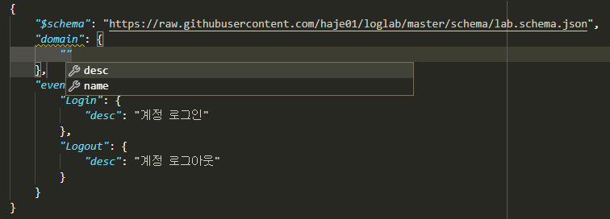

# LogLab


- [LogLab](#loglab)
  - [소개](#소개)
    - [기능](#기능)
    - [로그의 형식](#로그의-형식)
    - [가능한 질문](#가능한-질문)
    - [대상 사용자](#대상-사용자)
  - [설치](#설치)
  - [최초 랩 파일 만들기](#최초-랩-파일-만들기)
    - [스키마와 도메인 정보 지정하기](#스키마와-도메인-정보-지정하기)
  - [필드의 추가](#필드의-추가)
  - [새로운 이벤트의 추가](#새로운-이벤트의-추가)
  - [믹스인을 활용한 리팩토링](#믹스인을-활용한-리팩토링)
  - [게임관련 이벤트와 필드의 추가](#게임관련-이벤트와-필드의-추가)
    - [서버 번호 필드](#서버-번호-필드)
    - [믹스인의 처리 순서](#믹스인의-처리-순서)
    - [베이스간 믹스인](#베이스간-믹스인)
    - [옵션 필드](#옵션-필드)
    - [캐릭터 관련 이벤트](#캐릭터-관련-이벤트)
    - [몬스터와 아이템](#몬스터와-아이템)
  - [필드값의 제약](#필드값의-제약)
    - [서버 번호에 제약 걸기](#서버-번호에-제약-걸기)
    - [커스텀 타입 활용](#커스텀-타입-활용)
    - [나열 이용하기](#나열-이용하기)
  - [로그 파일의 검증](#로그-파일의-검증)
  - [공용 랩 파일을 통한 로그 표준화](#공용-랩-파일을-통한-로그-표준화)
  - [공용 랩 파일 만들기](#공용-랩-파일-만들기)
    - [공용 랩 파일 가져오기](#공용-랩-파일-가져오기)
  - [기타 기능과 팁](#기타-기능과-팁)
    - [복잡한 랩 파일 필터링하기](#복잡한-랩-파일-필터링하기)
    - [HTML 문서 출력](#html-문서-출력)
    - [로그 객체 출력](#로그-객체-출력)
      - [필드별 타입 지정](#필드별-타입-지정)
    - [현지화 (Localization)](#현지화-localization)
    - [실행 파일 이용과 빌드](#실행-파일-이용과-빌드)
  - [로그랩 활용 방안](#로그랩-활용-방안)
    - [로그 구현, 수집, 모니터링](#로그-구현-수집-모니터링)
    - [로그 변경 이력의 체계화](#로그-변경-이력의-체계화)
    - [디버그 로그는 어디에?](#디버그-로그는-어디에)
    - [MMORPG 위한 예제](#mmorpg-위한-예제)

## 소개

LogLab(로그랩) 은 로그를 효율적으로 설계하고 활용하기 위한 툴이다.


### 기능

로그랩은 다음과 같은 기능을 가지고 있다.

- 로그를 객체지향적이며 재활용 가능한 형태로 설계
- 설계된 로그에 관한 문서 자동 생성
- 실제 출력된 로그가 설계에 맞게 작성되었는지 검증

### 로그의 형식

로그랩은 [JSON Lines](https://jsonlines.org/) 형식으로 파일에 남기는 로그를 대상으로 한다. JSON Lines 는 아래 예처럼 한 라인 한 라인이 유효한 JSON 객체가 되어야 한다.

```js
{"DateTime": "2021-08-13T20:20:39+09:00", "Event": "Login", "ServerNo": 1, "AcntId": 1000}
{"DateTime": "2021-08-13T20:21:01+09:00", "Event": "Logout", "ServerNo": 1, "AcntId": 1000}
```

### 가능한 질문

다음과 같은 몇 가지 의문을 제기할 수 있겠다.

**왜 자유로운 형식의 텍스트 로그가 아닌가?**

완전 비정형 텍스트 로그는 작성하는 측에서는 편하지만, 파싱 및 관리가 힘들기에 원하는 정보를 추출하는데 한계가 있다.

**왜 CSV 가 아닌가?**

CSV 는 서비스 중 필드의 수나 위치가 변할 때 대응하기 까다로우며, 필드 값에 개행 문자나 구분자가 포함되면 파싱에 상당한 어려움을 겪게 된다. JSON 은 `키:값` 의 형식으로 언뜻 장황 (Verbose) 해 보이지만, 알아보기 쉽고 로그 구조 변경이 용이한 장점이 있다. 또한, 키는 반복적으로 나타나기에 압축하면 상당히 용량이 줄어든다.

**왜 DB에 남기지 않는가?**

DB에 남기는 로그는 잘 구조화되어 정보 활용 측면에서 뛰어나지만 다음과 같은 문제점이 있다.
  - 로그 구조의 변경이 까다롭다.
  - 시스템이 불안정할 때는 파일 로그보다 안정성이 떨어진다.
  - 파일 로그는 별도의 장비없이 손쉽게 남길 수 있고, 관리 부담이 적다.

**왜 로그를 설계해야 하는가?**

DB 와 달리 로그는 설계없이 그때그때 자유롭게 남기는 것이 미덕일 수 있겠으나, 로그 종류가 늘어나고 로그에 담긴 정보가 분석의 대상이 되는 시점부터 체계화된 로그가 필요하게 된다.
### 대상 사용자

로그랩은 다음과 같은 입장의 사용자에게 도움이 될 수 있다.

- 서비스를 위한 로그 설계가 필요한 개발자
- 로그를 처리하고 분석하는 데이터 엔지니어/분석가
- 조직에서 생성되는 로그의 형식을 일관되게 유지/공유 하고 싶은 관리자

> 로그랩은 윈도우, Linux, MacOS 에서 사용할 수 있다. 이후 설명은 Linux 를 중심으로 하겠으나, 다른 OS 에서도 큰 차이없이 동작할 것이다.

## 설치

LogLab의 설치를 위해서는 최소 Python 3.7 이상이 필요하다. 파이썬이 설치되어 있지 않다면 [이곳](https://www.python.org/) 에서 최신 버전의 파이썬을 설치하도록 하자.

LogLab 의 홈페이지는 https://github.com/haje01/loglab 이다. 다음과 같이 설치하자.

```
$ git clone https://github.com/haje01/loglab
$ uv pip install -e .
```

설치가 잘 되었다면 로그랩의 커맨드라인 툴인 `loglab` 을 이용할 수 있다. 다음과 같이 입력해보자.

```
$ loglab
Usage: loglab [OPTIONS] COMMAND [ARGS]...

Options:
  --help  Show this message and exit.

Commands:
  html     HTML 문서 출력.
  object   로그 객체 코드 출력.
  schema   로그 검증용 스키마 생성.
  show     로그 구성 요소 출력.
  verify   생성된 로그 파일 검증.
  version  로그랩 버전 표시.
```

위에서 알 수 있듯 `loglab` 에는 다양한 명령어가 있는데 예제를 통해 하나씩 살펴보도록 하겠다. 먼저 간단히 버전을 확인해보자.

```
$ loglab version
0.2.0
```

## 최초 랩 파일 만들기

지금부터는 가상의 모바일 게임 `foo` 를 위한 로그를 설계하는 예제를 통해 로그랩의 활용법을 하나씩 살펴보겠다.

로그랩은 **랩(lab) 파일** 로 불리는 JSON 파일에 로그 명세를 기술하는 것으로 로그를 설계한다. 랩 파일은 로그랩에서 제공하는 JSON 스키마 형식에 맞추어 작성하며, 확장자는 `.lab.json` 을 사용한다. [VS Code](https://code.visualstudio.com/) 등 JSON 스키마를 지원하는 에디터를 이용하면 인텔리센스 (IntelliSense) 기능이 지원되어 편집에 용이할 것이다.

먼저 빈 작업 디렉토리를 하나를 만들고, 에디터를 사용해 아래와 같은 내용으로 `foo.lab.json` 파일을 만들자.

```js
{
  "domain": {
    "name": "foo",
    "desc": "최고의 모바일 게임"
  },
  "events": {
    "Login": {
      "desc": "계정 로그인"
    }
  }
}
```

처음으로 나오는 `domain` 최상단 요소는 랩 파일의 **도메인 (domain) 정보** 를 기술하는데 사용한다. 도메인 요소는 랩 파일이 어떤 서비스를 위한 것인가에 대한 정보를 담는데, 모든 랩 파일에 꼭 있어야 하는 필수 요소이다.

위 예처럼 `domain` 요소 아래 도메인 이름 `name` 및 설명 `desc` 요소를 입력하면 되는데, 도메인 이름은 나중에 해당 랩 파일을 식별하는 용도로 사용되기에, 알파벳 소문자와 숫자, 그리고 밑줄 문자 `_` 만을 사용해 **식별 가능한 범위에서 간략하게 기술**한다.

> 관용적으로 랩 파일의 이름과 도메인 이름을 같게 하는 것을 추천한다.

로그랩에서는 로깅의 대상이 되는 각 사건을 **이벤트 (event)** 라고 하는데, `events` 최상단 요소에 하나 이상의 이벤트를 기술할 수 있다. 예제에서는 계정 로그인 이벤트를 위한 `Login` 을 만들었다. 그 아래의 `desc` 요소는 이벤트에 대한 설명을 위한 것이다. 이것은 필수 요소는 아니지만 문서화를 위해서는 꼭 필요하다.

각 이벤트에는 관련된 하나 이상의 **필드 (field)** 를 기술할 수 있는데, 예에서는 아직 필드 정보는 없다.

이제 작업 디텍토리에서 `loglab` 의 `show` 명령을 사용할텐데, 먼저 `--help` 옵션을 통해 도움말을 살펴보자.

```
$ loglab show --help
Usage: loglab show [OPTIONS] LABFILE

  로그 구성 요소 출력.

Options:
  -c, --custom-type  커스텀 타입 그대로 출력
  -n, --name TEXT    출력할 요소 이름 패턴
  -k, --keep-text    긴 문자열 그대로 출력
  -l, --lang TEXT    로그랩 메시지 언어
  --help             Show this message and exit.
```

`show` 는 첫 인자로 랩 파일 `LABFILE` 을 필요로 하는 것을 알 수 있다. 아래와 같이 실행한다.

```
$ loglab show foo.lab.json

Domain : foo
Description : 최고의 모바일 게임

Event : Login
Description : 계정 로그인
+----------+----------+---------------+
| Field    | Type     | Description   |
|----------+----------+---------------|
| DateTime | datetime | 이벤트 일시   |
+----------+----------+---------------+
```

`show` 명령은 랩 파일을 참고해 로그의 구성 요소들을 텍스트로 출력한다. 랩 파일에 기술된 도메인 정보, 이벤트 이름과 설명, 그리고 테이블 형식의 필드 정보가 출력되는 것을 확인할 수 있다.

아직 `Login` 이벤트에는 아무런 필드를 명시하지 않았음에도 `DateTime` 이라는 필드가 보인다. 이것은 모든 로그에 이벤트의 발생 일시는 꼭 필요하기에 **로그랩에서 자동으로 생성** 해준 것이다.

> 앞의 `Login` 과 `DateTime` 에서 알 수 있듯, 로그랩의 이벤트 및 필드 이름은 대문자로 시작 후 다음 합성어의 시작을 대문자로 (Pascal Case) 하고, 타입 이름은 소문자로 시작 후 다음 합성어의 시작을 대문자로 (Camel Case) 하는 것을 권장한다.

### 스키마와 도메인 정보 지정하기

복잡한 구조의 JSON 파일을 편집하다보면 어떤 내용이 기술될 수 있는지 기억하기 어렵고 틀리기 쉽다. 이런 경우 해당 형식의 [JSON 스키마](https://json-schema.org) 가 있다면 편리하다. 로그랩에서는 랩 파일을 위한 JSON 스키마를 제공한다. `foo.lab.json` 파일에 다음처럼 `$schema` 요소를 추가해 보자.

```js
{
  "$schema": "https://raw.githubusercontent.com/haje01/loglab/master/schema/lab.schema.json",
  "domain": {
    "name": "foo",
    "desc": "최고의 모바일 게임"
  },
  "events": {
    "Login": {
      "desc": "계정 로그인"
    }
  }
}
```

사용하는 에디터가 VS Code 처럼 JSON 스키마를 지원한다면, 이제 아래와 같은 가이드를 볼 수 있을 것이다.



또한, 문맥에 맞지 않는 요소나 틀린 철자 등도 찾아주기에 편리하다.
## 필드의 추가

> 지금부터는 공간을 아끼기 위해 표준 출력 및 JSON 파일의 맥락상 동일한 부분은 `...` 표시 후 생략하도록 하겠다.

필드는 이벤트에 관한 상세 정보를 표현한다. 기본으로 생성된 `DateTime` 외 필드를 추가해보자.

필드는 이벤트 요소 아래 `fields` 리스트에 기술하는데, 각 필드는 3 개 항목을 가지는 리스트로 표현한다. 아래와 같은 형식이다.

```js
{
  // ...

    "fields": [
      [필드_이름, 필드_타입, 필드_설명]
    ]

  // ...
}
```

로그랩에서 사용할 수 있는 필드의 기본 타입은 다음과 같다.

- `string` : 문자열
- `integer`: 정수
- `number` : 실수 (`float` 과 일치)
- `boolean` : 불린 (`true` 또는 `false`)
- `datetime` : 일시(날짜+시간). [RFC3339](https://json-schema.org/latest/json-schema-validation.html#RFC3339) 를 따른다.

> RFC3399 일시의 예로 `2021-09-12T23:41:50.52Z` 은 UTC 기준 2021년 9월 12일 23시 41분 50.52 초이며, `2021-09-14T16:39:57+09:00` 은 한국 표준시 (KST) 로 2021년 9월 14일 16시 39분 57초 이다.

예제의 `Login` 이벤트의 경우 로그인한 계정 ID 정보가 필요할 것이다. 아래와 같이 `AcntId` 필드를 추가한다.

```js
{
  // ...

  "events": {
    "Login": {
      "desc": "계정 로그인",
      "fields": [
          ["AcntId", "integer", "계정 ID"]
      ]
    }
}
```

> 이 글에서 필드 이름의 접미사 **아이디 (Id)** 가 붙은 것은 임의의 값으로 특정 개체를 가리키는 용도로, **코드 (Cd)** 는 미리 정해진 값으로 특정 범주값을 가리키는데 사용하겠다.

이제 `show` 명령을 내려보면,

```
$ loglab show foo.lab.json
# ...

Event : Login
Description : 계정 로그인
+----------+----------+---------------+
| Field    | Type     | Description   |
|----------+----------+---------------|
| DateTime | datetime | 이벤트 일시   |
| AcntId   | integer  | 계정 ID       |
+----------+----------+---------------+
```

`AcntId` 필드가 추가된 것을 확인할 수 있다.

> `DateTime` 과 `Event` 는 로그랩이 직접 사용하는 필드이기에, 사용자는 이 이름을 피해서 자신의 필드를 만들도록 하자.

## 새로운 이벤트의 추가

계정의 로그인 이벤트가 있다면, 로그아웃도 있어야 하지 않을까? 다음과 같이 추가해보자.

```js
{
  // ...

  "events": {
    "Login": {
      "desc": "계정 로그인",
      "fields": [
        ["AcntId", "integer", "계정 ID"]
      ]
    },
    "Logout": {
      "desc": "계정 로그아웃",
      "fields": [
        ["AcntId", "integer", "계정 ID"]
      ]
    }
  }
}
```

`show` 명령을 내려보면,

```
$ loglab show foo.lab.json
# ...

Event : Login
Description : 계정 로그인
+----------+----------+---------------+
| Field    | Type     | Description   |
|----------+----------+---------------|
| DateTime | datetime | 이벤트 일시   |
| AcntId   | integer  | 계정 ID       |
+----------+----------+---------------+

Event : Logout
Description : 계정 로그아웃
+----------+----------+---------------+
| Field    | Type     | Description   |
|----------+----------+---------------|
| DateTime | datetime | 이벤트 일시   |
| AcntId   | integer  | 계정 ID       |
+----------+----------+---------------+
```

`Logout` 이 잘 추가된 것을 알 수 있다.

그런데 로그인, 로그아웃 이벤트 모두 `AcntId` 필드을 가지고 있다. 앞으로 계정에 관한 다른 이벤트를 만든다면 거기에도 모두 이 필드를 만들어 주어야 할 것이다. 반복적인 작업을 방지할 수 없을까?

## 믹스인을 활용한 리팩토링

**믹스인 (mixin)** 은 다른 요소의 필드를 가져다 쓰는 방법이다. 믹스인을 활용하면 다양한 이벤트에서 공통적으로 필요한 필드를 공유할 수 있다.

믹스인을 효율적으로 하기 위해서는 공통 필드를 추출하여 **베이스 (base)** 로 만드는 것을 권장한다. 베이스는 이벤트와 비슷하나, 그 자체로 로그에 직접 출력되지는 않고, 이벤트나 다른 베이스에서 참조되기 위한 용도이다. 베이스는 랩 파일의 `bases` 최상단 요소에 다음과 같은 형식으로 정의한다.

```js
{
  // ...

  "bases": {
    "Account": {
      "desc": "계정 정보",
      "fields": [
        ["AcntId", "integer", "계정 ID"]
      ]
    }
  },
  "events": {
    "Login": {
      "desc": "계정 로그인",
      "mixins": ["bases.Account"]
    },
    "Logout": {
      "desc": "계정 로그아웃",
      "mixins": ["bases.Account"]
    }
  }
}
```

위 예에서 `bases` 아래 `Account` 라는 베이스를 만들었다. 여기에 계정 관련 공용 필드를 기술하면 되는데, 아직은 `AcntId` 필드만 있다. 기존 `Login`, `Logout` 이벤트의 `fields` 요소는 제거하고, 대신 `mixin` 리스트를 만든 후 `bases.Account` 를 기입한다. 이처럼 믹스인할 베이스 요소는 `bases.베이스_이름` 식의 경로로 지정한다.

> 이벤트는 베이스 뿐만 아니라 다른 이벤트도 믹스인할 수 있다. 이 경우 `events.이벤트_이름` 형식으로 경로를 지정하면 된다. 그러나, 베이스는 이벤트를 믹스인할 수 없다.

이제 각 이벤트는 `Account` 베이스에 등록된 필드를 모두 가져다 쓰게 된다. `show` 명령으로 확인하면,

```
$ loglab show foo.lab.json
# ...

Event : Login
Description : 계정 로그인
+----------+----------+---------------+
| Field    | Type     | Description   |
|----------+----------+---------------|
| DateTime | datetime | 이벤트 일시   |
| AcntId   | integer  | 계정 ID       |
+----------+----------+---------------+

Event : Logout
Description : 계정 로그아웃
+----------+----------+---------------+
| Field    | Type     | Description   |
|----------+----------+---------------|
| DateTime | datetime | 이벤트 일시   |
| AcntId   | integer  | 계정 ID       |
+----------+----------+---------------+
```

두 이벤트에 `fields` 항목이 없지만 `Account` 베이스의 필드를 가져와 앞에서와 같은 결과가 나오는 것을 알 수 있다. 이런 식으로 서로 다른 요소에서 공통 요소를 추출해 공유하는 것을 **리팩토링 (refactoring)** 이라고 한다.

> **리팩토링의 필요성**
>
> 예를 들어 계정에 관한 필드를 갖는 로그 이벤트가 30 개 있다고 하자. 어느날 계정 정보에 필드 하나가 추가되어야 한다는 요청이 들어오면, 리팩토링이 되지 않은 경우 30 개나 되는 이벤트를 일일이 찾아 수정해야 할 것이다. 미리 계정 관련 베이스를 만들어 리팩토링 해두었다면, 단 한 번의 수정으로 모든 이벤트에 추가 필드를 적용할 수 있을 것이다.

참고로, 위에서 알 수 있듯 `show` 명령의 결과에 베이스는 출력되지 않는다. 베이스는 참조되어 사용되어질 뿐, 그 자체로 이벤트는 아니기 때문이다.

## 게임관련 이벤트와 필드의 추가

이제 기본적인 랩 파일 작성 방법을 알게 되었다. 지금까지 배운 것을 활용하여 실제 게임에서 발생할 수 있는 다양한 이벤트와 필드를 추가해보자.

### 서버 번호 필드

게임 서비스내 대부분 이벤트는 특정 서버에서 발생하기 마련이다. 몇 번 서버의 이벤트인지 표시하기 위해 다음처럼 `Server` 베이스를 추가한다.

```js
{
  // ...

  "bases": {

    // ...

    "Server": {
      "desc": "서버 정보",
      "fields": [
        ["ServerNo", "integer", "서버 번호"]
      ]
    }
  },

  // ...
}
```

`Login`, `Logout` 이벤트도 당연히 특정 서버에 관한 것이기에, 다음과 같이 믹스인에 추가한다.

```js
{
  // ...

  "events": {
    "Login": {
      "desc": "계정 로그인",
      "mixins": ["bases.Account", "bases.Server"]
    },
    "Logout": {
      "desc": "계정 로그아웃",
      "mixins": ["bases.Account", "bases.Server"]
    }
  }
}
```

`show` 명령으로 두 이벤트에 `ServerNo` 필드가 추가된 것을 확인할 수 있다.

```
$ loglab show foo.lab.json
# ...

Event : Login
Description : 계정 로그인
+----------+----------+---------------+
| Field    | Type     | Description   |
|----------+----------+---------------|
| DateTime | datetime | 이벤트 일시   |
| AcntId   | integer  | 계정 ID       |
| ServerNo | integer  | 서버 번호     |
+----------+----------+---------------+

Event : Logout
Description : 계정 로그아웃
+----------+----------+---------------+
| Field    | Type     | Description   |
|----------+----------+---------------|
| DateTime | datetime | 이벤트 일시   |
| AcntId   | integer  | 계정 ID       |
| ServerNo | integer  | 서버 번호     |
+----------+----------+---------------+
```

### 믹스인의 처리 순서

 믹스인은 `mixin` 리스트에 등장하는 순서대로 수행되며, 앞 항목과 뒤 항목에 일치하는 필드가 있다면 뒤의 것으로 덮어쓰게 된다. 이것을 이용하면 특정 필드의 출력 순서를 조정하거나 필드를 재정의 할 수 있다. 예를 들어 위 예에서 `ServerNo` 필드가 `AcntId` 보다 먼저 나오게 하고 싶다면 `mixin` 리스트의 항목 순서를 다음과 같이 바꿔주면 된다.

 ```js
 {
    // ...

    "Login": {
      "desc": "계정 로그인",
      "mixins": ["bases.Server", "bases.Account"]
    },

    // ...
 ```

 `show` 결과는 다음과 같다.

```
$ loglab show foo.lab.json
# ...

Event : Login
Description : 계정 로그인
+----------+----------+---------------+
| Field    | Type     | Description   |
|----------+----------+---------------|
| DateTime | datetime | 이벤트 일시   |
| ServerNo | integer  | 서버 번호     |
| AcntId   | integer  | 계정 ID       |
+----------+----------+---------------+

# ...
```

### 베이스간 믹스인

베이스는 다른 베이스를 믹스인할 수 있다. 예제에서 계정에 관한 이벤트가 항상 서버 단위로 일어난다면, 아래와 같이`Account` 베이스에 `Server` 베이스를 믹스인할 수 있다.

```js
{
  // ...

  "bases": {
    "Server": {
      "desc": "서버 이벤트",
      "fields": [
        ["ServerNo", "integer", "서버 번호"]
      ]
    },
    "Account": {
      "desc": "계정 이벤트",
      "mixins": ["bases.Server"],
      "fields": [
        ["AcntId", "integer", "계정 ID"]
      ]
    }
  },
  "events": {
    "Login": {
      "desc": "계정 로그인",
      "mixins": ["bases.Account"]
    },
    "Logout": {
      "desc": "계정 로그아웃",
      "mixins": ["bases.Account"]
    }
  }
}
```

이제 `Account` 베이스 자체가 `Server` 를 믹스인하기에, `Login`, `Logout` 이벤트는 `Account` 베이스만 믹스인하면 된다.

> `bases` 나 `events` 내 요소들의 기술 순서는 중요하지 않다. 위의 경우 `Account` 가 `Server` 앞에 오더라도 문제가 없다.

### 옵션 필드

지금까지 등장한 모든 필드들은 기본적으로 로그 이벤트에 반드시 나와야 하는 **필수 (required)** 필드들이었다. 만약 나올 수도 있고 안 나와도 괜찮은 필드가 있다면, **옵션 (option)** 으로 만들 수 있다. 그것은 필드 리스트의 4번째 항목에 `true` 또는 `false` 를 지정하여 만들 수 있다 (`false` 인 경우 기본값이기에 굳이 기술할 필요가 없겠다).

예를 들어 `Logout` 이벤트에서, 로그인 이후 플레이한 시간을 선택적으로 포함하게 하려면 다음과 같이 할 수 있다.

```js
{
    // ...

  "events": {

    // ...

    "Logout": {
      "desc": "계정 로그아웃",
      "mixins": ["bases.Account"],
      "fields": [
        ["PlayTime", "number", "플레이 시간 (초)", true]
      ]
    },

    // ...
}
```

`show` 명령으로 보면 아래와 같다.

```
$ loglab show foo.lab.json
# ...

Event : Logout
Description : 계정 로그아웃
+----------+----------+------------------+------------+
| Field    | Type     | Description      | Optional   |
|----------+----------+------------------+------------|
| DateTime | datetime | 이벤트 일시      |            |
| ServerNo | integer  | 서버 번호        |            |
| AcntId   | integer  | 계정 ID          |            |
| PlayTime | number   | 플레이 시간 (초) | true       |
+----------+----------+------------------+------------+

# ...
```

지금까지 없던 `Optional` 컬럼이 보이고 `PlayTime` 필드만이 `true`로 표시된다. 또한 여기에서 `mixin` 과 `fields` 를 다 사용하고 있는데, 이런 식으로 `mixin` 만으로 부족할 때 `fields` 를 통해 필드를 추가할 수 있다. 만약 이 과정에서 중복 필드가 있나면 나중에 나오는 것이 남게 된다.

### 캐릭터 관련 이벤트

보통 온라인 게임에서 실제 플레이를 하는 것은 계정이 아니라 계정에 속한 캐릭터이다. 이에 캐릭터 관련 이벤트를 추가해보겠다 (일반적으로 한 계정은 하나 이상의 캐릭터를 소유하고 선택하여 플레이한다). 다음과 같이 `Character` 베이스를 추가한다.

```js
{
  // ...

  "bases": {

    // ...

    "Character": {
      "desc": "캐릭터 정보",
      "mixins": ["bases.Account"],
      "fields": [
        ["CharId", "integer", "캐릭터 ID"]
      ]
    }
  },

  // ...
}
```

캐릭터는 자신이 속한 계정의 정보를 필요로 하기에 `Account` 를 믹스인하였다. 이제 `Character` 베이스를 이용해, 캐릭터의 로그인/아웃 이벤트를 추가하겠다.

```js
{
  // ...

  "events": {

    // ...

    "CharLogin": {
      "desc": "캐릭터 로그인",
      "mixins": ["bases.Character"]
    },
    "CharLogout": {
      "desc": "캐릭터 로그아웃",
      "mixins": ["bases.Character", "events.Logout"]
    }
  }
}
```

`CharLogin` 은 캐릭터 베이스만을 사용해서 구현하였으나, `CharLogout` 은 캐릭터 베이스에 더해 계정 로그아웃 이벤트인 `Logout` 을 믹스인 해보았다. 이렇게 하면 중복되는 계정 정보 필드외 `PlayTime` 필드가 추가되게 된다.

`show` 명령으로 확인하면 `CharLogin` 과 `CharLogout` 이벤트를 확인할 수 있다.

```
$ loglab show foo.lab.json
# ...

Event : CharLogin
Description : 캐릭터 로그인
+----------+----------+---------------+
| Field    | Type     | Description   |
|----------+----------+---------------|
| DateTime | datetime | 이벤트 일시   |
| ServerNo | integer  | 서버 번호     |
| AcntId   | integer  | 계정 ID       |
| CharId   | integer  | 캐릭터 ID     |
+----------+----------+---------------+

Event : CharLogout
Description : 캐릭터 로그아웃
+----------+----------+------------------+------------+
| Field    | Type     | Description      | Optional   |
|----------+----------+------------------+------------|
| DateTime | datetime | 이벤트 일시      |            |
| ServerNo | integer  | 서버 번호        |            |
| AcntId   | integer  | 계정 ID          |            |
| CharId   | integer  | 캐릭터 ID        |            |
| PlayTime | number   | 플레이 시간 (초) | True       |
+----------+----------+------------------+------------+
```

이렇게 이벤트는 필요에 따라 다른 이벤트를 믹스인하여 사용할 수 있다.

### 몬스터와 아이템

좀 더 실제 게임과 가깝게 하기 위해 몬스터와 아이템 관련 이벤트도 만들겠다. 우선, 다음과 같은 베이스를 추가한다.

```js
{
  // ...

  "bases": {

    // ...

    "Position": {
      "desc": "맵상의 위치 정보",
      "fields": [
        ["MapCd", "integer", "맵 코드"],
        ["PosX", "number", "맵상 X 위치"],
        ["PosY", "number", "맵상 Y 위치"],
        ["PosZ", "number", "맵상 Z 위치"]
      ]
    },
    "Monster": {
      "desc": "몬스터 정보",
      "mixins": ["bases.Server"],
      "fields": [
        ["MonsterCd", "integer", "몬스터 타입 코드"],
        ["MonsterId", "integer", "몬스터 개체 ID"]
      ]
    }

    // ...
}
```

`Position` 베이스는 이벤트가 맵상의 특정 위치에서 발생하는 경우를 위한 것이다. 몬스터를 잡거나, 아이템을 습득하는 등 게임내 많은 이벤트가 맵상의 위치에서 일어나기에 필요하다. `Monster` 베이스는 다양한 몬스터 이벤트를 위한 것이다. 몬스터도 서버 내에서만 존재할 수 있기에 `bases.Server` 를 믹스인하였다.

이 베이스들을 이용해 캐릭터가 몬스터를 잡은 경우의 이벤트 `KillMonster` 를 추가한다.

```js
{
  // ...

  "events": {

    // ...

    "KillMonster": {
      "desc": "몬스터를 잡음",
      "mixins": ["bases.Character", "bases.Position", "bases.Monster"]
    }
}
```

> `Character` 및 `Monster` 베이스 둘 다 `Server` 베이스를 가지고 있으나, 둘을 함께 믹스인하여도 같은 필드는 덮어 써지기에 문제는 없다.

아래는 `show` 의 결과이다.
```
$ loglab show foo.lab.json
# ...

Event : KillMonster
Description : 몬스터를 잡음
+-----------+----------+------------------+
| Field     | Type     | Description      |
|-----------+----------+------------------|
| DateTime  | datetime | 이벤트 일시      |
| ServerNo  | integer  | 서버 번호        |
| AcntId    | integer  | 계정 ID          |
| CharId    | integer  | 캐릭터 ID        |
| MapCd     | integer  | 맵 코드          |
| PosX      | number   | 맵상 X 위치      |
| PosY      | number   | 맵상 Y 위치      |
| PosZ      | number   | 맵상 Z 위치      |
| MonsterCd | integer  | 몬스터 타입 코드 |
| MonsterId | integer  | 몬스터 개체 ID   |
+-----------+----------+------------------+

# ...
```

믹스인한 베이스의 정보, 즉 계정 및 캐릭터, 지도상의 위치, 몬스터 개체에 관한 정보들이 잘 결합된 것을 확인할 수 있다. 이런 식으로 베이스를 만들고 그것을 믹스인하는 것 만으로, 다양한 로그 이벤트를 쉽게 만들 수 있다.

이제 아이템 관련 베이스를 추가해보자.

```js
{
  // ...

  "bases": {

    // ...

    "Item": {
      "desc": "아이템 정보",
      "fields": [
        ["ItemCd", "integer", "아이템 타입 코드"],
        ["ItemId", "integer", "아이템 개체 ID"]
      ]
    }

    // ...
}
```

이것을 이용해 몬스터가 아이템을 떨어뜨리는 이벤트를 만든다.

```js
{
  // ...

  "events": {

    // ...

    "MonsterDropItem": {
      "desc": "몬스터가 아이템을 떨어뜨림",
      "mixins": ["bases.Monster", "bases.Position", "bases.Item"]
    }
}
```

몬스터가 주체이기에 지금까지와는 달리 계정이나 캐릭터 베이스가 믹스인되지 않았다. `show` 의 결과는 다음과 같다.

```
$ loglab show foo.lab.json
# ...

Event : MonsterDropItem
Description : 몬스터가 아이템을 떨어뜨림
+-----------+----------+------------------+
| Field     | Type     | Description      |
|-----------+----------+------------------|
| DateTime  | datetime | 이벤트 일시      |
| ServerNo  | integer  | 서버 번호        |
| MonsterCd | integer  | 몬스터 타입 코드 |
| MonsterId | integer  | 몬스터 개체 ID   |
| MapCd     | integer  | 맵 코드          |
| PosX      | number   | 맵상 X 위치      |
| PosY      | number   | 맵상 Y 위치      |
| PosZ      | number   | 맵상 Z 위치      |
| ItemCd    | integer  | 아이템 타입 코드 |
| ItemId    | integer  | 아이템 개체 ID   |
+-----------+----------+------------------+
```

비슷하게 캐릭터의 아이템 습득 이벤트도 간단히 만들 수 있다.

```js
{
  // ...

  "events": {

    // ...

    "GetItem": {
      "desc": "캐릭터의 아이템 습득",
      "mixins": ["bases.Character", "bases.Position", "bases.Item"]
    }
}
```

`show` 의 결과는 아래와 같다.

```
$ loglab show
# ...

Event : GetItem
Description : 캐릭터의 아이템 습득
+----------+----------+------------------+
| Field    | Type     | Description      |
|----------+----------+------------------|
| DateTime | datetime | 이벤트 일시      |
| ServerNo | integer  | 서버 번호        |
| AcntId   | integer  | 계정 ID          |
| CharId   | integer  | 캐릭터 ID        |
| MapCd    | integer  | 맵 코드          |
| PosX     | number   | 맵상 X 위치      |
| PosY     | number   | 맵상 Y 위치      |
| PosZ     | number   | 맵상 Z 위치      |
| ItemCd   | integer  | 아이템 타입 코드 |
| ItemId   | integer  | 아이템 개체 ID   |
+----------+----------+------------------+
# ...
```

## 필드값의 제약

지금까지는 필드를 만들 때 기본 타입만을 사용했는데, 실제 특성을 충분히 반영하지 못할 수 있다. 예를 들어 `Server` 베이스의 서버 번호 `ServerNo` 필드의 경우, 단순히 정수가 아닌 1 이상의 정수가 와야 할 것이다. 이렇게 필드의 값에 자세한 제한을 거는 것을 필드값을 **제약 (restrict)** 한다고 한다.

> 필드값의 제약은 로그 설계 측면에서 꼭 필요한 것은 아니지만, 뒤에 나올 로그 검증을 이용할 때 중요하다.

### 서버 번호에 제약 걸기

필드값을 제약하기 위해서는 필드 항목을 지금까지 사용하던 리스트 대신 `키:값` 형식으로 기술해야 한다. 예로 `ServerNo` 필드를 제약해보자.

```js
{
//...
  "bases": {
    "Server": {
      "desc": "서버 정보",
      "fields": [
        {
          "name": "ServerNo",
          "desc": "서버 번호",
          "type": "integer",
          "minimum": 1
        }
      ]
    },
//...
}
```

기존 리스트 `["ServerNo", "integer", "서버 번호"]` 대신 `name`, `desc`, `type` 키를 사용하는 요소로 바뀌었다. 끝에 추가된 `minimum` 부분은 **제약문** 으로 `ServerNo`의 값을 1 이상으로 제약하고 있다.

`show` 를 실행해보자.

```
$ loglab show foo.lab.json
# ...

Event : Login
Description : 계정 로그인
+----------+----------+---------------+------------+
| Field    | Type     | Description   | Restrict   |
|----------+----------+---------------+------------|
| DateTime | datetime | 이벤트 일시   |            |
| ServerNo | integer  | 서버 번호     | 1 이상     |
| AcntId   | integer  | 계정 ID       |            |
+----------+----------+---------------+------------+

Event : Logout
Description : 계정 로그아웃
+----------+----------+------------------+------------+------------+
| Field    | Type     | Description      | Optional   | Restrict   |
|----------+----------+------------------+------------+------------|
| DateTime | datetime | 이벤트 일시      |            |            |
| ServerNo | integer  | 서버 번호        |            | 1 이상     |
| AcntId   | integer  | 계정 ID          |            |            |
| PlayTime | number   | 플레이 시간 (초) | True       |            |
+----------+----------+------------------+------------+------------+

# ...
```

`ServerNo` 필드가 있는 모든 이벤트에 `Restrict` 라는 새로운 컬럼이 보이고, `1 이상` 이라는 제약이 표시된다.

제약문은 필드의 기본 타입별로 아래와 같은 것들이 있다.

**`integer` 또는 `number`**
  - `enum` : 허용하는 나열값
  - `minimum` : 포함하는 최소값
  - `maximum` : 포함하는 최대값
  - `exclusiveMinimum` : 제외하는 최소값
  - `exclusiveMaximum` : 제외하는 최대값

**`string`**
  - `enum` : 허용하는 나열값
  - `minLength` : 문자열의 최소 길이
  - `maxLength` : 문자열의 최대 길이
  - `pattern` : 허용하는 문자열의 정규식 패턴

예를 들어  `ServerNo` 를 100 미만으로 제약하고 싶다면 `exclusiveMaximum` 을 이용한다.

```js
{
  //...

  "bases": {
    "Server": {
      "desc": "서버 정보",
      "fields": [
        {
          "name": "ServerNo",
          "desc": "서버 번호",
          "type": "integer",
          "minimum": 1,
          "exclusiveMaximum": 100
        }
      ]
    },

  //...
}
```

`show` 결과는 아래와 같다.

```
$ loglab show foo.lab.json
# ...

Event : Login
Description : 계정 로그인
+----------+----------+---------------+-----------------+
| Field    | Type     | Description   | Restrict        |
|----------+----------+---------------+-----------------|
| DateTime | datetime | 이벤트 일시   |                 |
| ServerNo | integer  | 서버 번호     | 1 이상 100 미만 |
| AcntId   | integer  | 계정 ID       |                 |
+----------+----------+---------------+-----------------+

Event : Logout
Description : 계정 로그아웃
+----------+----------+------------------+------------+-----------------+
| Field    | Type     | Description      | Optional   | Restrict        |
|----------+----------+------------------+------------+-----------------|
| DateTime | datetime | 이벤트 일시      |            |                 |
| ServerNo | integer  | 서버 번호        |            | 1 이상 100 미만 |
| AcntId   | integer  | 계정 ID          |            |                 |
| PlayTime | number   | 플레이 시간 (초) | True       |                 |
+----------+----------+------------------+------------+-----------------+

# ...
```
`1 이상 100 미만` 으로 제약이 표시된다.

예제에서 나온 ID 나 코드 계열 필드들, 즉 `AcntId`, `CharId`, `MonsterCd`, `MonsterId`, `ItemCd`, `ItemId` 과 `MapCd` 에도 0 이상이 되도록 제약을 걸어주면 좋겠다. 그러나, 반복적인 제약을 매번 걸어주는 것은 상당히 번거롭다. 이에 커스텀 타입을 이용하는 방법을 소개하겠다.

### 커스텀 타입 활용

앞에서 말한 것 처럼 ID 및 코드 필드는 항상 0 이상의 정수 값이 필요하다고 할 때, 아래와 같이 커스텀 타입을 정의하면 편리하다.

```js
{
  //...

  "types": {
    "unsigned": {
      "desc": "0 이상의 정수",
      "type": "integer",
      "minimum": 0
    }
  },

  //...
}
```

랩 파일에 `types` 최상단 요소를 만들고, 그 아래 커스텀 타입을 정의한다. 커스텀 타입의 설명은 실제 출력되지는 않으나 참고를 위해 꼭 기술하도록 하자. 예에서는 `unsigned` 라는 커스텀 타입을 만들고 0 이상의 정수가 되도록 하였다.

> 랩 파일에서 최상단 요소의 등장 순서는 중요하지 않으나, 관례적으로 `domain`, `types`, `bases`, `events` 순으로 기술하는 것을 추천한다.

이것을 필드에서 참조할 때는 `types.타입_이름` 형식의 경로로 지정한다. 아래를 참고하자.

```js
{
  // ...

  "bases": {

    // ...

    "Account": {
      "desc": "계정 정보",
      "mixins": ["bases.Server"],
      "fields": [
        ["AcntId", "types.unsigned", "계정 ID"]
      ]
    },

  // ...
}
```

이제 `CharId`, `MonsterCd`, `MonsterId`, `ItemCd`, `ItemId` 과 `MapCd` 에 모두 `types.unsigned` 를 적용하여 간단히 제약을 걸 수 있다.

```js
{
  // ...

  "bases": {

    // ...

    "Monster": {
      "desc": "몬스터 정보",
      "fields": [
        ["MonsterCd", "types.unsigned", "몬스터 타입 코드"],
        ["MonsterId", "types.unsigned", "몬스터 개체 ID"]
      ]
    },
    "Item": {
      "desc": "아이템 정보",
      "fields": [
        ["ItemCd", "types.unsigned", "아이템 타입 코드"],
        ["ItemId", "types.unsigned", "아이템 개체 ID"]
      ]
    }

    // ...
}
```

> 기억해야 할 것은, **커스텀 타입을 이용하는 필드에는 추가적인 제약을 걸 수 없다** 는 점이다. 따라서, 필드에 `types.*` 로 커스텀 타입을 지정하는 것은 리스트 형식에서만 가능하다.

`show` 를 호출하면, 같은 내용을 확인할 수 있다.

```
$ loglab show foo.lab.json
# ...

Event : Login
Description : 계정 로그인
+----------+----------+---------------+-----------------+
| Field    | Type     | Description   | Restrict        |
|----------+----------+---------------+-----------------|
| DateTime | datetime | 이벤트 일시   |                 |
| ServerNo | integer  | 서버 번호     | 1 이상 100 미만 |
| AcntId   | integer  | 계정 ID       | 0 이상          |
+----------+----------+---------------+-----------------+

Event : Logout
Description : 계정 로그아웃
+----------+----------+------------------+------------+-----------------+
| Field    | Type     | Description      | Optional   | Restrict        |
|----------+----------+------------------+------------+-----------------|
| DateTime | datetime | 이벤트 일시      |            |                 |
| ServerNo | integer  | 서버 번호        |            | 1 이상 100 미만 |
| AcntId   | integer  | 계정 ID          |            | 0 이상          |
| PlayTime | number   | 플레이 시간 (초) | True       |                 |
+----------+----------+------------------+------------+-----------------+

# ...
```

`AcntId` 의 타입은 기본 타입인 `integer` 로 나오고, 거기에 `0 이상` 이 제약으로 표시되고 있다. 이것은 `show` 명령이 기본적으로 커스텀 타입을 기본 타입으로 바꿔주기 때문이다. 만약, 커스텀 타입을 그대로 보고 싶다면 아래처럼 `-c` 또는 `--custom-type` 옵션을 이용한다.

```
$ loglab show foo.lab.json -c
# ...

Type : types.unsigned
Description : Id 타입
+------------+---------------+------------+
| BaseType   | Description   | Restrict   |
|------------+---------------+------------|
| integer    | Id 타입       | 0 이상     |
+------------+---------------+------------+

Event : Login
Description : 계정 로그인
+----------+----------------+---------------+-----------------+
| Field    | Type           | Description   | Restrict        |
|----------+----------------+---------------+-----------------|
| DateTime | datetime       | 이벤트 일시   |                 |
| ServerNo | integer        | 서버 번호     | 1 이상 100 미만 |
| AcntId   | types.unsigned | 계정 ID       |                 |
+----------+----------------+---------------+-----------------+

Event : Logout
Description : 계정 로그아웃
+----------+----------------+------------------+------------+-----------------+
| Field    | Type           | Description      | Optional   | Restrict        |
|----------+----------------+------------------+------------+-----------------|
| DateTime | datetime       | 이벤트 일시      |            |                 |
| ServerNo | integer        | 서버 번호        |            | 1 이상 100 미만 |
| AcntId   | types.unsigned | 계정 ID          |            |                 |
| PlayTime | number         | 플레이 시간 (초) | True       |                 |
+----------+----------------+------------------+------------+-----------------+

# ...
```

이제 출력이 바뀌었다. 먼저 이벤트에 앞서 정의된 커스텀 타입을 보여주고, 이벤트에서 커스텀 타입을 이용하는 필드는 기본 타입으로 변환하지 않고 커스텀 타입 경로를 그대로 출력한다.

### 나열 이용하기

나열 (enum) 은 제약문의 하나로, 특정 값들만 허용하려는 경우 사용한다. 예로서 로그인시 게임을 하는 유저 디바이스의 플랫폼 (OS) 필드를 추가해보자.

플랫폼은 `ios` 와 `aos` 두 가지 값만 허용하고 싶은데, 이렇게 특정 값만 허용하기 위해 `enum` 을 사용한다. 다음과 같이 `Login` 이벤트에 `Platform` 필드를 추가한다.

```js
{
  // ...

  "events": {
    "Login": {
      "desc": "계정 로그인",
      "mixins": ["bases.Account"],
      "fields": [
        {
          "name": "Platform",
          "desc": "디바이스의 플랫폼",
          "type": "string",
          "enum": [
              "ios", "aos"
          ]
        }
      ]
    },

  // ...
}
```

`show` 의 결과는 아래와 같다.

```
$ loglab show foo.lab.json
# ...

Event : Login
Description : 계정 로그인
+----------+----------+-------------------+------------------+
| Field    | Type     | Description       | Restrict         |
|----------+----------+-------------------+------------------|
| DateTime | datetime | 이벤트 일시       |                  |
| ServerNo | integer  | 서버 번호         | 1 이상 100 미만  |
| AcntId   | integer  | 계정 ID           | 0 이상           |
| Platform | string   | 디바이스의 플랫폼 | ios, aos 중 하나 |
+----------+----------+-------------------+------------------+

# ...
```

`Platform` 필드가 추가되었고, 그 값은 `ios` 또는 `aos` 로 제약됨을 알 수 있다.

> `enum` 은 `string` 뿐만 아니라, `integer` 와 `number` 타입에서도 사용할 수 있다.

나열형 항목의 값에 대해 구체적인 설명을 붙여야 하는 경우도 있다. 예로 `Item` 베이스의 `ItemCd` 필드에 나열을 이용해 등장할 수 있는 값을 제한하고 설명도 붙이는 경우를 생각해 보자.

먼저 기존 `ItemCd` 필드의 리스트형 선언 `["ItemCd", "types.unsigned", "아이템 타입 코드"]` 을 아래와 같이 `키:밸류` 형으로 수정한다.

```js
{
  // ...

  "bases": {

    // ...

    "Item": {
      "desc": "아이템 정보",
      "fields": [
        {
            "name": "ItemCd",
            "type": "integer",
            "desc": "아이템 타입 코드",
            "enum": [1, 2, 3]
        },
        ["ItemId", "types.unsigned", "아이템 인스턴스 ID"]
      ]
    }

  // ...
}
```

기존 제약을 기본 타입 + `enum` 으로 대체할 것이기에, 기존 `types.unsigned` 대신 `integer` 로 타입을 변경하였다. 이대로 사용해도 되지만, 여기서는 각 값에 대한 설명을 아래와 같이 추가한다.

```js
{
  // ...

  "bases": {

    // ...

    "Item": {
      "desc": "아이템 정보",
      "fields": [
        {
          "name": "ItemCd",
          "type": "integer",
          "desc": "아이템 타입 코드",
          "enum":[
            [1, "칼"],
            [2, "방패"],
            [3, "물약"]
          ]
        },
        ["ItemId", "types.unsigned", "아이템 인스턴스 ID"]
      ]
    }

  // ...
}
```

`1`, `2` 같은 숫자값 대신 `[나열값, 나열값_설명]` 형식의 리스트를 사용한다. `show` 를 실행해보면 `ItemCd` 필드의 제약 컬럼에 각 나열값의 설명이 추가된 것을 알 수 있다.

```$ loglab show foo.lab.json
# ...

Event : GetItem
Description : 캐릭터의 아이템 습득
+----------+----------+----------------+-------------------------------+
| Field    | Type     | Description    | Restrict                      |
|----------+----------+----------------+-------------------------------|
| DateTime | datetime | 이벤트 일시    |                               |
| ServerNo | integer  | 서버 번호      | 1 이상 100 미만               |
| AcntId   | integer  | 계정 ID        | 0 이상                        |
| CharId   | integer  | 캐릭터 ID      |                               |
| MapCd    | integer  | 맵 코드        |                               |
| PosX     | number   | 맵상 X 위치    |                               |
| PosY     | number   | 맵상 Y 위치    |                               |
| PosZ     | number   | 맵상 Z 위치    |                               |
| ItemCd   | integer  | 아이템 타입 ID | 1 (칼), 2 (방패), 3 (물약) 중 |
|          |          |                | 하나                          |
| ItemId   | integer  | 아이템 개체 ID | 0 이상                        |
+----------+----------+----------------+-------------------------------+
```

> 로그 뿐만아니라 서버나 DB 등에서 함께 공유되는 나열값의 경우는 랩파일이 아닌 별도의 장소에서 기록/관리되어야 할 것이다. 이런 경우 랩 파일에서는 단순히 기본 타입만 지정하고, 자세한 나열값 정보는 별도 문서를 참조하도록 가이드하는 것이 맞겠다.

지금까지 로그 설계에 필요한 기본적인 내용을 설명하였다. 완전한 예제 파일 `foo.lab.json` 은 로그랩 코드의 `example` 디렉토리 또는 [여기](https://github.com/haje01/loglab/tree/master/example) 에서 확인할 수 있다.

## 로그 파일의 검증

로그 설계가 끝나면, 실제 서비스에서는 로그를 출력하도록 구현이 필요하다. 구현하는 측에서는 설계에 맞게 잘 구현되었는지 확인을 하고 싶은 경우가 많은데, 로그랩을 사용하면 설계된 로그의 정보를 이용하여 실제 로그를 검증할 수 있다. `loglab` 의 `verify` 명령으로 검증할 수 있는데, 먼저 도움말을 살펴보자.

```
$ loglab verify --help
Usage: loglab verify [OPTIONS] SCHEMA LOGFILE

  생성된 로그 파일 검증.

Options:
  --help  Show this message and exit.
```

`verify` 명령은 두 개의 파일명을 인자로 받는데, 첫 번째는 검증용 로그 스키마 파일 `SCHEMA` 이고, 두 번째는 검증할 로그 파일의 경로 `LOGFILE` 이다.

예제에서는 실제 서비스에서 생성된 로그가 없기에, 테스트를 위해 다음과 같은 가상의 로그를 만들어 `fakelog.txt` 파일로 저장하자.

```js
{"DateTime": "2021-08-13T20:20:39+09:00", "Event": "Login", "ServerNo": 1, "AcntId": 1000}
{"DateTime": "2021-08-13T20:21:01+09:00", "Event": "Logout", "ServerNo": 1, "AcntId": 1000}
```

`Event` 필드에 이벤트 이름이, `DateTime` 필드에 이벤트 발생 시간이 들어간다. 나머지 필드는 랩 파일에서 정의된 대로이다.

> 파일 내용에 맞는 확장자는 `.jsonl` 이겠으나, 로그 내용을 확인하기 좋도록 `.txt` 확장자를 사용하였다.

이제 검증을 위한 로그 스키마가 필요하다. 다음과 같은 `schema` 명령으로 지금까지 작성한 랩 파일에서 스키마를 만들수 있다.

```
$ loglab schema foo.lab.json
foo.schema.json 에 로그 스키마 저장.
```

확장자 `.schema.json` 가 붙은 JSON 스키마 형식의  로그 스키마 가 만들어 지는데, 이것으로 실제 로그를 검증할 수 있다. 아래와 같이 `verify` 명령을 수행하면,

```
$ loglab verify foo.schema.json fakelog.txt
Error: [Line: 1] 'Platform' is a required property
{'DateTime': '2021-08-13T20:20:39+09:00', 'Event': 'Login', 'ServerNo': 1, 'AcntId': 1000}
```

`fakelog.txt` 첫 번째 줄의 `Login` 이벤트에서 필수 필드인 `Platform` 이 빠졌다는 에러 메시지가 출력된다. 다음과 같이 수정해보자.

```js
{"DateTime": "2021-08-13T20:20:39+09:00", "Event": "Login", "ServerNo": 1, "AcntId": 1000, "Platform": "win"}
{"DateTime": "2021-08-13T20:21:01+09:00", "Event": "Logout", "ServerNo": 1, "AcntId": 1000}
```

의도적으로 잘못된 플랫폼값인 `win` 을 설정했다. 다시 `verify` 해보면,

```
$ loglab verify fakelog.txt
Error: [Line: 1] 'win' is not one of ['ios', 'aos']
{'DateTime': '2021-08-13T20:20:39+09:00', 'Event': 'Login', 'ServerNo': 1, 'AcntId': 1000, 'Platform': 'win'}
```

이번에는 `ios` 또는 `aos` 만 허용한다는 에러가 나온다. `win` 을 `ios` 로 고치고 다시 해보자.

```
$ loglab verify fakelog.txt
```

검증이 문제없이 성공했다 (성공한 경우 아무런 메시지가 나오지 않는다). 이 검증 기능을 활용하면 서비스 개발자가 만든 로그가 설계에 맞게 출력되고 있는지 확인할 때 유용할 것이다.

> 랩 파일 수정 후 스키마를 갱신하지 않으면 의도하지 않는 결과가 나올 수 있다. 랩 파일 수정 후 검증 시 꼭 `schema` 명령을 불러주도록 하자.

## 공용 랩 파일을 통한 로그 표준화

지금까지 예로든 게임 `foo` 를 만드는 `acme` 라는 회사에서, 새로운 PC 온라인 게임 `boo` 를 출시한다고 하자. `boo` 는 `foo` 와 유사하지만 다른 점도 꽤 있다.

회사는 앞으로도 다양한 서비스를 만들고 거기서 나오는 데이터를 처리/분석할 것이기에, 효율성을 위해 **로그의 기본 구조를 표준화** 하고 싶다. 이런 경우 조직 내에서 꼭 필요로하는 로그 구조를 **공용 랩 파일** 로 만든 뒤, 이것을 `foo` 와 `boo` 가 공유하고 확장해 나가는 방식으로 가능할 것이다.

## 공용 랩 파일 만들기

예제를 위해 지금까지 `foo.lab.json` 의 내용을 일부 정리해, 아래와 같이 회사 공용 랩 파일 `acme.lab.json` 파일을 만들자.

```js
{
  "$schema": "https://raw.githubusercontent.com/haje01/loglab/master/schema/lab.schema.json",
  "domain": {
    "name": "acme",
    "desc": "최고의 게임 회사"
  },
    "types": {
      "unsigned": {
        "type": "integer",
        "desc": "0 이상의 정수",
        "minimum": 0
      }
  },
  "bases": {
    "Server": {
      "desc": "서버 정보",
      "fields": [
        {
          "name": "ServerNo",
          "desc": "서버 번호",
          "type": "integer",
          "minimum": 1,
          "exclusiveMaximum": 100
        }
      ]
    },
    "Account": {
      "desc": "계정 정보",
      "mixins": ["bases.Server"],
      "fields": [
        ["AcntId", "types.unsigned", "계정 ID"]
      ]
    }
  },
  "events": {
    "Login": {
      "desc": "ACME 계정 로그인",
      "mixins": ["bases.Account"],
      "fields": [
        {
          "name": "Platform",
          "desc": "디바이스의 플랫폼",
          "type": "string",
          "enum": [
              "ios", "aos"
          ]
        }
      ]
    }
  }
}
```

> 실제 서비스에서 사용될 공용 파일은 조직의 웹페이지나 코드 저장소를 통해 내려받을 수 있도록 하는 것이 좋을 것이다.

### 공용 랩 파일 가져오기

이제 다음과 같은 내용으로 새로운 `boo.lab.json` 을 만든다.

```js
{
  "$schema": "https://raw.githubusercontent.com/haje01/loglab/master/schema/lab.schema.json",
  "domain": {
    "name": "boo",
    "desc": "최고의 PC 온라인 게임"
  },
  "import": ["acme"]
}
```

최상단 요소 `import` 는 가져올 외부 랩 파일 리스트를 가진다. 가져올 랩 파일 `acme.lab.json` 에서 확장자 `.lab.json` 은 생략하고 이름만을 기입한다.

> 하나 이상의 외부 랩 파일을 가져올 수 있으며, 겹치는 경우는 나중에 나오는 것이 우선한다.

`show` 를 해보면, 아직 도메인 정보외 아무 이벤트가 없는 것을 알 수 있다.

```
$ loglab show boo.lab.json

Domain : boo
Description : 최고의 PC 온라인 게임
```

그렇지만 실제로는 가져온 외부 랩 파일에서 선언한 모든 커스텀 타입, 베이스와 이벤트를 이용할 수 있다. `acme` 에서 정의된 `Login` 이벤트를 그대로 가져다 쓰려면 아래와 같이 한다.

```js
{
  "$schema": "https://raw.githubusercontent.com/haje01/loglab/master/schema/lab.schema.json",
  "domain": {
    "name": "boo",
    "desc": "최고의 PC 온라인 게임"
  },
  "import": ["acme"],
  "events": {
    "Login": {
      "mixins": ["acme.events.Login"]
    }
  }
}
```

`show` 를 해보면 `acme.lab.json` 에서 정의된 `Login` 의 필드가 그대로 나온다.

```
$ loglab show boo.lab.json

Domain : boo
Description : 최고의 PC 온라인 게임

Event : Login
Description : ACME 계정 로그인
+----------+----------+-------------------+------------------+
| Field    | Type     | Description       | Restrict         |
|----------+----------+-------------------+------------------|
| DateTime | datetime | 이벤트 일시       |                  |
| ServerNo | integer  | 서버 번호         | 1 이상 100 미만  |
| AcntId   | integer  | 계정 ID           | 0 이상           |
| Platform | string   | 디바이스의 플랫폼 | ios, aos 중 하나 |
+----------+----------+-------------------+------------------+
```

이벤트 자체의 설명이 없는 경우 믹스인된 `Account` 의 설명이 그대로 출력되는 것을 알 수 있는데, 이것은 **설명 찾기** 가 동작한 결과이다.

> **설명 찾기**
>
> 앞에서 설명은 필수가 아니나, 문서화를 위해 꼭 필요하다고 했다. 이 말은 `show` 나 앞으로 설명할 `html` 같은 명령을 통해 문서를 출력할 때는, 각 요소에 대한 설명을 최종적으로 찾을 수 있어야 한다는 뜻이다. 로그랩은 요소 자체의 설명이 없는 경우 아래와 같이 설명 찾기를 시도한다.
>
> - 먼저 각 베이스/이벤트에 설명이 없지만 믹스인은 있는 경우, 믹스인되는 요소의 설명을 순서대로 이용한다.
> - 설명과 믹스인이 모두 없거나, 믹스인되는 요소에도 설명이 없다면 아래와 같은 에러가 발생한다.
>   - ` Exception: Can not resolve description for 'Login'.`


`boo` 의 `Login` 에 맞도록 설명을 추가하고, `Platform` 필드도 PC 온라인 서비스에 맞게 변경해보자.


```js
{
  "$schema": "https://raw.githubusercontent.com/haje01/loglab/master/schema/lab.schema.json",
  "domain": {
    "name": "boo",
    "desc": "최고의 PC 온라인 게임"
  },
  "import": ["acme"],
  "events": {
    "Login": {
      "desc": "BOO 로그인",
      "mixins": ["acme.events.Login"],
      "fields": [
        {
          "name": "Platform",
          "desc": "PC의 플랫폼",
          "type": "string",
          "enum": [
              "win", "mac", "linux"
          ]
        }
      ]
    }
  }
}
```

`show` 를 해보면 이벤트 설명과 `Platform` 필드의 나열값이 바뀐 것을 알 수 있다.

```
$ loglab show boo.lab.json

Domain : boo
Description : 최고의 PC 온라인 게임

Event : Login
Description : BOO 로그인
+----------+----------+---------------+-------------------------+
| Field    | Type     | Description   | Restrict                |
|----------+----------+---------------+-------------------------|
| DateTime | datetime | 이벤트 일시   |                         |
| ServerNo | integer  | 서버 번호     | 1 이상 100 미만         |
| AcntId   | integer  | 계정 ID       | 0 이상                  |
| Platform | string   | PC의 플랫폼   | win, mac, linux 중 하나 |
+----------+----------+---------------+-------------------------+
```

커스텀 타입을 그대로 출력하면 아래와 같다.

```
$ loglab show boo.lab.json -c

Domain : boo
Description : 최고의 PC 온라인 게임

Type : acme.types.unsigned
Description : 0 이상의 정수
+------------+---------------+------------+
| BaseType   | Description   | Restrict   |
|------------+---------------+------------|
| integer    | 0 이상의 정수 | 0 이상     |
+------------+---------------+------------+

Event : Login
Description : BOO 로그인
+----------+---------------------+---------------+-------------------------+
| Field    | Type                | Description   | Restrict                |
|----------+---------------------+---------------+-------------------------|
| DateTime | datetime            | 이벤트 일시   |                         |
| ServerNo | integer             | 서버 번호     | 1 이상 100 미만         |
| AcntId   | acme.types.unsigned | 계정 ID       |                         |
| Platform | string              | PC의 플랫폼   | win, mac, linux 중 하나 |
+----------+---------------------+---------------+-------------------------+

```

먼저 외부 랩 파일에서 정의된 `acme.types.unsigned` 타입의 정의가 나오고, 각 이벤트에서 이것을 사용하는 필드들을 확인할 수 있다.

외부 랩 파일에서 정의된 타입이나 베이스를 가져와 자신의 이벤트를 만드는 것도 가능하다. `boo.lab.json` 에 다음과 같이 `ServerMemory` 이벤트를 추가하자.

```js
{
  // ...

  "import": ["acme"],
  "events": {
    // ...

    "ServerMemory": {
      "desc": "서버 가용 메모리.",
      "mixins": ["acme.bases.Server"],
      "fields": [
        ["AvailMemory", "acme.types.unsigned", "가용 메모리 (MB)"]
      ]
    }
  }
}
```
`show` 를 해보면,

```
$ loglab show boo.lab.json

# ...

Event : ServerMemory
Description : 서버 가용 메모리.
+-------------+----------+------------------+-----------------+
| Field       | Type     | Description      | Restrict        |
|-------------+----------+------------------+-----------------|
| DateTime    | datetime | 이벤트 일시      |                 |
| ServerNo    | integer  | 서버 번호        | 1 이상 100 미만 |
| AvailMemory | integer  | 가용 메모리 (MB) | 0 이상          |
+-------------+----------+------------------+-----------------+
```

`acme` 에서 정의된 커스텀 타입 및 베이스가 잘 적용된 것을 알 수 있다.

이런 식으로 **공용 랩 파일을 만들고 그것에 정의된 타입, 베이스, 이벤트를 활용하여 서비스별 로그를 설계한다면, 조직의 표준을 따르면서도 서비스 별 특성에 맞는 확장이 가능** 할 것이다.


> 외부 랩 파일을 활용할 때는 먼저 어떤 타입과 베이스가 정의되어 있는지 잘 살펴보고 사용하도록 하자. 제공하는 쪽의 철학을 이해하는 것이 도움이 될 것이다.

완전한 예제 파일 `acme.lab.json` 과 `boo.lab.json` 은 로그랩 코드의 `example` 디렉토리 또는 [여기](https://github.com/haje01/loglab/tree/master/example) 에서 확인할 수 있다.

## 기타 기능과 팁

여기서는 로그랩을 활용하는데 도움이 되는 기타 기능들을 소개하겠다.

### 복잡한 랩 파일 필터링하기

다양한 이벤트를 정의하고, 외부 랩 파일까지 쓰다보면 한 눈에 구조를 파악하기가 점점 힘들어진다. 이럴 때는 `show` 에 필터를 걸어서 보면 편리하다. `show` 명령의 `-n` 또는 `--name` 옵션을 이용해 찾는 타입/베이스/이벤트 이름의 패턴을 줄 수 있다.

예를 들어 캐릭터 관련 이벤트만 보고 싶다면,

```
$ loglab show foo.lab.json -n Char

Domain : foo
Description : 위대한 모바일 게임

Event : CharLogin
Description : 캐릭터 로그인
+----------+----------+---------------+-----------------+
| Field    | Type     | Description   | Restrict        |
|----------+----------+---------------+-----------------|
| DateTime | datetime | 이벤트 일시   |                 |
| ServerNo | integer  | 서버 번호     | 1 이상 100 미만 |
| AcntId   | integer  | 계정 ID       | 0 이상          |
| CharId   | integer  | 캐릭터 ID     | 0 이상          |
+----------+----------+---------------+-----------------+

Event : CharLogout
Description : 캐릭터 로그아웃
+----------+----------+---------------+-----------------+
| Field    | Type     | Description   | Restrict        |
|----------+----------+---------------+-----------------|
| DateTime | datetime | 이벤트 일시   |                 |
| ServerNo | integer  | 서버 번호     | 1 이상 100 미만 |
| AcntId   | integer  | 계정 ID       | 0 이상          |
| CharId   | integer  | 캐릭터 ID     | 0 이상          |
+----------+----------+---------------+-----------------+
```

다음과 같이 하면 이름에 `types` 가 들어가는 요소들, 즉 타입들만 볼 수 있다.

```
$ loglab show foo.lab.json -c -n types

Domain : foo
Description : 위대한 모바일 게임

Type : types.unsigned
Description : Id 타입
+------------+---------------+------------+
| BaseType   | Description   | Restrict   |
|------------+---------------+------------|
| integer    | Id 타입       | 0 이상     |
+------------+---------------+------------+
```

### HTML 문서 출력

로그의 설계, 개발 그리고 검증 작업이 끝난 후에는, 유관 조직에 로그에 관한 설명서를 공유해야 할 필요가 생긴다. 이런 경우 로그랩의 HTML 출력 기능을 사용하면 유용하다. 다음과 같은 명령으로 간단히 생성할 수 있다.

```
$ loglab html foo.lab.json
'foo.html' 에 HTML 문서 저장.
```

생성된 `foo.html` 파일을 웹브라우저로 열어보면 아래와 같은 페이지를 확인할 수 있을 것이다.


### 로그 객체 출력

서비스 코드에서 로그 출력을 구현할 때, 필요한 필드와 값을 매번 문자열로 만들어 쓰는 것은 번거롭습니다. 로그 이벤트 구조에 맞는 객체(Object)를 미리 정의하고 그것의 멤버 변수에 값을 채운 뒤, 최종적으로 JSON 형식으로 직렬화(Serialize)하는 방식이 더 편리하고 안전합니다. 여기서는 이러한 객체를 **로그 객체(Log Object)**로 부르겠습니다.

로그랩은 `object` 명령을 통해 로그 객체를 위한 코드 생성을 지원합니다.

```
$ loglab object <랩 파일> <코드 타입>
```

첫 번째 인자는 랩 파일명이고, 두 번째 인자는 생성할 프로그래밍 언어 타입입니다. 현재는 Python (`py`), C# (`cs`), C++ (`cpp`)를 지원합니다.

#### Python

다음과 같이 `object` 명령으로 파이썬 로그 객체 코드를 출력합니다.

```
$ loglab object foo.lab.json py -o loglab_foo.py
```

아래는 랩 파일 `foo.lab.json`에서 생성된 파이썬 로그 객체 파일 `loglab_foo.py`의 내용 중 일부입니다.

```python
"""
    ** 이 파일은 LogLab 에서 생성된 것입니다. 고치지 마세요! **

    Domain: foo
    Description: 위대한 모바일 게임
"""
import json
from datetime import datetime
from typing import Optional

# ...

class Logout:
    """계정 로그아웃"""

    def __init__(self, _ServerNo: int, _AcntId: int):
        self.reset(_ServerNo, _AcntId)

    def reset(self, _ServerNo: int, _AcntId: int):

        self.ServerNo = _ServerNo
        self.AcntId = _AcntId
        self.PlayTime : Optional[float] = None

    def serialize(self):
        data = dict(DateTime=datetime.now().astimezone().isoformat(),
                    Event="Logout")
        data["ServerNo"] = self.ServerNo
        data["AcntId"] = self.AcntId
        if self.PlayTime is not None:
            data["PlayTime"] = self.PlayTime
        return json.dumps(data)

# ...
```

아래는 이 파일을 불러와서 사용하는 예입니다. 이벤트의 필수 필드는 객체의 생성자 인자로 전달하고, 옵션 필드는 객체 생성 후 직접 설정합니다.

```python
import loglab_foo as lf

e = lf.Logout(33, 44)
e.PlayTime = 100
print(e.serialize())
```

결과는 아래와 같습니다.

```json
{"DateTime": "2021-11-12T13:37:05.491169+09:00", "Event": "Logout", "ServerNo": 33, "AcntId": 44, "PlayTime": 100}
```

> 설정되지 않은 옵션 필드는 결과 JSON에 포함되지 않습니다.

#### C#

다음과 같이 C# 버전을 생성할 수 있습니다.

```
$ loglab object foo.lab.json cs -o loglab_foo.cs
```

아래는 C# 로그 객체 파일 `loglab_foo.cs` 내용의 일부입니다.

```cs
/*

    ** 이 파일은 LogLab 에서 생성된 것입니다. 고치지 마세요! **

    Domain: foo
    Description: 위대한 모바일 게임

*/

using System;
using System.Collections.Generic;
using System.Diagnostics;

namespace loglab_foo
{
    // ...
    public class Logout
    {
        public const string Event = "Logout";
        // 서버 번호
        public int? ServerNo = null;
        // 계정 ID
        public int? AcntId = null;
        // 플레이 시간 (초)
        public float? PlayTime = null;

        public Logout() {}
        public Logout(int _ServerNo, int _AcntId)
        {
            Reset(_ServerNo, _AcntId);
        }
        public void Reset(int _ServerNo, int _AcntId)
        {
            ServerNo = _ServerNo;
            AcntId = _AcntId;
            PlayTime = null;
        }
        public string Serialize()
        {
            List<string> fields = new List<string>();
            Debug.Assert(ServerNo.HasValue);
            fields.Add($"\"ServerNo\": {ServerNo}");
            Debug.Assert(AcntId.HasValue);
            fields.Add($"\"AcntId\": {AcntId}");
            if (PlayTime.HasValue)
                fields.Add($"\"PlayTime\": {PlayTime}");
            string sfields = String.Join(", ", fields);
            string dt = DateTime.Now.ToString("yyyy-MM-ddTHH:mm:ss.fffzzz");
            string sjson = ${"{\"DateTime\": \"{dt}\", \"Event\": \"{Event}\", {sfields}}}";
            return sjson;
        }
    }
    // ...
}
```

사용 예제는 다음과 같습니다.

```cs
using System;
using loglab_foo;

namespace csharp
{
    class Program
    {
        static void Main(string[] args)
        {
            Logout logout = new Logout(33, 44);
            logout.PlayTime = 100;
            Console.WriteLine(logout.Serialize());
        }
    }
}
```

#### C++

C++ 로그 객체는 C++17 표준을 기반으로 생성됩니다. 다음과 같이 헤더 파일을 생성합니다.

```
$ loglab object foo.lab.json cpp -o loglab_foo.h
```

아래는 생성된 파일 loglab_foo.h 의 일부입니다.

```c++
/*

    이 파일은 LogLab 에서 생성된 것입니다. 고치지 마세요!

    Domain: foo
    Description: 위대한 모바일 게임
*/

#pragma once

#include <iostream>
#include <string>
#include <vector>
#include <optional>
#include <chrono>
#include <sstream>
#include <iomanip>

namespace loglab_foo
{
    /// <summary>
    ///  계정 로그인
    /// </summary>
    class Login
    {
    public:
        static constexpr const char* Event = "Login";

        // Required fields
        // 서버 번호
        int ServerNo;
        // 계정 ID
        int AcntId;
        // 디바이스의 플랫폼
        std::string Platform;

        // Optional fields

        Login() {}

        Login(int _ServerNo, int _AcntId, std::string _Platform)
        {
            Reset(_ServerNo, _AcntId, _Platform);
        }

        void Reset(int _ServerNo, int _AcntId, std::string _Platform)
        {
            ServerNo = _ServerNo;
            AcntId = _AcntId;
            Platform = _Platform;
        }

        std::string Serialize()
        {
            std::stringstream ss;
            ss << "{";

            // DateTime and Event
            auto now = std::chrono::system_clock::now();
            auto in_time_t = std::chrono::system_clock::to_time_t(now);
            ss << "\"DateTime\":\"" << std::put_time(std::gmtime(&in_time_t), "%Y-%m-%dT%H:%M:%SZ") << "\",";
            ss << "\"Event\":\"" << Event << "\"";

            // Required fields
            ss << ",";
            ss << "\"ServerNo\":";
            ss << ServerNo;
            ss << ",";
            ss << "\"AcntId\":";
            ss << AcntId;
            ss << ",";
            ss << "\"Platform\":";
            ss << "\"" << Platform << "\"";

            // Optional fields

            ss << "}";
            return ss.str();
        }
    };

    // ...

}
```

생성된 `loglab_foo.h` 파일은 `loglab_foo`와 같은 `loglab_<도메인 이름>` 네임스페이스 안에 각 이벤트 클래스를 정의합니다. 옵션 필드는 `std::optional`을 사용합니다.

아래는 생성된 `loglab_foo.h`를 사용하는 예제 `main.cpp`입니다.

```cpp
#include <iostream>
#include "loglab_foo.h" // LogLab이 생성한 헤더 파일을 포함합니다.

// LogLab이 생성한 네임스페이스를 사용합니다.
using namespace loglab_foo;

int main() {
    // --- Login 이벤트 사용 예제 ---
    // 필수 필드를 생성자 인자로 전달하여 객체를 생성합니다.
    Login login_event(1, 1001, "ios");
    std::cout << "Login Event: " << login_event.Serialize() << std::endl;

    // --- Logout 이벤트 사용 예제 (옵션 필드 포함) ---
    Logout logout_event(1, 1001);
    logout_event.PlayTime = 123.45f; // 옵션 필드 설정
    std::cout << "Logout Event: " << logout_event.Serialize() << std::endl;

    return 0;
}
```

코드를 빌드하고 실행하려면 `g++`와 같은 C++ 컴파일러가 필요합니다.

**1. 컴파일**
`std::optional`을 사용하므로 C++17 표준 이상으로 컴파일해야 합니다.

```bash
g++ -std=c++17 -o main_app main.cpp
```

**2. 실행**

```bash
./main_app
```

**3. 결과**
```
Login Event: {"DateTime":"...", "Event":"Login", "ServerNo":1, "AcntId":1001, "Platform":"ios"}
Logout Event: {"DateTime":"...", "Event":"Logout", "ServerNo":1, "AcntId":1001, "PlayTime":123.45}
```

이와 같이, 로그 객체를 사용하면 각 언어의 타입 시스템을 활용하여 안전하고 손쉽게 JSON 형태의 로그 문자열을 얻을 수 있습니다. 실제 파일에 쓰기 위해서는 생성된 문자열을 사용하는 로깅 라이브러리에 전달하면 됩니다.

> **빈번한 로그 객체 생성**
>
> 만약 특정 이벤트가 매우 자주 발생하고 그때마다 로그 객체를 생성하여 로그를 쓴다면, 가비지 컬렉션이나 메모리 단편화 등으로 인한 시스템 성능 저하가 발생할 수 있습니다. 이에 로그랩에서 생성된 로그 객체는 **리셋(Reset)** 메소드를 통해 객체를 초기화하는 기능을 제공합니다. 이벤트 처리 코드에서 로그 객체를 매번 생성하지 말고, 클래스의 멤버 변수나 정적(Static) 객체로 선언해 두고, 리셋 메소드로 그 객체를 초기화한 후 재활용하는 방식을 추천합니다.

#### 필드별 타입 지정

로그랩의 `object` 명령으로 생성된 로그 객체 멤버 변수의 타입은, 랩파일에서 지정된 필드의 타입을 고려하여 대상 프로그래밍 랭귀지의 일반적인 타입으로 생성된다. 예를 들어 랩 파일에서 `integer` 로 지정된 필드는, C# 로그 객체 생성시 `int` 를 이용한다.

그러나 필드별로 특정 타입을 지정해 사용해야 하는 경우가 있다. 예로 지금까지 예제에서 계정 ID 를 뜻하던 `AcntId` 필드에 C# 의 정수형 `int` 의 범위를 넘어서는 큰 값을 지정해야 한다면 곤란하게 된다. 이런 경우를 위해 랩 파일의 필드에 로그 객체 생성시 사용할 타입을 프로그래밍 언어별로 지정할 수 있다. 아래 예를 살펴보자.

```js
{
  // ...
 "types": {

    // ...

    "ulong": {
      "type": "integer",
      "desc": "0 이상 정수 (C# 로그 객체에서 ulong)",
      "minimum": 0,
      "objtype": {
        "cs": "ulong"
      }
    }
  }

// ...

}
```

`types` 에 `ulong` 이라는 커스텀 타입을 정의하고, 이것의 `objtype` 요소에 C# `cs` 를 위한 타입을 지정하는 식이다. 이렇게 하면 이 커스텀 타입 `types.ulong` 을 이용하는 필드의 C# 로그 객체 생성시, 기본 타입인 `int` 가 아닌 `ulong` 을 이용하게 된다.

### 현지화 (Localization)

서비스가 잘 완성되어 해외 진출을 준비하는 경우, 현지 언어로 된 로그 문서가 필요할 수 있다. 현재 로그랩에서는 해당 언어를 위한 별도의 랩 파일을 만들고 현지 언어로 설명을 번역하는 식으로 작업이 가능하다.

문제가 되는 것은 로그랩에서 설명을 위해 자동으로 추가되는 메시지들 (`이벤트 시간`, `~이상`, `~미만` 등) 이 한국어로 나오는 것이다. 이런 경우를 위해 로그랩은 메시지 언어를 `언어_지역` 형식의 로케일로 선택하는 기능을 제공한다.

> 언어 코드는 [ISO 639-1](https://en.wikipedia.org/wiki/List_of_ISO_639-1_codes), 지역 코드는 [ISO 3166-1](https://en.wikipedia.org/wiki/ISO_3166-1) 을 따른다.

현재는 영어 `en_US` 와 중국어 `zh_CN` 가 준비되어 있다. 아래와 같이 `show` 명령에서 `-l` 또는 `--lang` 옵션을 통해 메시지 언어를 선택해보자.

```
$ loglab show foo.lab.json -l en_US

# ...

Event : GetItem
Description : 캐릭터의 아이템 습득
+----------+----------+------------------+--------------------------+
| Field    | Type     | Description      | Restrict                 |
|----------+----------+------------------+--------------------------|
| DateTime | datetime | Event date time  |                          |
| ServerNo | integer  | 서버 번호        | 1 or above below 100     |
| AcntId   | integer  | 계정 ID          | 0 or above               |
| CharId   | integer  | 캐릭터 ID        | 0 or above               |
| MapCd    | integer  | 맵 코드          | 0 or above               |
| PosX     | number   | 맵상 X 위치      |                          |
| PosY     | number   | 맵상 Y 위치      |                          |
| PosZ     | number   | 맵상 Z 위치      |                          |
| ItemCd   | integer  | 아이템 타입 코드 | one of 1 (칼), 2 (방패), |
|          |          |                  | 3 (물약)                 |
| ItemId   | integer  | 아이템 개체 ID   | 0 or above               |
+----------+----------+------------------+--------------------------+
```

```
$ loglab show foo.lab.json -l zh_CN

# ...

Event : GetItem
Description : 캐릭터의 아이템 습득
+----------+----------+------------------+----------------------------+
| Field    | Type     | Description      | Restrict                   |
|----------+----------+------------------+----------------------------|
| DateTime | datetime | 事件日期         |                            |
| ServerNo | integer  | 서버 번호        | 1 以上(含) 100 以下        |
| AcntId   | integer  | 계정 ID          | 0 以上(含)                 |
| CharId   | integer  | 캐릭터 ID        | 0 以上(含)                 |
| MapCd    | integer  | 맵 코드          | 0 以上(含)                 |
| PosX     | number   | 맵상 X 위치      |                            |
| PosY     | number   | 맵상 Y 위치      |                            |
| PosZ     | number   | 맵상 Z 위치      |                            |
| ItemCd   | integer  | 아이템 타입 코드 | 1 (칼), 2 (방패), 3 (물약) |
|          |          |                  | 之一                       |
| ItemId   | integer  | 아이템 개체 ID   | 0 以上(含)                 |
+----------+----------+------------------+----------------------------+
```

지금까지 작성한 랩 파일을 사용해서 이벤트와 필드 설명이 한국어로 나오지만, 로그랩에서 자동으로 추가한 설명은 지정한 언어로 나오는 것을 알 수 있다. 앞에서 설명한 `html` 명령도 같은 식으로 동작한다.

### 실행 파일 이용과 빌드

인터넷 접근이 자유롭지 않은 환경에서 로그랩을 사용하기 위해서는 실행 파일 형태가 편할 수 있겠다. 아래의 링크에서 미리 빌드된 `loglab` 실행 파일을 찾을 수 있다.

[로그랩 릴리즈](https://github.com/haje01/loglab/releases)

여기에서 OS 에 맞는 압축 파일을 받아서 풀고, 어느 곳에서나 실행될 수 있도록 Path 를 걸어두면 되겠다.


로그랩 코드에서 직접 실행파일을 빌드하고 싶다면 [PyInstaller](http://www.pyinstaller.org) 가 필요하다. PyInstaller 홈페이지를 참고하여 설치하자.

> PyEnv를 사용하는 경우 빌드시 동적 라이브러리를 찾지 못해 에러가 나올 수 있다. 이때는 macOS의 경우 `--enable-framework` 옵션으로 파이썬을 빌드하여 설치해야 한다. 자세한 것은 [이 글](https://github.com/pyenv/pyenv/issues/443) 을 참고하자. 리눅스의 경우 `--enable-shared` 옵션으로 빌드한다.

윈도우에서 빌드는 로그랩 설치 디렉토리에서 다음과 같이 한다.

```
> tools\build.bat
```

리눅스/macOS 에서는 다음과 같이 빌드한다.

```
$ sh tools/build.sh
```

정상적으로 빌드가 되면, `dist/` 디렉토리 아래 `loglab.exe` (윈도우) 또는 `loglab` (리눅스/macOS) 실행 파일이 만들어진다. 이것을 배포하면 되겠다.

## 로그랩 활용 방안

끝으로, 로그랩을 어떤 식으로 사용하면 좋을지 알아보자.

### 로그 구현, 수집, 모니터링

로그랩을 통해 로그 구조의 설계가 끝났으면, 실제 서비스의 서버 등에서 로그 코드를 작성해야 하겠다. 사용하는 프로그래밍 언어별로 적절한 로깅 라이브러리를 선택하여 설계에 맞는 JSON 형식으로 남기도록 하자. 남은 로그는 [fluentd](https://www.fluentd.org/) 나 [Filebeat](https://www.elastic.co/kr/beats/filebeat) 같은 로그 수집기를 통해 중앙 저장소에 모으고, 적절한 ETL 과정을 거치면 분석 가능한 형태의 데이터로 거듭날 것이다. 이 과정에서 로그의 실시간 모니터링이 필요하면 [Elasticsearch](https://www.elastic.co/kr/elasticsearch/) 같은 툴을 함께 이용할 수 있을 것이다.

### 로그 변경 이력의 체계화

특정 서비스를 장기간 운용하다보면 버전별 로그 변경 내용을 문서화하고 공유하는 것도 큰 일이다. 로그랩을 통해 설계/운용되는 로그는 텍스트 형식인 랩 파일 안에 로그 구조의 모든 것이 표현되기에, 텍스트 파일의 차이를 비교하는 `diff` 등의 툴로 랩 파일을 비교하면 버전별 로그 구조의 차이를 간단히 표현할 수 있다. 로그 변경 이력을 수작업으로 기록할 필요가 사라지는 것이다.

추가적으로, 랩 파일의 `domain` 요소 아래 `version` 을 선택적으로 기술할 수 있는데, 이것을 이용하면 `html` 명령으로 생성하는 HTML 파일의 타이틀에 버전 정보가 추가되기에 문서 구분에 도움이 될 수 있다.

### 디버그 로그는 어디에?

게임 업계에서는 분석의 대상이 되는 주요 이벤트의 로그를 **운영 (Operation) 로그** 라 하고, 개발자가 디버깅을 위해 남기는 로그를 **디버그 (Debug) 로그** 로 구분하여 부르는 경우가 많다. 디버그 로그에는 많은 필드가 필요하지 않으며, 개발자가 자유롭게 기술할 수 있는 문자열 필드 하나가 중심이 된다.

로그의 용량 및 용도 측면에서는 운영 로그와 디버그 로그를 별도의 파일에 남기는 것이 맞다고 볼 수 있지만, 두 종류의 로그가 하나의 파일에 있으면 디버깅에는 더 유리할 수 있어 같은 파일에 남기는 것을 선호할 수도 있겠다.

이 선택은 서비스 특성에 맞게 결정하면 되겠다.

> 만약 운영 로그와 디버그 로그를 하나의 파일에 기록하려면, 랩 파일에 디버그 로그용 이벤트를 하나 추가해 사용하면 되겠다. 아래에 소개하는 MMORPG 예제의 `Debug` 이벤트를 참고하자.

### MMORPG 위한 예제

로그랩을 큰 프로젝트에 사용할 때 참고할 만한 예제가 있으면 도움이 될 것이다. 아래는 MMORPG 게임의 주요 이벤트들을 로그랩으로 기술한 것이다 (로그랩 코드의 `example` 디렉토리에서 확인할 수 있다).

랩 파일 : https://raw.githubusercontent.com/haje01/loglab/master/example/rpg.lab.json

HTML 보기 : http://htmlpreview.github.io/?https://raw.githubusercontent.com/haje01/loglab/master/example/rpg.html#

몇 가지 기술상 특징을 설명하면,

**증가/감소는 하나의 이벤트로**

기본 필드는 변하지 않고 수량만 증가 또는 감소하는 이벤트들이 있다. 예를 들어 아이템의 경우 증가하거나 감소할 수 있는데 이것을 각각 별도 이벤트로 만들지 않고, 아이템 변화 `ItemChg` 이벤트 하나를 만들고 변화량 `Change` 에 +/- 값을 주는 식으로 구현하였다.

**ID 와 코드의 구분**

앞에서도 언급했지만, 개별 개체를 구분할 때는 아이디 `Id` 를, 미리 정의된 특정 범주값을 나타낼 때는 코드 `Cd` 를 필드의 접미어로 사용했다. 예로 특정 아이템에 대해 `ItemId` 는 그 아이템 개체를 식별하기 위한 값이고, `ItemCd` 는 그 아이템이 어떤 종류인지 분류하기 위한 값이다. `Id` 는 임의값으로 유니크하면 되고, `Cd` 는 미리 정의된 값으로 문서화된 설명이 있어야 한다.

**맵 코드와 좌표**

게임내 특정 지역에서 발생하는 이벤트를 위해 맵 코드와 위치 좌표 필드를 포함하였다. 예제에서는 계정이나 시스템 등 맵상에서가 아닌 이벤트들도 함께 다루기 위해 옵션으로 설정하였으나, 가능한 경우 꼭 기록하는 것이 분석에 도움이 된다.

**링크 ID 이용**

하나의 사건에서 여러 로그 이벤트가 발생하는 경우가 있다. 예를 들어 거래소에서 아이템을 구매하는 경우 아이템은 들어오고 돈은 빠져나가야 한다. 로그 측면에서는 아이템 증가 로그와 돈 감소 로그가 함께 남아야 하는 것이다.

이런 경우 분석을 위해서는 그 사건의 연관 로그들을 찾아볼 수 있어야 하는데, 필자는 **링크 ID** 방식을 추천한다. 링크 ID 는 사건 발생 시점에서 랜덤 정수 하나를 만들고 (트랜잭션 ID 등도 가능하겠다), 그것을 연관된 로그들의 같은 필드 (예제에서는 `LinkRd`) 에 기입하는 방식이다. 랜덤한 정수는 웬만해서는 일치하기 힘들기에, 비슷한 시간대에 발생한 연관 로그들을 찾기에는 충분한 식별력을 가진다.

> 일부 서비스들은 이런 경우 다양한 관련 이벤트 정보를 하나의 필드에 뭉쳐서 넣는 방식을 취하는데, 파싱이 힘들고 확장이 어려워 좋은 방법은 아닌 것 같다.

**캐릭터 싱크 로그**

싱크 로그는 서버에서 정기적 (예: 5 분) 으로 캐릭터의 정보를 로그로 출력하는 것이다 (일종의 스냅샷). 예제에서는 캐릭터 상태 `CharSync` 와 캐릭터 머니 상태 `CharMoneySync` 이벤트로 구성하였다. 머니는 종류에 따라 다양할 수 있기에 별도 이벤트로 분리하였고 `LinkRd` 로 연결해서 보도록 하였다. 싱크 로그는 게임내 이상현상이나 어뷰징 탐지에 활용될 수 있다.


이 예제의 방식이 절대적인 것은 아니며, 어디까지나 로그랩의 활용에 참고가 되었으면 한다.
