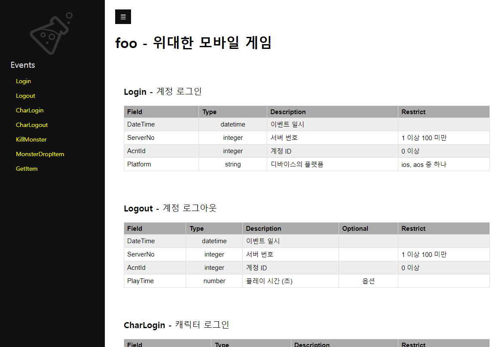

고급 기능
=========

필드값의 제약
-------------

지금까지는 필드를 만들 때 기본 타입만을 사용했는데, 실제 특성을 충분히
반영하지 못할 수 있다. 예를 들어 ``Server`` 베이스의 서버 번호
``ServerNo`` 필드의 경우, 단순히 정수가 아닌 1 이상의 정수가 와야 할
것이다. 이렇게 필드의 값에 자세한 제한을 거는 것을 필드값을 **제약
(restrict)** 한다고 한다.

.. note::

   필드값의 제약은 로그 설계 측면에서 꼭 필요한 것은 아니지만, 뒤에 나올
   로그 검증을 이용할 때 중요하다.

서버 번호에 제약 걸기
~~~~~~~~~~~~~~~~~~~~~

필드값을 제약하기 위해서는 필드 항목을 지금까지 사용하던 리스트 대신
``키:값`` 형식으로 기술해야 한다. 예로 ``ServerNo`` 필드를 제약해보자.

.. code:: json

   {
   //...
     "bases": {
       "Server": {
         "desc": "서버 정보",
         "fields": [
           {
             "name": "ServerNo",
             "desc": "서버 번호",
             "type": "integer",
             "minimum": 1
           }
         ]
       },
   //...
   }

기존 리스트 ``["ServerNo", "integer", "서버 번호"]`` 대신 ``name``,
``desc``, ``type`` 키를 사용하는 요소로 바뀌었다. 끝에 추가된
``minimum`` 부분은 **제약문** 으로 ``ServerNo``\ 의 값을 1 이상으로
제약하고 있다.

``show`` 를 실행해보자.

::

   $ loglab show foo.lab.json
   # ...

   Event : Login
   Description : 계정 로그인
   +----------+----------+---------------+------------+
   | Field    | Type     | Description   | Restrict   |
   |----------+----------+---------------+------------|
   | DateTime | datetime | 이벤트 일시   |            |
   | ServerNo | integer  | 서버 번호     | 1 이상     |
   | AcntId   | integer  | 계정 ID       |            |
   +----------+----------+---------------+------------+

   Event : Logout
   Description : 계정 로그아웃
   +----------+----------+------------------+------------+------------+
   | Field    | Type     | Description      | Optional   | Restrict   |
   |----------+----------+------------------+------------+------------|
   | DateTime | datetime | 이벤트 일시      |            |            |
   | ServerNo | integer  | 서버 번호        |            | 1 이상     |
   | AcntId   | integer  | 계정 ID          |            |            |
   | PlayTime | number   | 플레이 시간 (초) | True       |            |
   +----------+----------+------------------+------------+------------+

   # ...

``ServerNo`` 필드가 있는 모든 이벤트에 ``Restrict`` 라는 새로운 컬럼이
보이고, ``1 이상`` 이라는 제약이 표시된다.

제약문은 필드의 기본 타입별로 아래와 같은 것들이 있다.

**integer 또는 number**

- ``enum`` : 허용하는 나열값
- ``minimum`` : 포함하는 최소값
- ``maximum`` : 포함하는 최대값
- ``exclusiveMinimum`` : 제외하는 최소값
- ``exclusiveMaximum`` : 제외하는 최대값

**string**

- ``enum`` : 허용하는 나열값
- ``minLength`` : 문자열의 최소 길이
- ``maxLength`` : 문자열의 최대 길이
- ``pattern`` : 허용하는 문자열의 정규식 패턴

예를 들어 ``ServerNo`` 를 100 미만으로 제약하고 싶다면 ``exclusiveMaximum`` 을 이용한다.

.. code:: json

   {
     //...

     "bases": {
       "Server": {
         "desc": "서버 정보",
         "fields": [
           {
             "name": "ServerNo",
             "desc": "서버 번호",
             "type": "integer",
             "minimum": 1,
             "exclusiveMaximum": 100
           }
         ]
       },

     //...
   }

``show`` 결과는 아래와 같다.

::

   $ loglab show foo.lab.json
   # ...

   Event : Login
   Description : 계정 로그인
   +----------+----------+---------------+-----------------+
   | Field    | Type     | Description   | Restrict        |
   |----------+----------+---------------+-----------------|
   | DateTime | datetime | 이벤트 일시   |                 |
   | ServerNo | integer  | 서버 번호     | 1 이상 100 미만 |
   | AcntId   | integer  | 계정 ID       |                 |
   +----------+----------+---------------+-----------------+

   Event : Logout
   Description : 계정 로그아웃
   +----------+----------+------------------+------------+-----------------+
   | Field    | Type     | Description      | Optional   | Restrict        |
   |----------+----------+------------------+------------+-----------------|
   | DateTime | datetime | 이벤트 일시      |            |                 |
   | ServerNo | integer  | 서버 번호        |            | 1 이상 100 미만 |
   | AcntId   | integer  | 계정 ID          |            |                 |
   | PlayTime | number   | 플레이 시간 (초) | True       |                 |
   +----------+----------+------------------+------------+-----------------+

   # ...

``1 이상 100 미만`` 으로 제약이 표시된다.

예제에서 나온 ID 나 코드 계열 필드들, 즉 ``AcntId``, ``CharId``,
``MonsterCd``, ``MonsterId``, ``ItemCd``, ``ItemId`` 과 ``MapCd`` 에도 0
이상이 되도록 제약을 걸어주면 좋겠다. 그러나, 반복적인 제약을 매번
걸어주는 것은 상당히 번거롭다. 이에 커스텀 타입을 이용하는 방법을
소개하겠다.

커스텀 타입 활용
~~~~~~~~~~~~~~~~

앞에서 말한 것 처럼 ID 및 코드 필드는 항상 0 이상의 정수 값이 필요하다고
할 때, 아래와 같이 커스텀 타입을 정의하면 편리하다.

.. code:: json

   {
     //...

     "types": {
       "unsigned": {
         "desc": "0 이상의 정수",
         "type": "integer",
         "minimum": 0
       }
     },

     //...
   }

랩 파일에 ``types`` 최상단 요소를 만들고, 그 아래 커스텀 타입을
정의한다. 커스텀 타입의 설명은 실제 출력되지는 않으나 참고를 위해 꼭
기술하도록 하자. 예에서는 ``unsigned`` 라는 커스텀 타입을 만들고 0
이상의 정수가 되도록 하였다.

.. note::

   랩 파일에서 최상단 요소의 등장 순서는 중요하지 않으나, 관례적으로
   ``domain``, ``types``, ``bases``, ``events`` 순으로 기술하는 것을
   추천한다.

이것을 필드에서 참조할 때는 ``types.타입_이름`` 형식의 경로로 지정한다.
아래를 참고하자.

.. code:: json

   {
     // ...

     "bases": {

       // ...

       "Account": {
         "desc": "계정 정보",
         "mixins": ["bases.Server"],
         "fields": [
           ["AcntId", "types.unsigned", "계정 ID"]
         ]
       },

     // ...
   }

이제 ``CharId``, ``MonsterCd``, ``MonsterId``, ``ItemCd``, ``ItemId`` 과
``MapCd`` 에 모두 ``types.unsigned`` 를 적용하여 간단히 제약을 걸 수
있다.

.. code:: json

   {
     // ...

     "bases": {

       // ...

       "Monster": {
         "desc": "몬스터 정보",
         "fields": [
           ["MonsterCd", "types.unsigned", "몬스터 타입 코드"],
           ["MonsterId", "types.unsigned", "몬스터 개체 ID"]
         ]
       },
       "Item": {
         "desc": "아이템 정보",
         "fields": [
           ["ItemCd", "types.unsigned", "아이템 타입 코드"],
           ["ItemId", "types.unsigned", "아이템 개체 ID"]
         ]
       }

       // ...
   }

..

.. warning::

   기억해야 할 것은, **커스텀 타입을 이용하는 필드에는 추가적인 제약을
   걸 수 없다** 는 점이다. 따라서, 필드에 ``types.*`` 로 커스텀 타입을
   지정하는 것은 필드 기술을 리스트 형식으로 할때만 가능하다.

``show`` 를 호출하면, 같은 내용을 확인할 수 있다.

::

   $ loglab show foo.lab.json
   # ...

   Event : Login
   Description : 계정 로그인
   +----------+----------+---------------+-----------------+
   | Field    | Type     | Description   | Restrict        |
   |----------+----------+---------------+-----------------|
   | DateTime | datetime | 이벤트 일시   |                 |
   | ServerNo | integer  | 서버 번호     | 1 이상 100 미만 |
   | AcntId   | integer  | 계정 ID       | 0 이상          |
   +----------+----------+---------------+-----------------+

   Event : Logout
   Description : 계정 로그아웃
   +----------+----------+------------------+------------+-----------------+
   | Field    | Type     | Description      | Optional   | Restrict        |
   |----------+----------+------------------+------------+-----------------|
   | DateTime | datetime | 이벤트 일시      |            |                 |
   | ServerNo | integer  | 서버 번호        |            | 1 이상 100 미만 |
   | AcntId   | integer  | 계정 ID          |            | 0 이상          |
   | PlayTime | number   | 플레이 시간 (초) | True       |                 |
   +----------+----------+------------------+------------+-----------------+

   # ...

``AcntId`` 의 타입은 기본 타입인 ``integer`` 로 나오고, 거기에
``0 이상`` 이 제약으로 표시되고 있다. 이것은 ``show`` 명령이 기본적으로
커스텀 타입을 기본 타입으로 바꿔주기 때문이다. 만약, 커스텀 타입을
그대로 보고 싶다면 아래처럼 ``-c`` 또는 ``--custom-type`` 옵션을
이용한다.

::

   $ loglab show foo.lab.json -c
   # ...

   Type : types.unsigned
   Description : Id 타입
   +------------+---------------+------------+
   | BaseType   | Description   | Restrict   |
   |------------+---------------+------------|
   | integer    | Id 타입       | 0 이상     |
   +------------+---------------+------------+

   Event : Login
   Description : 계정 로그인
   +----------+----------------+---------------+-----------------+
   | Field    | Type           | Description   | Restrict        |
   |----------+----------------+---------------+-----------------|
   | DateTime | datetime       | 이벤트 일시   |                 |
   | ServerNo | integer        | 서버 번호     | 1 이상 100 미만 |
   | AcntId   | types.unsigned | 계정 ID       |                 |
   +----------+----------------+---------------+-----------------+

   Event : Logout
   Description : 계정 로그아웃
   +----------+----------------+------------------+------------+-----------------+
   | Field    | Type           | Description      | Optional   | Restrict        |
   |----------+----------------+------------------+------------+-----------------|
   | DateTime | datetime       | 이벤트 일시      |            |                 |
   | ServerNo | integer        | 서버 번호        |            | 1 이상 100 미만 |
   | AcntId   | types.unsigned | 계정 ID          |            |                 |
   | PlayTime | number         | 플레이 시간 (초) | True       |                 |
   +----------+----------------+------------------+------------+-----------------+

   # ...

이제 출력이 바뀌었다. 먼저 이벤트에 앞서 정의된 커스텀 타입을 보여주고,
이벤트에서 커스텀 타입을 이용하는 필드는 기본 타입으로 변환하지 않고
커스텀 타입 경로를 그대로 출력한다.

나열 이용하기
~~~~~~~~~~~~~

나열 (enum) 은 제약문의 하나로, 필드에 특정 값들만 허용하려는 경우
사용한다. 예로서 로그인시 게임을 하는 유저 디바이스의 플랫폼 (OS) 필드를
추가해보자.

플랫폼은 ``ios`` 와 ``aos`` 두 가지 값만 허용하고 싶은데, 이렇게 특정
값만 허용하기 위해 ``enum`` 을 사용한다. 다음과 같이 ``Login`` 이벤트에
``Platform`` 필드를 추가한다.

.. code:: json

   {
     // ...

     "events": {
       "Login": {
         "desc": "계정 로그인",
         "mixins": ["bases.Account"],
         "fields": [
           {
             "name": "Platform",
             "desc": "디바이스의 플랫폼",
             "type": "string",
             "enum": [
                 "ios", "aos"
             ]
           }
         ]
       },

     // ...
   }

``show`` 의 결과는 아래와 같다.

::

   $ loglab show foo.lab.json
   # ...

   Event : Login
   Description : 계정 로그인
   +----------+----------+-------------------+------------------+
   | Field    | Type     | Description       | Restrict         |
   |----------+----------+-------------------+------------------|
   | DateTime | datetime | 이벤트 일시       |                  |
   | ServerNo | integer  | 서버 번호         | 1 이상 100 미만  |
   | AcntId   | integer  | 계정 ID           | 0 이상           |
   | Platform | string   | 디바이스의 플랫폼 | ios, aos 중 하나 |
   +----------+----------+-------------------+------------------+

   # ...

``Platform`` 필드가 추가되었고, 그 값은 ``ios`` 또는 ``aos`` 로 제약됨을
알 수 있다.

.. note::

   ``enum`` 은 ``string`` 뿐만 아니라, ``integer`` 와 ``number``
   타입에서도 사용할 수 있다.

나열형 항목의 값에 대해 구체적인 설명을 붙여야 하는 경우도 있다. 예로
``Item`` 베이스의 ``ItemCd`` 필드에 나열을 이용해 등장할 수 있는 값을
제한하고 설명도 붙이는 경우를 생각해 보자.

먼저 기존 ``ItemCd`` 필드의 리스트형 선언
``["ItemCd", "types.unsigned", "아이템 타입 코드"]`` 을 아래와 같이
``키:밸류`` 형으로 수정한다.

.. code:: json

   {
     // ...

     "bases": {

       // ...

       "Item": {
         "desc": "아이템 정보",
         "fields": [
           {
               "name": "ItemCd",
               "type": "integer",
               "desc": "아이템 타입 코드",
               "enum": [1, 2, 3]
           },
           ["ItemId", "types.unsigned", "아이템 인스턴스 ID"]
         ]
       }

     // ...
   }

기존 제약을 기본 타입 + ``enum`` 으로 대체할 것이기에, 기존
``types.unsigned`` 대신 ``integer`` 로 타입을 변경하였다. 이대로
사용해도 되지만, 여기서는 각 값에 대한 설명을 아래와 같이 추가한다.

.. code:: json

   {
     // ...

     "bases": {

       // ...

       "Item": {
         "desc": "아이템 정보",
         "fields": [
           {
             "name": "ItemCd",
             "type": "integer",
             "desc": "아이템 타입 코드",
             "enum":[
               [1, "칼"],
               [2, "방패"],
               [3, "물약"]
             ]
           },
           ["ItemId", "types.unsigned", "아이템 인스턴스 ID"]
         ]
       }

     // ...
   }

``1``, ``2`` 같은 숫자값 대신 ``[나열값, 나열값_설명]`` 형식의 리스트를
사용한다. ``show`` 를 실행해보면 ``ItemCd`` 필드의 제약 컬럼에 각
나열값의 설명이 추가된 것을 알 수 있다.

::

  $ loglab show foo.lab.json

  # ...

  Event : GetItem
  Description : 캐릭터의 아이템 습득
  +----------+----------+----------------+-------------------------------+
  | Field    | Type     | Description    | Restrict                      |
  |----------+----------+----------------+-------------------------------|
  | DateTime | datetime | 이벤트 일시    |                               |
  | ServerNo | integer  | 서버 번호      | 1 이상 100 미만               |
  | AcntId   | integer  | 계정 ID        | 0 이상                        |
  | CharId   | integer  | 캐릭터 ID      |                               |
  | MapCd    | integer  | 맵 코드        |                               |
  | PosX     | number   | 맵상 X 위치    |                               |
  | PosY     | number   | 맵상 Y 위치    |                               |
  | PosZ     | number   | 맵상 Z 위치    |                               |
  | ItemCd   | integer  | 아이템 타입 ID | 1 (칼), 2 (방패), 3 (물약) 중 |
  |          |          |                | 하나                          |
  | ItemId   | integer  | 아이템 개체 ID | 0 이상                        |
  +----------+----------+----------------+-------------------------------+

.. note::

   로그 뿐만아니라 서버나 DB 등에서 함께 공유되는 나열값의 경우는 랩파일이 아닌 별도의 장소에서 기록/관리되어야 할 것이다. 이런 경우 랩 파일에서는 단순히 기본 타입만 지정하고, 자세한 나열값 정보는 별도 문서를 참조하도록 가이드하는 것이 맞겠다.

상수 이용하기
~~~~~~~~~~~~~~~

상수 (const) 는 제약문의 하나로, 필드가 항상 지정된 값 하나만 가져야 하는 경우에 사용한다. 이벤트의 카테고리 분류 등을 숫자로 표시하려는 경우 베이스나 상위 이벤트에 정의하여 사용하면 유용할 것이다.

.. note::

  이런 값은 로그 자체 보다는, 로그의 수집 또는 정리 (ETL) 하는 하위 작업에서 유용할 수 있다.

예로서, 지금까지의 이벤트를 크게 '계정 이벤트', '캐릭터 이벤트', '시스템 이벤트' 의 세 가지로 분류하고 싶다고 하자. 이를 위해 다음처럼 `bases` 아래의 `Account` 와 `Character` 에 상수 필드를 추가하고, `System` 을 추가한다.

.. code:: json

   {
     // ...

     "bases": {

       // ...

       "Account": {
         "desc": "계정 정보",
         "mixins": ["bases.Server"],
         "fields": [
           ["AcntId", "types.unsigned", "계정 ID"],
           {
             "name": "Category",
             "desc": "이벤트 분류",
             "type": "integer",
             "const": [1, "계정 이벤트"]
           }
         ]
       },
       "Character": {
         "desc": "캐릭터 정보",
         "mixins": ["bases.Account"],
         "fields": [
           ["CharId", "types.unsigned", "캐릭터 ID"],
           {
             "name": "Category",
             "desc": "이벤트 분류",
             "type": "integer",
             "const": [2, "캐릭터 이벤트"]
           }
         ]
       },
       "System": {
         "desc": "시스템 이벤트",
         "mixins": ["bases.Server"],
         "fields": [
           {
             "name": "Category",
             "desc": "이벤트 분류",
             "type": "integer",
             "const": [3, "시스템 이벤트"]
           }
         ]
       }

     // ...

   }

각 ``const`` 필드에는 상수값과 그 값에 대한 설명을 기술한다.

다음으로, 계정 / 캐릭터의 이벤트가 아닌 ``MonsterDropItem`` 에
``System`` 베이스를 믹스인한다.

.. code:: json

   "events":

     // ...

     "MonsterDropItem": {
           "desc": "몬스터가 아이템을 떨어뜨림",
           "mixins": ["bases.System", "bases.Monster", "bases.Position", "bases.Item"]
         }

     // ...

``show`` 의 결과는 아래와 같다.

::

   # ...

   Event : Login
   Description : 계정 로그인
   +----------+----------+-------------------+----------------------+
   | Field    | Type     | Description       | Restrict             |
   |----------+----------+-------------------+----------------------|
   | DateTime | datetime | 이벤트 일시       |                      |
   | ServerNo | integer  | 서버 번호         |                      |
   | AcntId   | integer  | 계정 ID           |                      |
   | Category | integer  | 이벤트 분류       | 항상 1 (계정 이벤트) |
   | Platform | string   | 디바이스의 플랫폼 | ios, aos 중 하나     |
   +----------+----------+-------------------+----------------------+

   # ...

   Event : CharLogin
   Description : 캐릭터 로그인
   +----------+----------+---------------+------------------------+
   | Field    | Type     | Description   | Restrict               |
   |----------+----------+---------------+------------------------|
   | DateTime | datetime | 이벤트 일시   |                        |
   | ServerNo | integer  | 서버 번호     |                        |
   | AcntId   | integer  | 계정 ID       |                        |
   | Category | integer  | 이벤트 분류   | 항상 2 (캐릭터 이벤트) |
   | CharId   | integer  | 캐릭터 ID     |                        |
   +----------+----------+---------------+------------------------+

   # ...

   Event : MonsterDropItem
   Description : 몬스터가 아이템을 떨어뜨림
   +-----------+----------+------------------+-------------------------------+
   | Field     | Type     | Description      | Restrict                      |
   |-----------+----------+------------------+-------------------------------|
   | DateTime  | datetime | 이벤트 일시      |                               |
   | ServerNo  | integer  | 서버 번호        |                               |
   | Category  | integer  | 이벤트 분류      | 항상 3 (시스템 이벤트)        |
   | MonsterCd | integer  | 몬스터 타입 코드 |                               |
   | MonsterId | integer  | 몬스터 개체 ID   |                               |
   | MapCd     | integer  | 맵 코드          |                               |
   | PosX      | number   | 맵상 X 위치      |                               |
   | PosY      | number   | 맵상 Y 위치      |                               |
   | PosZ      | number   | 맵상 Z 위치      |                               |
   | ItemCd    | integer  | 아이템 타입 코드 | 1 (칼), 2 (방패), 3 (물약) 중 |
   |           |          |                  | 하나                          |
   | ItemId    | integer  | 아이템 개체 ID   |                               |
   +-----------+----------+------------------+-------------------------------+

   # ...

계정 이벤트인 ``Login`` 에는 ``Category`` 가 항상 ``1`` 이고, 캐릭터
이벤트인 ``CharLogin`` 에는 ``Category`` 가 항상 ``2``, 그리고 시스템
이벤트인 ``MonsterDropItem`` 에는 항상 ``3`` 로 설명이 나오는 것을
확인할 수 있다.

--------------

지금까지 로그 설계에 필요한 기본적인 내용을 설명하였다. 완전한 예제 파일
``foo.lab.json`` 은 로그랩 코드의 ``example`` 디렉토리 또는
`여기 <https://github.com/haje01/loglab/tree/master/example>`__ 에서
확인할 수 있다.

로그 파일의 검증
----------------

로그 설계가 끝나면, 실제 서비스에서는 로그를 출력하도록 구현이 필요하다.
구현하는 측에서는 설계에 맞게 잘 구현되었는지 확인을 하고 싶은 경우가
많은데, 로그랩을 사용하면 설계된 로그의 정보를 이용하여 실제 로그를
검증할 수 있다. ``loglab`` 의 ``verify`` 명령으로 검증할 수 있는데, 먼저
도움말을 살펴보자.

::

   $ loglab verify --help
   Usage: loglab verify [OPTIONS] SCHEMA LOGFILE

     생성된 로그 파일 검증.

   Options:
     --help  Show this message and exit.

``verify`` 명령은 두 개의 파일명을 인자로 받는데, 첫 번째는 검증용 로그
스키마 파일 ``SCHEMA`` 이고, 두 번째는 검증할 로그 파일의 경로
``LOGFILE`` 이다.

예제에서는 실제 서비스에서 생성된 로그가 없기에, 테스트를 위해 다음과
같은 가상의 로그를 만들어 ``fakelog.txt`` 파일로 저장하자.

.. code:: json

   {"DateTime": "2021-08-13T20:20:39+09:00", "Event": "Login", "ServerNo": 1, "AcntId": 1000}
   {"DateTime": "2021-08-13T20:21:01+09:00", "Event": "Logout", "ServerNo": 1, "AcntId": 1000}

``Event`` 필드에 이벤트 이름이, ``DateTime`` 필드에 이벤트 발생 시간이
들어간다. 나머지 필드는 랩 파일에서 정의된 대로이다.

.. note::

   파일 내용에 맞는 확장자는 ``.jsonl`` 이겠으나, 로그 내용을 확인하기
   좋도록 ``.txt`` 확장자를 사용하였다.

이제 검증을 위한 로그 스키마가 필요하다. 다음과 같은 ``schema`` 명령으로
지금까지 작성한 랩 파일에서 스키마를 만들수 있다.

::

   $ loglab schema foo.lab.json
   foo.schema.json 에 로그 스키마 저장.

확장자 ``.schema.json`` 가 붙은 JSON 스키마 형식의 로그 스키마 가 만들어
지는데, 이것으로 실제 로그를 검증할 수 있다. 아래와 같이 ``verify``
명령을 수행하면,

::

   $ loglab verify foo.schema.json fakelog.txt
   Error: [Line: 1] 'Platform' is a required property
   {'DateTime': '2021-08-13T20:20:39+09:00', 'Event': 'Login', 'ServerNo': 1, 'AcntId': 1000}

``fakelog.txt`` 첫 번째 줄의 ``Login`` 이벤트에서 필수 필드인
``Platform`` 이 빠졌다는 에러 메시지가 출력된다. 다음과 같이 수정해보자.

.. code:: json

   {"DateTime": "2021-08-13T20:20:39+09:00", "Event": "Login", "ServerNo": 1, "AcntId": 1000, "Platform": "win"}
   {"DateTime": "2021-08-13T20:21:01+09:00", "Event": "Logout", "ServerNo": 1, "AcntId": 1000}

의도적으로 잘못된 플랫폼값인 ``win`` 을 설정했다. 다시 ``verify``
해보면,

::

   $ loglab verify fakelog.txt
   Error: [Line: 1] 'win' is not one of ['ios', 'aos']
   {'DateTime': '2021-08-13T20:20:39+09:00', 'Event': 'Login', 'ServerNo': 1, 'AcntId': 1000, 'Platform': 'win'}

이번에는 ``ios`` 또는 ``aos`` 만 허용한다는 에러가 나온다. ``win`` 을
``ios`` 로 고치고 다시 해보자.

::

   $ loglab verify fakelog.txt

검증이 문제없이 성공했다 (성공한 경우 아무런 메시지가 나오지 않는다). 이
검증 기능을 활용하면 서비스 개발자가 만든 로그가 설계에 맞게 출력되고
있는지 확인할 때 유용할 것이다.

.. warning::

   랩 파일 수정 후 스키마를 갱신하지 않으면 의도하지 않는 결과가 나올 수
   있다. 랩 파일 수정 후 검증 시 꼭 ``schema`` 명령을 불러주도록 하자.

공용 랩 파일을 통한 로그 표준화
-------------------------------

지금까지 예로든 게임 ``foo`` 를 만드는 ``acme`` 라는 회사에서, 새로운 PC
온라인 게임 ``boo`` 를 출시한다고 하자. ``boo`` 는 ``foo`` 와 유사하지만
다른 점도 꽤 있다.

회사는 앞으로도 다양한 서비스를 만들고 거기서 나오는 데이터를
처리/분석할 것이기에, 효율성을 위해 **로그의 기본 구조를 표준화** 하고
싶다. 이런 경우 조직 내에서 꼭 필요로하는 로그 구조를 **공용 랩 파일**
로 만든 뒤, 이것을 ``foo`` 와 ``boo`` 가 공유하고 확장해 나가는 방식으로
가능할 것이다.

공용 랩 파일 만들기
~~~~~~~~~~~~~~~~~~~

예제를 위해 지금까지 ``foo.lab.json`` 의 내용을 일부 정리해, 아래와 같이
회사 공용 랩 파일 ``acme.lab.json`` 파일을 만들자.

.. code:: json

   {
     "$schema": "https://raw.githubusercontent.com/haje01/loglab/master/loglab/schema/lab.schema.json",
     "domain": {
       "name": "acme",
       "desc": "최고의 게임 회사"
     },
       "types": {
         "unsigned": {
           "type": "integer",
           "desc": "0 이상의 정수",
           "minimum": 0
         }
     },
     "bases": {
       "Server": {
         "desc": "서버 정보",
         "fields": [
           {
             "name": "ServerNo",
             "desc": "서버 번호",
             "type": "integer",
             "minimum": 1,
             "exclusiveMaximum": 100
           }
         ]
       },
       "Account": {
         "desc": "계정 정보",
         "mixins": ["bases.Server"],
         "fields": [
           ["AcntId", "types.unsigned", "계정 ID"]
         ]
       }
     },
     "events": {
       "Login": {
         "desc": "ACME 계정 로그인",
         "mixins": ["bases.Account"],
         "fields": [
           {
             "name": "Platform",
             "desc": "디바이스의 플랫폼",
             "type": "string",
             "enum": [
                 "ios", "aos"
             ]
           }
         ]
       }
     }
   }

.. note::

   실제 서비스에서 사용될 공용 파일은 조직의 웹페이지나 코드 저장소를
   통해 내려받을 수 있도록 하는 것이 좋을 것이다.

공용 랩 파일 가져오기
~~~~~~~~~~~~~~~~~~~~~

이제 다음과 같은 내용으로 새로운 ``boo.lab.json`` 을 만든다.

.. code:: json

   {
     "$schema": "https://raw.githubusercontent.com/haje01/loglab/master/loglab/schema/lab.schema.json",
     "domain": {
       "name": "boo",
       "desc": "최고의 PC 온라인 게임"
     },
     "import": ["acme"]
   }

최상단 요소 ``import`` 는 가져올 외부 랩 파일 리스트를 가진다. 가져올 랩
파일 ``acme.lab.json`` 에서 확장자 ``.lab.json`` 은 생략하고 이름만을
기입한다.

.. note::

   하나 이상의 외부 랩 파일을 가져올 수 있으며, 겹치는 경우는 나중에
   나오는 것이 우선한다.

``show`` 를 해보면, 아직 도메인 정보외 아무 이벤트가 없는 것을 알 수
있다.

::

   $ loglab show boo.lab.json

   Domain : boo
   Description : 최고의 PC 온라인 게임

그렇지만 실제로는 가져온 외부 랩 파일에서 선언한 모든 커스텀 타입,
베이스와 이벤트를 이용할 수 있다. ``acme`` 에서 정의된 ``Login``
이벤트를 그대로 가져다 쓰려면 아래와 같이 한다.

.. code:: json

   {
     "$schema": "https://raw.githubusercontent.com/haje01/loglab/master/loglab/schema/lab.schema.json",
     "domain": {
       "name": "boo",
       "desc": "최고의 PC 온라인 게임"
     },
     "import": ["acme"],
     "events": {
       "Login": {
         "mixins": ["acme.events.Login"]
       }
     }
   }

``show`` 를 해보면 ``acme.lab.json`` 에서 정의된 ``Login`` 의 필드가
그대로 나온다.

::

   $ loglab show boo.lab.json

   Domain : boo
   Description : 최고의 PC 온라인 게임

   Event : Login
   Description : ACME 계정 로그인
   +----------+----------+-------------------+------------------+
   | Field    | Type     | Description       | Restrict         |
   |----------+----------+-------------------+------------------|
   | DateTime | datetime | 이벤트 일시       |                  |
   | ServerNo | integer  | 서버 번호         | 1 이상 100 미만  |
   | AcntId   | integer  | 계정 ID           | 0 이상           |
   | Platform | string   | 디바이스의 플랫폼 | ios, aos 중 하나 |
   +----------+----------+-------------------+------------------+

이벤트 자체의 설명이 없는 경우 믹스인된 ``Account`` 의 설명이 그대로
출력되는 것을 알 수 있는데, 이것은 **설명 찾기** 가 동작한 결과이다.

.. note::

   **설명 찾기**

   앞에서 설명은 필수가 아니나, 문서화를 위해 꼭 필요하다고 했다. 이
   말은 ``show`` 나 앞으로 설명할 ``html`` 같은 명령을 통해 문서를
   출력할 때는, 각 요소에 대한 설명을 최종적으로 찾을 수 있어야 한다는
   뜻이다. 로그랩은 요소 자체의 설명이 없는 경우 아래와 같이 설명 찾기를
   시도한다.

   -  먼저 각 베이스/이벤트에 설명이 없지만 믹스인은 있는 경우,
      믹스인되는 요소의 설명을 순서대로 이용한다.
   -  설명과 믹스인이 모두 없거나, 믹스인되는 요소에도 설명이 없다면
      아래와 같은 에러가 발생한다.

      -  ``Exception: Can not resolve description for 'Login'.``

``boo`` 의 ``Login`` 에 맞도록 설명을 추가하고, ``Platform`` 필드도 PC
온라인 서비스에 맞게 변경해보자.

.. code:: json

   {
     "$schema": "https://raw.githubusercontent.com/haje01/loglab/master/loglab/schema/lab.schema.json",
     "domain": {
       "name": "boo",
       "desc": "최고의 PC 온라인 게임"
     },
     "import": ["acme"],
     "events": {
       "Login": {
         "desc": "BOO 로그인",
         "mixins": ["acme.events.Login"],
         "fields": [
           {
             "name": "Platform",
             "desc": "PC의 플랫폼",
             "type": "string",
             "enum": [
                 "win", "mac", "linux"
             ]
           }
         ]
       }
     }
   }

``show`` 를 해보면 이벤트 설명과 ``Platform`` 필드의 나열값이 바뀐 것을
알 수 있다.

::

   $ loglab show boo.lab.json

   Domain : boo
   Description : 최고의 PC 온라인 게임

   Event : Login
   Description : BOO 로그인
   +----------+----------+---------------+-------------------------+
   | Field    | Type     | Description   | Restrict                |
   |----------+----------+---------------+-------------------------|
   | DateTime | datetime | 이벤트 일시   |                         |
   | ServerNo | integer  | 서버 번호     | 1 이상 100 미만         |
   | AcntId   | integer  | 계정 ID       | 0 이상                  |
   | Platform | string   | PC의 플랫폼   | win, mac, linux 중 하나 |
   +----------+----------+---------------+-------------------------+

커스텀 타입을 그대로 출력하면 아래와 같다.

::

   $ loglab show boo.lab.json -c

   Domain : boo
   Description : 최고의 PC 온라인 게임

   Type : acme.types.unsigned
   Description : 0 이상의 정수
   +------------+---------------+------------+
   | BaseType   | Description   | Restrict   |
   |------------+---------------+------------|
   | integer    | 0 이상의 정수 | 0 이상     |
   +------------+---------------+------------+

   Event : Login
   Description : BOO 로그인
   +----------+---------------------+---------------+-------------------------+
   | Field    | Type                | Description   | Restrict                |
   |----------+---------------------+---------------+-------------------------|
   | DateTime | datetime            | 이벤트 일시   |                         |
   | ServerNo | integer             | 서버 번호     | 1 이상 100 미만         |
   | AcntId   | acme.types.unsigned | 계정 ID       |                         |
   | Platform | string              | PC의 플랫폼   | win, mac, linux 중 하나 |
   +----------+---------------------+---------------+-------------------------+

먼저 외부 랩 파일에서 정의된 ``acme.types.unsigned`` 타입의 정의가
나오고, 각 이벤트에서 이것을 사용하는 필드들을 확인할 수 있다.

외부 랩 파일에서 정의된 타입이나 베이스를 가져와 자신의 이벤트를 만드는
것도 가능하다. ``boo.lab.json`` 에 다음과 같이 ``ServerMemory`` 이벤트를
추가하자.

.. code:: json

   {
     // ...

     "import": ["acme"],
     "events": {
       // ...

       "ServerMemory": {
         "desc": "서버 가용 메모리.",
         "mixins": ["acme.bases.Server"],
         "fields": [
           ["AvailMemory", "acme.types.unsigned", "가용 메모리 (MB)"]
         ]
       }
     }
   }

``show`` 를 해보면,

::

   $ loglab show boo.lab.json

   # ...

   Event : ServerMemory
   Description : 서버 가용 메모리.
   +-------------+----------+------------------+-----------------+
   | Field       | Type     | Description      | Restrict        |
   |-------------+----------+------------------+-----------------|
   | DateTime    | datetime | 이벤트 일시      |                 |
   | ServerNo    | integer  | 서버 번호        | 1 이상 100 미만 |
   | AvailMemory | integer  | 가용 메모리 (MB) | 0 이상          |
   +-------------+----------+------------------+-----------------+

``acme`` 에서 정의된 커스텀 타입 및 베이스가 잘 적용된 것을 알 수 있다.

이런 식으로 **공용 랩 파일을 만들고 그것에 정의된 타입, 베이스, 이벤트를
활용하여 서비스별 로그를 설계한다면, 조직의 표준을 따르면서도 서비스 별
특성에 맞는 확장이 가능** 할 것이다.

.. note::

   외부 랩 파일을 활용할 때는 먼저 어떤 타입과 베이스가 정의되어 있는지
   잘 살펴보고 사용하도록 하자. 제공하는 쪽의 철학을 이해하는 것이
   도움이 될 것이다.

완전한 예제 파일 ``acme.lab.json`` 과 ``boo.lab.json`` 은 로그랩 코드의
``example`` 디렉토리 또는
`여기 <https://github.com/haje01/loglab/tree/master/example>`__ 에서
확인할 수 있다.

HTML 문서 출력
--------------

로그의 설계, 개발 그리고 검증 작업이 끝난 후에는, 유관 조직에 로그에
관한 설명서를 공유해야 할 필요가 생긴다. 이런 경우 로그랩의 HTML 출력
기능을 사용하면 유용하다. 다음과 같은 명령으로 간단히 생성할 수 있다.

::

   $ loglab html foo.lab.json
   'foo.html' 에 HTML 문서 저장.

생성된 ``foo.html`` 파일을 웹브라우저로 열어보면 아래와 같은 페이지를
확인할 수 있을 것이다.

   html_output

로그 객체 코드 생성
------------------

서비스 코드에서 로그 출력을 구현할 때, 필요한 필드와 값을 매번 문자열로
만들어 쓰는 것은 번거롭다. 로그 이벤트 구조에 맞는 객체(Object)를 미리
정의하고 그것의 멤버 변수에 값을 채운 뒤, 최종적으로 JSON 형식으로
직렬화(Serialize)하는 방식이 더 편리하고 안전하다. 여기서는 이러한
객체를 **로그 객체(Log Object)**\ 로 부르겠다.

로그랩은 ``object`` 명령을 통해 로그 객체를 위한 코드 생성을 지원한다.

::

   $ loglab object <랩 파일> <코드 타입>

첫 번째 인자는 랩 파일명이고, 두 번째 인자는 생성할 프로그래밍 언어
타입이다. 현재는 Python (``py``), C# (``cs``), C++ (``cpp``)를 지원한다.

   ``const`` 로 지정된 필드는 로그 객체를 통해 설정할 수 없고, 객체
   시리얼라이즈 (Serialize) 시에 랩파일에 지정된 값으로 출력된다.

Python
~~~~~~

다음과 같이 ``object`` 명령으로 파이썬 로그 객체 코드를 출력한다.

::

   $ loglab object foo.lab.json py -o loglab_foo.py

아래는 랩 파일 ``foo.lab.json``\ 에서 생성된 파이썬 로그 객체 파일
``loglab_foo.py``\ 의 내용 중 일부이다.

.. code:: python

   """
       ** 이 파일은 LogLab 에서 생성된 것입니다. 고치지 마세요! **

       Domain: foo
       Description: 위대한 모바일 게임
   """
   import json
   from datetime import datetime
   from typing import Optional

   # ...

   class Logout:
       """계정 로그아웃"""

       def __init__(self, _ServerNo: int, _AcntId: int):
           self.reset(_ServerNo, _AcntId)

       def reset(self, _ServerNo: int, _AcntId: int):

           self.ServerNo = _ServerNo
           self.AcntId = _AcntId
           self.PlayTime : Optional[float] = None

       def serialize(self):
           data = dict(DateTime=datetime.now().astimezone().isoformat(),
                       Event="Logout")
           data["ServerNo"] = self.ServerNo
           data["AcntId"] = self.AcntId
           if self.PlayTime is not None:
               data["PlayTime"] = self.PlayTime
           return json.dumps(data)

   # ...

아래는 이 파일을 불러와서 사용하는 예이다. 이벤트의 필수 필드는 객체의
생성자 인자로 전달하고, 옵션 필드는 객체 생성 후 직접 설정한다.

.. code:: python

   import loglab_foo as lf

   e = lf.Logout(33, 44)
   e.PlayTime = 100
   print(e.serialize())

결과는 아래와 같다.

.. code:: json

   {"DateTime": "2021-11-12T13:37:05.491169+09:00", "Event": "Logout", "ServerNo": 33, "AcntId": 44, "PlayTime": 100}

.. note::

   설정되지 않은 옵션 필드는 결과 JSON에 포함되지 않는다.

C#
~~~

다음과 같이 C# 버전을 생성할 수 있다.

::

   $ loglab object foo.lab.json cs -o loglab_foo.cs

아래는 C# 로그 객체 파일 ``loglab_foo.cs`` 내용의 일부이다.

.. code:: cs

   /*

       ** 이 파일은 LogLab 에서 생성된 것입니다. 고치지 마세요! **

       Domain: foo
       Description: 위대한 모바일 게임

   */

   using System;
   using System.Collections.Generic;
   using System.Diagnostics;

   namespace loglab_foo
   {
       // ...

       /// 

       ///  계정 로그아웃
       /// 

       public class Logout
       {
           public const string Event = "Logout";
           // 서버 번호
           public int? ServerNo = null;
           // 계정 ID
           public int? AcntId = null;
           // 플레이 시간 (초)
           public float? PlayTime = null;
           public static JsonSerializerOptions options = new JsonSerializerOptions
           {
               Encoder = JavaScriptEncoder.UnsafeRelaxedJsonEscaping
           };

           public Logout(int _ServerNo, int _AcntId)
           {
               Reset(_ServerNo, _AcntId);
           }
           public void Reset(int _ServerNo, int _AcntId)
           {
               ServerNo = _ServerNo;
               AcntId = _AcntId;
               PlayTime = null;
           }
           public string Serialize()
           {
               List<string> fields = new List<string>();
               Debug.Assert(ServerNo.HasValue);
               fields.Add($"\"ServerNo\": {ServerNo}");
               Debug.Assert(AcntId.HasValue);
               fields.Add($"\"AcntId\": {AcntId}");
               fields.Add($"\"Category\": 1");
               if (PlayTime.HasValue)
                   fields.Add($"\"PlayTime\": {PlayTime}");
               string sfields = String.Join(", ", fields);
               string dt = DateTime.Now.ToString("yyyy-MM-ddTHH:mm:ss.fffzzz");
               string sjson = $"{{\"DateTime\": \"{dt}\", \"Event\": \"{Event}\", {sfields}}}";
               return sjson;
           }
       }
       // ...
   }

사용 예제는 다음과 같다.

.. code:: cs

   using System;
   using loglab_foo;

   namespace csharp
   {
       class Program
       {
           static void Main(string[] args)
           {
               Logout logout = new Logout(33, 44);
               logout.PlayTime = 100;
               Console.WriteLine(logout.Serialize());
           }
       }
   }

C++
~~~

C++ 로그 객체는 C++17 표준을 기반으로 생성된다. 다음과 같이 헤더 파일을
생성한다.

::

   $ loglab object foo.lab.json cpp -o loglab_foo.h

아래는 생성된 파일 loglab_foo.h 의 일부이다.

.. code:: cpp

   /*

       이 파일은 LogLab 에서 생성된 것입니다. 고치지 마세요!

       Domain: foo
       Description: 위대한 모바일 게임
   */

   #pragma once

   #include <iostream>
   #include <string>
   #include <vector>
   #include <optional>
   #include <chrono>
   #include <sstream>
   #include <iomanip>

   namespace loglab_foo
   {
       class LogSerializer {
       public:
           static thread_local std::stringstream ss;
           static thread_local std::string buffer;
           static thread_local char datetime_buffer[32];

           static std::string& SerializeToBuffer(const std::string& content) {
               ss.clear();
               ss.str("");
               ss << content;
               buffer = ss.str();
               return buffer;
           }

           static const char* FormatDateTime() {
               auto now = std::chrono::system_clock::now();
               auto in_time_t = std::chrono::system_clock::to_time_t(now);
               auto microseconds = std::chrono::duration_cast<std::chrono::microseconds>(now.time_since_epoch()) % 1000000;

               std::tm* tm_utc = std::gmtime(&in_time_t);
               int len = std::sprintf(datetime_buffer, "%04d-%02d-%02dT%02d:%02d:%02d.%06ldZ",
                   tm_utc->tm_year + 1900, tm_utc->tm_mon + 1, tm_utc->tm_mday,
                   tm_utc->tm_hour, tm_utc->tm_min, tm_utc->tm_sec,
                   microseconds.count());

               return datetime_buffer;
           }
       };

       // Thread-local static member definitions
       thread_local std::stringstream LogSerializer::ss;
       thread_local std::string LogSerializer::buffer;
       thread_local char LogSerializer::datetime_buffer[32];

       /// 

       ///  계정 로그아웃
       /// 

       class Logout
       {
       public:
           static constexpr const char* Event = "Logout";

           // Required fields
           // 서버 번호
           int ServerNo;
           // 계정 ID
           int AcntId;

           // Optional fields
           // 플레이 시간 (초)
           std::optional<float> PlayTime;

           Logout() {}

           Logout(int _ServerNo, int _AcntId)
           {
               reset(_ServerNo, _AcntId);
           }

           void reset(int _ServerNo, int _AcntId)
           {
               ServerNo = _ServerNo;
               AcntId = _AcntId;
               PlayTime.reset();
           }

           std::string& serialize()
           {
               LogSerializer::ss.clear();
               LogSerializer::ss.str("");
               LogSerializer::ss << "{";

               // DateTime and Event
               LogSerializer::ss << "\"DateTime\":\"" << LogSerializer::FormatDateTime() << "\",";
               LogSerializer::ss << "\"Event\":\"" << Event << "\"";

               // Required fields
               LogSerializer::ss << ",";
               LogSerializer::ss << "\"ServerNo\":";
               LogSerializer::ss << ServerNo;
               LogSerializer::ss << ",";
               LogSerializer::ss << "\"AcntId\":";
               LogSerializer::ss << AcntId;

               // Optional fields
               if (PlayTime.has_value())
               {
                   LogSerializer::ss << ",";
                   LogSerializer::ss << "\"PlayTime\":";
                   LogSerializer::ss << PlayTime.value();
               }

               // Const fields
               LogSerializer::ss << ",";
               LogSerializer::ss << "\"Category\":";
               LogSerializer::ss << 1;

               LogSerializer::ss << "}";
               LogSerializer::buffer = LogSerializer::ss.str();
               return LogSerializer::buffer;
           }
       };

       // ...

   }

생성된 ``loglab_foo.h`` 파일은 ``loglab_foo``\ 와 같은
``loglab_<도메인 이름>`` 네임스페이스 안에 각 이벤트 클래스를 정의한다.
옵션 필드는 ``std::optional``\ 을 사용한다.

아래는 생성된 ``loglab_foo.h``\ 를 사용하는 예제 ``main.cpp`` 이다.

.. code:: cpp

   #include <iostream>
   #include "loglab_foo.h" // LogLab이 생성한 헤더 파일을 포함한다.

   // LogLab이 생성한 네임스페이스를 사용한다.
   using namespace loglab_foo;

   int main() {
       // --- Login 이벤트 사용 예제 ---
       // 필수 필드를 생성자 인자로 전달하여 객체를 생성한다.
       Login login_event(1, 1001, "ios");
       std::cout << "Login Event: " << login_event.serialize() << std::endl;

       // --- Logout 이벤트 사용 예제 (옵션 필드 포함) ---
       Logout logout_event(1, 1001);
       logout_event.PlayTime = 123.45f; // 옵션 필드 설정
       std::cout << "Logout Event: " << logout_event.serialize() << std::endl;

       return 0;
   }

코드를 빌드하고 실행하려면 ``g++``\ 와 같은 C++ 컴파일러가 필요하다.

**1. 컴파일**

``std::optional``\ 을 사용하므로 C++17 표준 이상으로 컴파일해야 한다.

.. code:: bash

   g++ -std=c++17 -o main_app main.cpp

**2. 실행**

.. code:: bash

   ./main_app

**3. 결과**

::

   Login Event: {"DateTime":"2025-07-16T08:35:04.013922Z","Event":"Login","ServerNo":1,"AcntId":1001,"Platform":"ios"}
   Logout Event: {"DateTime":"2025-07-16T08:35:04.013981Z","Event":"Logout","ServerNo":1,"AcntId":1001,"PlayTime":123.45}

이와 같이, 로그 객체를 사용하면 각 언어의 타입 시스템을 활용하여
안전하고 손쉽게 JSON 형태의 로그 문자열을 얻을 수 있다. 실제 파일에 쓰기
위해서는 생성된 문자열을 사용하는 로깅 라이브러리에 전달하면 된다.

.. note::

   **빈번한 로그 객체 생성**

   만약 특정 이벤트가 매우 자주 발생하고 그때마다 로그 객체를 생성하여
   로그를 쓴다면, 가비지 컬렉션이나 메모리 단편화 등으로 인한 시스템
   성능 저하가 발생할 수 있다. 이에 로그랩에서 생성된 로그 객체는
   **리셋(Reset)** 메소드를 통해 객체를 초기화하는 기능을 제공한다.
   이벤트 처리 코드에서 로그 객체를 매번 생성하지 말고, 클래스의 멤버
   변수나 정적(Static) 객체로 선언해 두고, 리셋 메소드로 그 객체를
   초기화한 후 재활용하는 방식을 추천한다.
