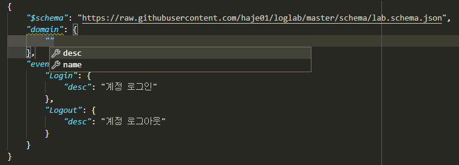

기본 기능
===============

최초 랩 파일 만들기
-------------------

지금부터는 가상의 모바일 게임 ``foo`` 를 위한 로그를 설계하는 예제를
통해 로그랩의 활용법을 하나씩 살펴보겠다.

로그랩은 **랩(lab) 파일** 로 불리는 JSON 파일에 로그 명세를 기술하는
것으로 로그를 설계한다. 랩 파일은 로그랩에서 제공하는 JSON 스키마 형식에
맞추어 작성하며, 확장자는 ``.lab.json`` 을 사용한다. `VS
Code <https://code.visualstudio.com/>`__ 등 JSON 스키마를 지원하는
에디터를 이용하면 인텔리센스 (IntelliSense) 기능이 지원되어 편집에
용이할 것이다.

먼저 빈 작업 디렉토리를 하나를 만들고, 에디터를 사용해 아래와 같은
내용으로 ``foo.lab.json`` 파일을 만들자.

.. code:: json

   {
     "domain": {
       "name": "foo",
       "desc": "최고의 모바일 게임"
     },
     "events": {
       "Login": {
         "desc": "계정 로그인"
       }
     }
   }

처음으로 나오는 ``domain`` 최상단 요소는 랩 파일의 **도메인 (domain)
정보** 를 기술하는데 사용한다. 도메인 요소는 랩 파일이 어떤 서비스를
위한 것인가에 대한 정보를 담는데, 모든 랩 파일에 꼭 있어야 하는 필수
요소이다.

위 예처럼 ``domain`` 요소 아래 도메인 이름 ``name`` 및 설명 ``desc``
요소를 입력하면 되는데, 도메인 이름은 나중에 해당 랩 파일을 식별하는
용도로 사용되기에, 알파벳 소문자와 숫자, 그리고 밑줄 문자 ``_`` 만을
사용해 **식별 가능한 범위에서 간략하게 기술**\ 한다.

.. note::

   관용적으로 랩 파일의 이름과 도메인 이름을 같게 하는 것을 추천한다.

로그랩에서는 로깅의 대상이 되는 각 사건을 **이벤트 (event)** 라고
하는데, ``events`` 최상단 요소에 하나 이상의 이벤트를 기술할 수 있다.
예제에서는 계정 로그인 이벤트를 위한 ``Login`` 을 만들었다. 그 아래의
``desc`` 요소는 이벤트에 대한 설명을 위한 것이다. 이것은 필수 요소는
아니지만 문서화를 위해서는 꼭 필요하다.

각 이벤트에는 관련된 하나 이상의 **필드 (field)** 를 기술할 수 있는데,
예에서는 아직 필드 정보는 없다.

이제 작업 디텍토리에서 ``loglab`` 의 ``show`` 명령을 사용할텐데, 먼저
``--help`` 옵션을 통해 도움말을 살펴보자.

::

   $ loglab show --help
   Usage: loglab show [OPTIONS] LABFILE

     로그 구성 요소 출력.

   Options:
     -c, --custom-type  커스텀 타입 그대로 출력
     -n, --name TEXT    출력할 요소 이름 패턴
     -k, --keep-text    긴 문자열 그대로 출력
     -l, --lang TEXT    로그랩 메시지 언어
     --help             Show this message and exit.

``show`` 는 첫 인자로 랩 파일 ``LABFILE`` 을 필요로 하는 것을 알 수
있다. 아래와 같이 실행한다.

::

   $ loglab show foo.lab.json

   Domain : foo
   Description : 최고의 모바일 게임

   Event : Login
   Description : 계정 로그인
   +----------+----------+---------------+
   | Field    | Type     | Description   |
   |----------+----------+---------------|
   | DateTime | datetime | 이벤트 일시   |
   +----------+----------+---------------+

``show`` 명령은 랩 파일을 참고해 로그의 구성 요소들을 텍스트로 출력한다.
랩 파일에 기술된 도메인 정보, 이벤트 이름과 설명, 그리고 테이블 형식의
필드 정보가 출력되는 것을 확인할 수 있다.

아직 ``Login`` 이벤트에는 아무런 필드를 명시하지 않았음에도 ``DateTime``
이라는 필드가 보인다. 이것은 모든 로그에 이벤트의 발생 일시는 꼭
필요하기에 **로그랩에서 자동으로 생성** 해준 것이다.

.. note::

   앞의 ``Login`` 과 ``DateTime`` 에서 알 수 있듯, 로그랩의 이벤트 및
   필드 이름은 대문자로 시작 후 다음 합성어의 시작을 대문자로 (Pascal
   Case) 하고, 타입 이름은 소문자로 시작 후 다음 합성어의 시작을
   대문자로 (Camel Case) 하는 것을 권장한다.

스키마와 도메인 정보 지정하기
~~~~~~~~~~~~~~~~~~~~~~~~~~~~~

복잡한 구조의 JSON 파일을 편집하다보면 어떤 내용이 기술될 수 있는지
기억하기 어렵고 틀리기 쉽다. 이런 경우 해당 형식의 `JSON
스키마 <https://json-schema.org>`__ 가 있다면 편리하다. 로그랩에서는 랩
파일을 위한 JSON 스키마를 제공한다. ``foo.lab.json`` 파일에 다음처럼
``$schema`` 요소를 추가해 보자.

.. code:: json

   {
     "$schema": "https://raw.githubusercontent.com/haje01/loglab/master/loglab/schema/lab.schema.json",
     "domain": {
       "name": "foo",
       "desc": "최고의 모바일 게임"
     },
     "events": {
       "Login": {
         "desc": "계정 로그인"
       }
     }
   }

사용하는 에디터가 VS Code 처럼 JSON 스키마를 지원한다면, 이제 아래와
같은 가이드를 볼 수 있을 것이다.

   스키마 가이드

또한, 문맥에 맞지 않는 요소나 틀린 철자 등도 찾아주기에 편리하다.

필드의 추가
-----------

.. note::

   지금부터는 공간을 아끼기 위해 표준 출력 및 JSON 파일의 맥락상 동일한
   부분은 ``...`` 표시 후 생략하도록 하겠다.

필드는 이벤트에 관한 상세 정보를 표현한다. 기본으로 생성된 ``DateTime``
외 필드를 추가해보자.

필드는 이벤트 요소 아래 ``fields`` 리스트에 기술하는데, 각 필드는 3 개
항목을 가지는 리스트로 표현한다. 아래와 같은 형식이다.

.. code::

   {
     // ...

       "fields": [
         [필드_이름, 필드_타입, 필드_설명]
       ]

     // ...
   }

로그랩에서 사용할 수 있는 필드의 기본 타입은 다음과 같다.

-  ``string`` : 문자열
-  ``integer``: 정수
-  ``number`` : 실수 (``float`` 과 일치)
-  ``boolean`` : 불린 (``true`` 또는 ``false``)
-  ``datetime`` : 일시(날짜+시간).
   `RFC3339 <https://json-schema.org/latest/json-schema-validation.html#RFC3339>`__
   를 따른다.

.. note::

   RFC3399 일시의 예로 ``2021-09-12T23:41:50.52Z`` (또는 ``2021-09-12T23:41:50.52+00:00`` 도 가능) 은 UTC 기준 2021년
   9월 12일 23시 41분 50.52 초이며, ``2021-09-14T16:39:57+09:00`` 은
   한국 표준시 (KST) 로 2021년 9월 14일 16시 39분 57초 이다.

예제의 ``Login`` 이벤트의 경우 로그인한 계정 ID 정보가 필요할 것이다.
아래와 같이 ``AcntId`` 필드를 추가한다.

.. code:: json

   {
     // ...

     "events": {
       "Login": {
         "desc": "계정 로그인",
         "fields": [
             ["AcntId", "integer", "계정 ID"]
         ]
       }
   }

..

.. note::

   이 글에서 필드 이름의 접미사 **아이디 (Id)** 가 붙은 것은 임의의
   값으로 특정 개체를 가리키는 용도로, **코드 (Cd)** 는 미리 정해진
   값으로 특정 범주값을 가리키는데 사용하겠다.

이제 ``show`` 명령을 내려보면,

::

   $ loglab show foo.lab.json
   # ...

   Event : Login
   Description : 계정 로그인
   +----------+----------+---------------+
   | Field    | Type     | Description   |
   |----------+----------+---------------|
   | DateTime | datetime | 이벤트 일시   |
   | AcntId   | integer  | 계정 ID       |
   +----------+----------+---------------+

``AcntId`` 필드가 추가된 것을 확인할 수 있다.

.. note::

   ``DateTime`` 과 ``Event`` 는 로그랩이 직접 사용하는 필드이기에,
   사용자는 이 이름을 피해서 자신의 필드를 만들도록 하자.

새로운 이벤트의 추가
--------------------

계정의 로그인 이벤트가 있다면, 로그아웃도 있어야 하지 않을까? 다음과
같이 추가해보자.

.. code:: json

   {
     // ...

     "events": {
       "Login": {
         "desc": "계정 로그인",
         "fields": [
           ["AcntId", "integer", "계정 ID"]
         ]
       },
       "Logout": {
         "desc": "계정 로그아웃",
         "fields": [
           ["AcntId", "integer", "계정 ID"]
         ]
       }
     }
   }

``show`` 명령을 내려보면,

::

   $ loglab show foo.lab.json
   # ...

   Event : Login
   Description : 계정 로그인
   +----------+----------+---------------+
   | Field    | Type     | Description   |
   |----------+----------+---------------|
   | DateTime | datetime | 이벤트 일시   |
   | AcntId   | integer  | 계정 ID       |
   +----------+----------+---------------+

   Event : Logout
   Description : 계정 로그아웃
   +----------+----------+---------------+
   | Field    | Type     | Description   |
   |----------+----------+---------------|
   | DateTime | datetime | 이벤트 일시   |
   | AcntId   | integer  | 계정 ID       |
   +----------+----------+---------------+

``Logout`` 이 잘 추가된 것을 알 수 있다.

그런데 로그인, 로그아웃 이벤트 모두 ``AcntId`` 필드을 가지고 있다.
앞으로 계정에 관한 다른 이벤트를 만든다면 거기에도 모두 이 필드를 만들어
주어야 할 것이다. 반복적인 작업을 방지할 수 없을까?

믹스인을 활용한 리팩토링
------------------------

**믹스인 (mixin)** 은 다른 요소의 필드를 가져다 쓰는 방법이다. 믹스인을
활용하면 다양한 이벤트에서 공통적으로 필요한 필드를 공유할 수 있다.

믹스인을 효율적으로 하기 위해서는 공통 필드를 추출하여 **베이스 (base)**
로 만드는 것을 권장한다. 베이스는 이벤트와 비슷하나, 그 자체로 로그에
직접 출력되지는 않고, 이벤트나 다른 베이스에서 참조되기 위한 용도이다.
베이스는 랩 파일의 ``bases`` 최상단 요소에 다음과 같은 형식으로
정의한다.

.. code:: json

   {
     // ...

     "bases": {
       "Account": {
         "desc": "계정 정보",
         "fields": [
           ["AcntId", "integer", "계정 ID"]
         ]
       }
     },
     "events": {
       "Login": {
         "desc": "계정 로그인",
         "mixins": ["bases.Account"]
       },
       "Logout": {
         "desc": "계정 로그아웃",
         "mixins": ["bases.Account"]
       }
     }
   }

위 예에서 ``bases`` 아래 ``Account`` 라는 베이스를 만들었다. 여기에 계정
관련 공용 필드를 기술하면 되는데, 아직은 ``AcntId`` 필드만 있다. 기존
``Login``, ``Logout`` 이벤트의 ``fields`` 요소는 제거하고, 대신
``mixin`` 리스트를 만든 후 ``bases.Account`` 를 기입한다. 이처럼
믹스인할 베이스 요소는 ``bases.베이스_이름`` 식의 경로로 지정한다.

.. note::

   이벤트는 베이스 뿐만 아니라 다른 이벤트도 믹스인할 수 있다. 이 경우
   ``events.이벤트_이름`` 형식으로 경로를 지정하면 된다. 그러나,
   베이스는 이벤트를 믹스인할 수 없다.

이제 각 이벤트는 ``Account`` 베이스에 등록된 필드를 모두 가져다 쓰게
된다. ``show`` 명령으로 확인하면,

::

   $ loglab show foo.lab.json
   # ...

   Event : Login
   Description : 계정 로그인
   +----------+----------+---------------+
   | Field    | Type     | Description   |
   |----------+----------+---------------|
   | DateTime | datetime | 이벤트 일시   |
   | AcntId   | integer  | 계정 ID       |
   +----------+----------+---------------+

   Event : Logout
   Description : 계정 로그아웃
   +----------+----------+---------------+
   | Field    | Type     | Description   |
   |----------+----------+---------------|
   | DateTime | datetime | 이벤트 일시   |
   | AcntId   | integer  | 계정 ID       |
   +----------+----------+---------------+

두 이벤트에 ``fields`` 항목이 없지만 ``Account`` 베이스의 필드를 가져와
앞에서와 같은 결과가 나오는 것을 알 수 있다. 이런 식으로 서로 다른
요소에서 공통 요소를 추출해 공유하는 것을 **리팩토링 (refactoring)**
이라고 한다.

.. note::

   **리팩토링의 필요성**

   예를 들어 계정에 관한 필드를 갖는 로그 이벤트가 30 개 있다고 하자.
   어느날 계정 정보에 필드 하나가 추가되어야 한다는 요청이 들어오면,
   리팩토링이 되지 않은 경우 30 개나 되는 이벤트를 일일이 찾아 수정해야
   할 것이다. 미리 계정 관련 베이스를 만들어 리팩토링 해두었다면, 단 한
   번의 수정으로 모든 이벤트에 추가 필드를 적용할 수 있을 것이다.

참고로, 위에서 알 수 있듯 ``show`` 명령의 결과에 베이스는 출력되지
않는다. 베이스는 참조되어 사용되어질 뿐, 그 자체로 이벤트는 아니기
때문이다.

게임관련 이벤트와 필드의 추가
-----------------------------

이제 기본적인 랩 파일 작성 방법을 알게 되었다. 지금까지 배운 것을
활용하여 실제 게임에서 발생할 수 있는 다양한 이벤트와 필드를 추가해보자.

서버 번호 필드
~~~~~~~~~~~~~~

게임 서비스내 대부분 이벤트는 특정 서버에서 발생하기 마련이다. 몇 번
서버의 이벤트인지 표시하기 위해 다음처럼 ``Server`` 베이스를 추가한다.

.. code:: json

   {
     // ...

     "bases": {

       // ...

       "Server": {
         "desc": "서버 정보",
         "fields": [
           ["ServerNo", "integer", "서버 번호"]
         ]
       }
     },

     // ...
   }

``Login``, ``Logout`` 이벤트도 당연히 특정 서버에 관한 것이기에, 다음과
같이 믹스인에 추가한다.

.. code:: json

   {
     // ...

     "events": {
       "Login": {
         "desc": "계정 로그인",
         "mixins": ["bases.Account", "bases.Server"]
       },
       "Logout": {
         "desc": "계정 로그아웃",
         "mixins": ["bases.Account", "bases.Server"]
       }
     }
   }

``show`` 명령으로 두 이벤트에 ``ServerNo`` 필드가 추가된 것을 확인할 수
있다.

::

   $ loglab show foo.lab.json
   # ...

   Event : Login
   Description : 계정 로그인
   +----------+----------+---------------+
   | Field    | Type     | Description   |
   |----------+----------+---------------|
   | DateTime | datetime | 이벤트 일시   |
   | AcntId   | integer  | 계정 ID       |
   | ServerNo | integer  | 서버 번호     |
   +----------+----------+---------------+

   Event : Logout
   Description : 계정 로그아웃
   +----------+----------+---------------+
   | Field    | Type     | Description   |
   |----------+----------+---------------|
   | DateTime | datetime | 이벤트 일시   |
   | AcntId   | integer  | 계정 ID       |
   | ServerNo | integer  | 서버 번호     |
   +----------+----------+---------------+

믹스인의 처리 순서
~~~~~~~~~~~~~~~~~~

믹스인은 ``mixin`` 리스트에 등장하는 순서대로 수행되며, 앞 항목과 뒤
항목에 일치하는 필드가 있다면 뒤의 것으로 덮어쓰게 된다. 이것을 이용하면
특정 필드의 출력 순서를 조정하거나 필드를 재정의 할 수 있다. 예를 들어
위 예에서 ``ServerNo`` 필드가 ``AcntId`` 보다 먼저 나오게 하고 싶다면
``mixin`` 리스트의 항목 순서를 다음과 같이 바꿔주면 된다.

.. code:: json

   {
      // ...

      "Login": {
        "desc": "계정 로그인",
        "mixins": ["bases.Server", "bases.Account"]
      },

      // ...

``show`` 결과는 다음과 같다.

::

   $ loglab show foo.lab.json
   # ...

   Event : Login
   Description : 계정 로그인
   +----------+----------+---------------+
   | Field    | Type     | Description   |
   |----------+----------+---------------|
   | DateTime | datetime | 이벤트 일시   |
   | ServerNo | integer  | 서버 번호     |
   | AcntId   | integer  | 계정 ID       |
   +----------+----------+---------------+

   # ...

베이스간 믹스인
~~~~~~~~~~~~~~~

베이스는 다른 베이스를 믹스인할 수 있다. 예제에서 계정에 관한 이벤트가
항상 서버 단위로 일어난다면, 아래와 같이\ ``Account`` 베이스에
``Server`` 베이스를 믹스인할 수 있다.

.. code:: json

   {
     // ...

     "bases": {
       "Server": {
         "desc": "서버 이벤트",
         "fields": [
           ["ServerNo", "integer", "서버 번호"]
         ]
       },
       "Account": {
         "desc": "계정 이벤트",
         "mixins": ["bases.Server"],
         "fields": [
           ["AcntId", "integer", "계정 ID"]
         ]
       }
     },
     "events": {
       "Login": {
         "desc": "계정 로그인",
         "mixins": ["bases.Account"]
       },
       "Logout": {
         "desc": "계정 로그아웃",
         "mixins": ["bases.Account"]
       }
     }
   }

이제 ``Account`` 베이스 자체가 ``Server`` 를 믹스인하기에, ``Login``,
``Logout`` 이벤트는 ``Account`` 베이스만 믹스인하면 된다.

.. note::

   ``bases`` 나 ``events`` 내 요소들의 기술 순서는 중요하지 않다. 위의
   경우 ``Account`` 가 ``Server`` 앞에 오더라도 문제가 없다.

옵션 필드
~~~~~~~~~

지금까지 등장한 모든 필드들은 기본적으로 로그 이벤트에 반드시 나와야
하는 **필수 (required)** 필드들이었다. 만약 나올 수도 있고 안 나와도
괜찮은 필드가 있다면, **옵션 (option)** 으로 만들 수 있다. 그것은 필드
리스트의 4번째 항목에 ``true`` 또는 ``false`` 를 지정하여 만들 수 있다
(``false`` 인 경우 기본값이기에 굳이 기술할 필요가 없겠다).

예를 들어 ``Logout`` 이벤트에서, 로그인 이후 플레이한 시간을 선택적으로
포함하게 하려면 다음과 같이 할 수 있다.

.. code:: json

   {
       // ...

     "events": {

       // ...

       "Logout": {
         "desc": "계정 로그아웃",
         "mixins": ["bases.Account"],
         "fields": [
           ["PlayTime", "number", "플레이 시간 (초)", true]
         ]
       },

       // ...
   }

``show`` 명령으로 보면 아래와 같다.

::

   $ loglab show foo.lab.json
   # ...

   Event : Logout
   Description : 계정 로그아웃
   +----------+----------+------------------+------------+
   | Field    | Type     | Description      | Optional   |
   |----------+----------+------------------+------------|
   | DateTime | datetime | 이벤트 일시      |            |
   | ServerNo | integer  | 서버 번호        |            |
   | AcntId   | integer  | 계정 ID          |            |
   | PlayTime | number   | 플레이 시간 (초) | true       |
   +----------+----------+------------------+------------+

   # ...

지금까지 없던 ``Optional`` 컬럼이 보이고 ``PlayTime`` 필드만이
``true``\ 로 표시된다. 또한 여기에서 ``mixin`` 과 ``fields`` 를 다
사용하고 있는데, 이런 식으로 ``mixin`` 만으로 부족할 때 ``fields`` 를
통해 필드를 추가할 수 있다. 만약 이 과정에서 중복 필드가 있나면 나중에
나오는 것이 남게 된다.

캐릭터 관련 이벤트
~~~~~~~~~~~~~~~~~~

보통 온라인 게임에서 실제 플레이를 하는 것은 계정이 아니라 계정에 속한
캐릭터이다. 이에 캐릭터 관련 이벤트를 추가해보겠다 (일반적으로 한 계정은
하나 이상의 캐릭터를 소유하고 선택하여 플레이한다). 다음과 같이
``Character`` 베이스를 추가한다.

.. code:: json

   {
     // ...

     "bases": {

       // ...

       "Character": {
         "desc": "캐릭터 정보",
         "mixins": ["bases.Account"],
         "fields": [
           ["CharId", "integer", "캐릭터 ID"]
         ]
       }
     },

     // ...
   }

캐릭터는 자신이 속한 계정의 정보를 필요로 하기에 ``Account`` 를
믹스인하였다. 이제 ``Character`` 베이스를 이용해, 캐릭터의 로그인/아웃
이벤트를 추가하겠다.

.. code:: json

   {
     // ...

     "events": {

       // ...

       "CharLogin": {
         "desc": "캐릭터 로그인",
         "mixins": ["bases.Character"]
       },
       "CharLogout": {
         "desc": "캐릭터 로그아웃",
         "mixins": ["bases.Character", "events.Logout"]
       }
     }
   }

``CharLogin`` 은 캐릭터 베이스만을 사용해서 구현하였으나, ``CharLogout``
은 캐릭터 베이스에 더해 계정 로그아웃 이벤트인 ``Logout`` 을 믹스인
해보았다. 이렇게 하면 중복되는 계정 정보 필드외 ``PlayTime`` 필드가
추가되게 된다.

``show`` 명령으로 확인하면 ``CharLogin`` 과 ``CharLogout`` 이벤트를
확인할 수 있다.

::

   $ loglab show foo.lab.json
   # ...

   Event : CharLogin
   Description : 캐릭터 로그인
   +----------+----------+---------------+
   | Field    | Type     | Description   |
   |----------+----------+---------------|
   | DateTime | datetime | 이벤트 일시   |
   | ServerNo | integer  | 서버 번호     |
   | AcntId   | integer  | 계정 ID       |
   | CharId   | integer  | 캐릭터 ID     |
   +----------+----------+---------------+

   Event : CharLogout
   Description : 캐릭터 로그아웃
   +----------+----------+------------------+------------+
   | Field    | Type     | Description      | Optional   |
   |----------+----------+------------------+------------|
   | DateTime | datetime | 이벤트 일시      |            |
   | ServerNo | integer  | 서버 번호        |            |
   | AcntId   | integer  | 계정 ID          |            |
   | CharId   | integer  | 캐릭터 ID        |            |
   | PlayTime | number   | 플레이 시간 (초) | True       |
   +----------+----------+------------------+------------+

이렇게 이벤트는 필요에 따라 다른 이벤트를 믹스인하여 사용할 수 있다.

몬스터와 아이템
~~~~~~~~~~~~~~~

좀 더 실제 게임과 가깝게 하기 위해 몬스터와 아이템 관련 이벤트도
만들겠다. 우선, 다음과 같은 베이스를 추가한다.

.. code:: json

   {
     // ...

     "bases": {

       // ...

       "Position": {
         "desc": "맵상의 위치 정보",
         "fields": [
           ["MapCd", "integer", "맵 코드"],
           ["PosX", "number", "맵상 X 위치"],
           ["PosY", "number", "맵상 Y 위치"],
           ["PosZ", "number", "맵상 Z 위치"]
         ]
       },
       "Monster": {
         "desc": "몬스터 정보",
         "mixins": ["bases.Server"],
         "fields": [
           ["MonsterCd", "integer", "몬스터 타입 코드"],
           ["MonsterId", "integer", "몬스터 개체 ID"]
         ]
       }

       // ...
   }

``Position`` 베이스는 이벤트가 맵상의 특정 위치에서 발생하는 경우를 위한
것이다. 몬스터를 잡거나, 아이템을 습득하는 등 게임내 많은 이벤트가
맵상의 위치에서 일어나기에 필요하다. ``Monster`` 베이스는 다양한 몬스터
이벤트를 위한 것이다. 몬스터도 서버 내에서만 존재할 수 있기에
``bases.Server`` 를 믹스인하였다.

이 베이스들을 이용해 캐릭터가 몬스터를 잡은 경우의 이벤트 ``KillMonster`` 를 추가한다.

.. code:: json

   {
     // ...

     "events": {

       // ...

       "KillMonster": {
         "desc": "몬스터를 잡음",
         "mixins": ["bases.Character", "bases.Position", "bases.Monster"]
       }
   }

..

.. note::

   ``Character`` 및 ``Monster`` 베이스 둘 다 ``Server`` 베이스를 가지고
   있으나, 둘을 함께 믹스인하여도 같은 필드는 덮어 써지기에 문제는 없다.

아래는 ``show`` 의 결과이다.

::

   $ loglab show foo.lab.json
   # ...

   Event : KillMonster
   Description : 몬스터를 잡음
   +-----------+----------+------------------+
   | Field     | Type     | Description      |
   |-----------+----------+------------------|
   | DateTime  | datetime | 이벤트 일시      |
   | ServerNo  | integer  | 서버 번호        |
   | AcntId    | integer  | 계정 ID          |
   | CharId    | integer  | 캐릭터 ID        |
   | MapCd     | integer  | 맵 코드          |
   | PosX      | number   | 맵상 X 위치      |
   | PosY      | number   | 맵상 Y 위치      |
   | PosZ      | number   | 맵상 Z 위치      |
   | MonsterCd | integer  | 몬스터 타입 코드 |
   | MonsterId | integer  | 몬스터 개체 ID   |
   +-----------+----------+------------------+

   # ...

믹스인한 베이스의 정보, 즉 계정 및 캐릭터, 지도상의 위치, 몬스터 개체에
관한 정보들이 잘 결합된 것을 확인할 수 있다. 이런 식으로 베이스를 만들고
그것을 믹스인하는 것 만으로, 다양한 로그 이벤트를 쉽게 만들 수 있다.

이제 아이템 관련 베이스를 추가해보자.

.. code:: json

   {
     // ...

     "bases": {

       // ...

       "Item": {
         "desc": "아이템 정보",
         "fields": [
           ["ItemCd", "integer", "아이템 타입 코드"],
           ["ItemId", "integer", "아이템 개체 ID"]
         ]
       }

       // ...
   }

이것을 이용해 몬스터가 아이템을 떨어뜨리는 이벤트를 만든다.

.. code:: json

   {
     // ...

     "events": {

       // ...

       "MonsterDropItem": {
         "desc": "몬스터가 아이템을 떨어뜨림",
         "mixins": ["bases.Monster", "bases.Position", "bases.Item"]
       }
   }

몬스터가 주체이기에 지금까지와는 달리 계정이나 캐릭터 베이스가
믹스인되지 않았다. ``show`` 의 결과는 다음과 같다.

::

   $ loglab show foo.lab.json
   # ...

   Event : MonsterDropItem
   Description : 몬스터가 아이템을 떨어뜨림
   +-----------+----------+------------------+
   | Field     | Type     | Description      |
   |-----------+----------+------------------|
   | DateTime  | datetime | 이벤트 일시      |
   | ServerNo  | integer  | 서버 번호        |
   | MonsterCd | integer  | 몬스터 타입 코드 |
   | MonsterId | integer  | 몬스터 개체 ID   |
   | MapCd     | integer  | 맵 코드          |
   | PosX      | number   | 맵상 X 위치      |
   | PosY      | number   | 맵상 Y 위치      |
   | PosZ      | number   | 맵상 Z 위치      |
   | ItemCd    | integer  | 아이템 타입 코드 |
   | ItemId    | integer  | 아이템 개체 ID   |
   +-----------+----------+------------------+

비슷하게 캐릭터의 아이템 습득 이벤트도 간단히 만들 수 있다.

.. code:: json

   {
     // ...

     "events": {

       // ...

       "GetItem": {
         "desc": "캐릭터의 아이템 습득",
         "mixins": ["bases.Character", "bases.Position", "bases.Item"]
       }
   }

``show`` 의 결과는 아래와 같다.

::

   $ loglab show
   # ...

   Event : GetItem
   Description : 캐릭터의 아이템 습득
   +----------+----------+------------------+
   | Field    | Type     | Description      |
   |----------+----------+------------------|
   | DateTime | datetime | 이벤트 일시      |
   | ServerNo | integer  | 서버 번호        |
   | AcntId   | integer  | 계정 ID          |
   | CharId   | integer  | 캐릭터 ID        |
   | MapCd    | integer  | 맵 코드          |
   | PosX     | number   | 맵상 X 위치      |
   | PosY     | number   | 맵상 Y 위치      |
   | PosZ     | number   | 맵상 Z 위치      |
   | ItemCd   | integer  | 아이템 타입 코드 |
   | ItemId   | integer  | 아이템 개체 ID   |
   +----------+----------+------------------+
   # ...
