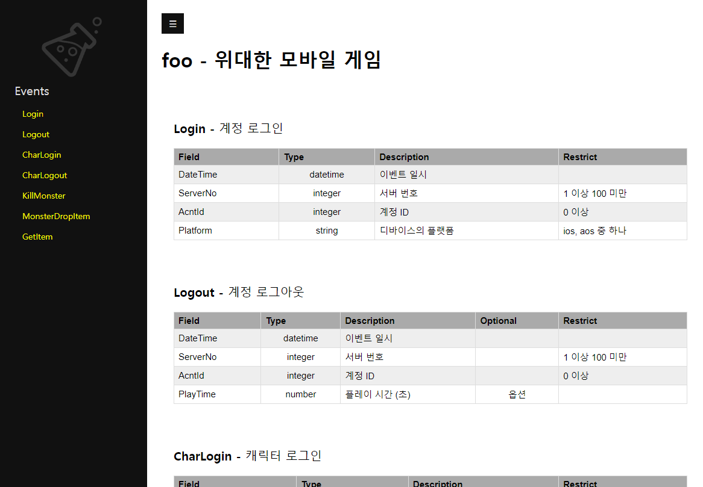

기타 기능과 팁
==============

여기서는 로그랩을 활용하는데 도움이 되는 기타 기능들을 소개하겠다.

복잡한 랩 파일 필터링하기
-------------------------

다양한 이벤트를 정의하고, 외부 랩 파일까지 쓰다보면 한 눈에 구조를
파악하기가 점점 힘들어진다. 이럴 때는 ``show`` 에 필터를 걸어서 보면
편리하다. ``show`` 명령의 ``-n`` 또는 ``--name`` 옵션을 이용해 찾는
타입/베이스/이벤트 이름의 패턴을 줄 수 있다.

예를 들어 캐릭터 관련 이벤트만 보고 싶다면,

::

   $ loglab show foo.lab.json -n Char

   Domain : foo
   Description : 위대한 모바일 게임

   Event : CharLogin
   Description : 캐릭터 로그인
   +----------+----------+---------------+-----------------+
   | Field    | Type     | Description   | Restrict        |
   |----------+----------+---------------+-----------------|
   | DateTime | datetime | 이벤트 일시   |                 |
   | ServerNo | integer  | 서버 번호     | 1 이상 100 미만 |
   | AcntId   | integer  | 계정 ID       | 0 이상          |
   | CharId   | integer  | 캐릭터 ID     | 0 이상          |
   +----------+----------+---------------+-----------------+

   Event : CharLogout
   Description : 캐릭터 로그아웃
   +----------+----------+---------------+-----------------+
   | Field    | Type     | Description   | Restrict        |
   |----------+----------+---------------+-----------------|
   | DateTime | datetime | 이벤트 일시   |                 |
   | ServerNo | integer  | 서버 번호     | 1 이상 100 미만 |
   | AcntId   | integer  | 계정 ID       | 0 이상          |
   | CharId   | integer  | 캐릭터 ID     | 0 이상          |
   +----------+----------+---------------+-----------------+

다음과 같이 하면 이름에 ``types`` 가 들어가는 요소들, 즉 타입들만 볼 수
있다.

::

   $ loglab show foo.lab.json -c -n types

   Domain : foo
   Description : 위대한 모바일 게임

   Type : types.unsigned
   Description : Id 타입
   +------------+---------------+------------+
   | BaseType   | Description   | Restrict   |
   |------------+---------------+------------|
   | integer    | Id 타입       | 0 이상     |
   +------------+---------------+------------+

HTML 문서 출력
--------------

로그의 설계, 개발 그리고 검증 작업이 끝난 후에는, 유관 조직에 로그에
관한 설명서를 공유해야 할 필요가 생긴다. 이런 경우 로그랩의 HTML 출력
기능을 사용하면 유용하다. 다음과 같은 명령으로 간단히 생성할 수 있다.

::

   $ loglab html foo.lab.json
   'foo.html' 에 HTML 문서 저장.

생성된 ``foo.html`` 파일을 웹브라우저로 열어보면 아래와 같은 페이지를
확인할 수 있을 것이다.

   html_output

로그 객체 출력
--------------

서비스 코드에서 로그 출력을 구현할 때, 필요한 필드와 값을 매번 문자열로
만들어 쓰는 것은 번거롭다. 로그 이벤트 구조에 맞는 객체(Object)를 미리
정의하고 그것의 멤버 변수에 값을 채운 뒤, 최종적으로 JSON 형식으로
직렬화(Serialize)하는 방식이 더 편리하고 안전하다. 여기서는 이러한
객체를 **로그 객체(Log Object)**\ 로 부르겠다.

로그랩은 ``object`` 명령을 통해 로그 객체를 위한 코드 생성을 지원한다.

::

   $ loglab object <랩 파일> <코드 타입>

첫 번째 인자는 랩 파일명이고, 두 번째 인자는 생성할 프로그래밍 언어
타입이다. 현재는 Python (``py``), C# (``cs``), C++ (``cpp``)를 지원한다.

   ``const`` 로 지정된 필드는 로그 객체를 통해 설정할 수 없고, 객체
   시리얼라이즈 (Serialize) 시에 랩파일에 지정된 값으로 출력된다.

Python
~~~~~~

다음과 같이 ``object`` 명령으로 파이썬 로그 객체 코드를 출력한다.

::

   $ loglab object foo.lab.json py -o loglab_foo.py

아래는 랩 파일 ``foo.lab.json``\ 에서 생성된 파이썬 로그 객체 파일
``loglab_foo.py``\ 의 내용 중 일부이다.

.. code:: python

   """
       ** 이 파일은 LogLab 에서 생성된 것입니다. 고치지 마세요! **

       Domain: foo
       Description: 위대한 모바일 게임
   """
   import json
   from datetime import datetime
   from typing import Optional

   # ...

   class Logout:
       """계정 로그아웃"""

       def __init__(self, _ServerNo: int, _AcntId: int):
           self.reset(_ServerNo, _AcntId)

       def reset(self, _ServerNo: int, _AcntId: int):

           self.ServerNo = _ServerNo
           self.AcntId = _AcntId
           self.PlayTime : Optional[float] = None

       def serialize(self):
           data = dict(DateTime=datetime.now().astimezone().isoformat(),
                       Event="Logout")
           data["ServerNo"] = self.ServerNo
           data["AcntId"] = self.AcntId
           if self.PlayTime is not None:
               data["PlayTime"] = self.PlayTime
           return json.dumps(data)

   # ...

아래는 이 파일을 불러와서 사용하는 예이다. 이벤트의 필수 필드는 객체의
생성자 인자로 전달하고, 옵션 필드는 객체 생성 후 직접 설정한다.

.. code:: python

   import loglab_foo as lf

   e = lf.Logout(33, 44)
   e.PlayTime = 100
   print(e.serialize())

결과는 아래와 같다.

.. code:: json

   {"DateTime": "2021-11-12T13:37:05.491169+09:00", "Event": "Logout", "ServerNo": 33, "AcntId": 44, "PlayTime": 100}

.. note::

   설정되지 않은 옵션 필드는 결과 JSON에 포함되지 않는다.

C#
~~~

다음과 같이 C# 버전을 생성할 수 있다.

::

   $ loglab object foo.lab.json cs -o loglab_foo.cs

아래는 C# 로그 객체 파일 ``loglab_foo.cs`` 내용의 일부이다.

.. code:: cs

   /*

       ** 이 파일은 LogLab 에서 생성된 것입니다. 고치지 마세요! **

       Domain: foo
       Description: 위대한 모바일 게임

   */

   using System;
   using System.Collections.Generic;
   using System.Diagnostics;

   namespace loglab_foo
   {
       // ...

       /// 

       ///  계정 로그아웃
       /// 

       public class Logout
       {
           public const string Event = "Logout";
           // 서버 번호
           public int? ServerNo = null;
           // 계정 ID
           public int? AcntId = null;
           // 플레이 시간 (초)
           public float? PlayTime = null;
           public static JsonSerializerOptions options = new JsonSerializerOptions
           {
               Encoder = JavaScriptEncoder.UnsafeRelaxedJsonEscaping
           };

           public Logout(int _ServerNo, int _AcntId)
           {
               Reset(_ServerNo, _AcntId);
           }
           public void Reset(int _ServerNo, int _AcntId)
           {
               ServerNo = _ServerNo;
               AcntId = _AcntId;
               PlayTime = null;
           }
           public string Serialize()
           {
               List<string> fields = new List<string>();
               Debug.Assert(ServerNo.HasValue);
               fields.Add($"\"ServerNo\": {ServerNo}");
               Debug.Assert(AcntId.HasValue);
               fields.Add($"\"AcntId\": {AcntId}");
               fields.Add($"\"Category\": 1");
               if (PlayTime.HasValue)
                   fields.Add($"\"PlayTime\": {PlayTime}");
               string sfields = String.Join(", ", fields);
               string dt = DateTime.Now.ToString("yyyy-MM-ddTHH:mm:ss.fffzzz");
               string sjson = $"{{\"DateTime\": \"{dt}\", \"Event\": \"{Event}\", {sfields}}}";
               return sjson;
           }
       }
       // ...
   }

사용 예제는 다음과 같다.

.. code:: cs

   using System;
   using loglab_foo;

   namespace csharp
   {
       class Program
       {
           static void Main(string[] args)
           {
               Logout logout = new Logout(33, 44);
               logout.PlayTime = 100;
               Console.WriteLine(logout.Serialize());
           }
       }
   }

C++
~~~

C++ 로그 객체는 C++17 표준을 기반으로 생성된다. 다음과 같이 헤더 파일을
생성한다.

::

   $ loglab object foo.lab.json cpp -o loglab_foo.h

아래는 생성된 파일 loglab_foo.h 의 일부이다.

.. code:: cpp

   /*

       이 파일은 LogLab 에서 생성된 것입니다. 고치지 마세요!

       Domain: foo
       Description: 위대한 모바일 게임
   */

   #pragma once

   #include <iostream>
   #include <string>
   #include <vector>
   #include <optional>
   #include <chrono>
   #include <sstream>
   #include <iomanip>

   namespace loglab_foo
   {
       class LogSerializer {
       public:
           static thread_local std::stringstream ss;
           static thread_local std::string buffer;
           static thread_local char datetime_buffer[32];

           static std::string& SerializeToBuffer(const std::string& content) {
               ss.clear();
               ss.str("");
               ss << content;
               buffer = ss.str();
               return buffer;
           }

           static const char* FormatDateTime() {
               auto now = std::chrono::system_clock::now();
               auto in_time_t = std::chrono::system_clock::to_time_t(now);
               auto microseconds = std::chrono::duration_cast<std::chrono::microseconds>(now.time_since_epoch()) % 1000000;

               std::tm* tm_utc = std::gmtime(&in_time_t);
               int len = std::sprintf(datetime_buffer, "%04d-%02d-%02dT%02d:%02d:%02d.%06ldZ",
                   tm_utc->tm_year + 1900, tm_utc->tm_mon + 1, tm_utc->tm_mday,
                   tm_utc->tm_hour, tm_utc->tm_min, tm_utc->tm_sec,
                   microseconds.count());

               return datetime_buffer;
           }
       };

       // Thread-local static member definitions
       thread_local std::stringstream LogSerializer::ss;
       thread_local std::string LogSerializer::buffer;
       thread_local char LogSerializer::datetime_buffer[32];

       /// 

       ///  계정 로그아웃
       /// 

       class Logout
       {
       public:
           static constexpr const char* Event = "Logout";

           // Required fields
           // 서버 번호
           int ServerNo;
           // 계정 ID
           int AcntId;

           // Optional fields
           // 플레이 시간 (초)
           std::optional<float> PlayTime;

           Logout() {}

           Logout(int _ServerNo, int _AcntId)
           {
               reset(_ServerNo, _AcntId);
           }

           void reset(int _ServerNo, int _AcntId)
           {
               ServerNo = _ServerNo;
               AcntId = _AcntId;
               PlayTime.reset();
           }

           std::string& serialize()
           {
               LogSerializer::ss.clear();
               LogSerializer::ss.str("");
               LogSerializer::ss << "{";

               // DateTime and Event
               LogSerializer::ss << "\"DateTime\":\"" << LogSerializer::FormatDateTime() << "\",";
               LogSerializer::ss << "\"Event\":\"" << Event << "\"";

               // Required fields
               LogSerializer::ss << ",";
               LogSerializer::ss << "\"ServerNo\":";
               LogSerializer::ss << ServerNo;
               LogSerializer::ss << ",";
               LogSerializer::ss << "\"AcntId\":";
               LogSerializer::ss << AcntId;

               // Optional fields
               if (PlayTime.has_value())
               {
                   LogSerializer::ss << ",";
                   LogSerializer::ss << "\"PlayTime\":";
                   LogSerializer::ss << PlayTime.value();
               }

               // Const fields
               LogSerializer::ss << ",";
               LogSerializer::ss << "\"Category\":";
               LogSerializer::ss << 1;

               LogSerializer::ss << "}";
               LogSerializer::buffer = LogSerializer::ss.str();
               return LogSerializer::buffer;
           }
       };

       // ...

   }

생성된 ``loglab_foo.h`` 파일은 ``loglab_foo``\ 와 같은
``loglab_<도메인 이름>`` 네임스페이스 안에 각 이벤트 클래스를 정의한다.
옵션 필드는 ``std::optional``\ 을 사용한다.

아래는 생성된 ``loglab_foo.h``\ 를 사용하는 예제 ``main.cpp`` 이다.

.. code:: cpp

   #include <iostream>
   #include "loglab_foo.h" // LogLab이 생성한 헤더 파일을 포함한다.

   // LogLab이 생성한 네임스페이스를 사용한다.
   using namespace loglab_foo;

   int main() {
       // --- Login 이벤트 사용 예제 ---
       // 필수 필드를 생성자 인자로 전달하여 객체를 생성한다.
       Login login_event(1, 1001, "ios");
       std::cout << "Login Event: " << login_event.serialize() << std::endl;

       // --- Logout 이벤트 사용 예제 (옵션 필드 포함) ---
       Logout logout_event(1, 1001);
       logout_event.PlayTime = 123.45f; // 옵션 필드 설정
       std::cout << "Logout Event: " << logout_event.serialize() << std::endl;

       return 0;
   }

코드를 빌드하고 실행하려면 ``g++``\ 와 같은 C++ 컴파일러가 필요하다.

**1. 컴파일** ``std::optional``\ 을 사용하므로 C++17 표준 이상으로
컴파일해야 한다.

.. code:: bash

   g++ -std=c++17 -o main_app main.cpp

**2. 실행**

.. code:: bash

   ./main_app

**3. 결과**

::

   Login Event: {"DateTime":"2025-07-16T08:35:04.013922Z","Event":"Login","ServerNo":1,"AcntId":1001,"Platform":"ios"}
   Logout Event: {"DateTime":"2025-07-16T08:35:04.013981Z","Event":"Logout","ServerNo":1,"AcntId":1001,"PlayTime":123.45}

이와 같이, 로그 객체를 사용하면 각 언어의 타입 시스템을 활용하여
안전하고 손쉽게 JSON 형태의 로그 문자열을 얻을 수 있다. 실제 파일에 쓰기
위해서는 생성된 문자열을 사용하는 로깅 라이브러리에 전달하면 된다.

.. note::

   **빈번한 로그 객체 생성**

   만약 특정 이벤트가 매우 자주 발생하고 그때마다 로그 객체를 생성하여
   로그를 쓴다면, 가비지 컬렉션이나 메모리 단편화 등으로 인한 시스템
   성능 저하가 발생할 수 있다. 이에 로그랩에서 생성된 로그 객체는
   **리셋(Reset)** 메소드를 통해 객체를 초기화하는 기능을 제공한다.
   이벤트 처리 코드에서 로그 객체를 매번 생성하지 말고, 클래스의 멤버
   변수나 정적(Static) 객체로 선언해 두고, 리셋 메소드로 그 객체를
   초기화한 후 재활용하는 방식을 추천한다.

필드별 타입 지정
~~~~~~~~~~~~~~~~

로그랩의 ``object`` 명령으로 생성된 로그 객체 멤버 변수의 타입은,
랩파일에서 지정된 필드의 타입을 고려하여 대상 프로그래밍 랭귀지의
일반적인 타입으로 생성된다. 예를 들어 랩 파일에서 ``integer`` 로 지정된
필드는, C# 로그 객체 생성시 ``int`` 를 이용한다.

그러나 필드별로 특정 타입을 지정해 사용해야 하는 경우가 있다. 예로
지금까지 예제에서 계정 ID 를 뜻하던 ``AcntId`` 필드에 C# 의 정수형
``int`` 의 범위를 넘어서는 큰 값을 지정해야 한다면 곤란하게 된다. 이런
경우를 위해 랩 파일의 필드에 로그 객체 생성시 사용할 타입을 프로그래밍
언어별로 지정할 수 있다. 아래 예를 살펴보자.

.. code:: js

   {
     // ...
    "types": {

       // ...

       "ulong": {
         "type": "integer",
         "desc": "0 이상 정수 (C# 로그 객체에서 ulong)",
         "minimum": 0,
         "objtype": {
           "cs": "ulong"
         }
       }
     }

   // ...

   }

``types`` 에 ``ulong`` 이라는 커스텀 타입을 정의하고, 이것의 ``objtype``
요소에 C# ``cs`` 를 위한 타입을 지정하는 식이다. 이렇게 하면 이 커스텀
타입 ``types.ulong`` 을 이용하는 필드의 C# 로그 객체 생성시, 기본 타입인
``int`` 가 아닌 ``ulong`` 을 이용하게 된다.

현지화 (Localization)
---------------------

서비스가 잘 완성되어 해외 진출을 준비하는 경우, 현지 언어로 된 로그
문서가 필요할 수 있다. 현재 로그랩에서는 해당 언어를 위한 별도의 랩
파일을 만들고 현지 언어로 설명을 번역하는 식으로 작업이 가능하다.

문제가 되는 것은 로그랩에서 설명을 위해 자동으로 추가되는 메시지들
(``이벤트 시간``, ``~이상``, ``~미만`` 등) 이 한국어로 나오는 것이다.
이런 경우를 위해 로그랩은 메시지 언어를 ``언어_지역`` 형식의 로케일로
선택하는 기능을 제공한다.

.. note::

   언어 코드는 `ISO
   639-1 <https://en.wikipedia.org/wiki/List_of_ISO_639-1_codes>`__,
   지역 코드는 `ISO 3166-1 <https://en.wikipedia.org/wiki/ISO_3166-1>`__
   을 따른다.

현재는 영어 ``en_US``, 중국어 ``zh_CN``, 일본어 ``ja_JP`` 가 준비되어
있다. 아래와 같이 ``show`` 명령에서 ``-l`` 또는 ``--lang`` 옵션을 통해
메시지 언어를 선택해보자.

::

   $ loglab show foo.lab.json -l en_US

   # ...

   Event : GetItem
   Description : 캐릭터의 아이템 습득
   +----------+----------+------------------+----------------------------+
   | Field    | Type     | Description      | Restrict                   |
   |----------+----------+------------------+----------------------------|
   | DateTime | datetime | Event date time  |                            |
   | ServerNo | integer  | 서버 번호        | 1 or above below 100       |
   | AcntId   | integer  | 계정 ID          |                            |
   | Category | integer  | 이벤트 분류      | always 2 (캐릭터 이벤트)   |
   | CharId   | integer  | 캐릭터 ID        |                            |
   | MapCd    | integer  | 맵 코드          |                            |
   | PosX     | number   | 맵상 X 위치      |                            |
   | PosY     | number   | 맵상 Y 위치      |                            |
   | PosZ     | number   | 맵상 Z 위치      |                            |
   | ItemCd   | integer  | 아이템 타입 코드 | one of 1 (칼), 2 (방패), 3 |
   |          |          |                  | (물약)                     |
   | ItemId   | integer  | 아이템 개체 ID   |                            |
   +----------+----------+------------------+----------------------------+

::

   $ loglab show foo.lab.json -l zh_CN

   # ...

   Event : GetItem
   Description : 캐릭터의 아이템 습득
   +----------+----------+------------------+----------------------------+
   | Field    | Type     | Description      | Restrict                   |
   |----------+----------+------------------+----------------------------|
   | DateTime | datetime | 事件日期         |                            |
   | ServerNo | integer  | 서버 번호        | 1 以上(含) 100 以下        |
   | AcntId   | integer  | 계정 ID          |                            |
   | Category | integer  | 이벤트 분류      | 始终 2 (캐릭터 이벤트)     |
   | CharId   | integer  | 캐릭터 ID        |                            |
   | MapCd    | integer  | 맵 코드          |                            |
   | PosX     | number   | 맵상 X 위치      |                            |
   | PosY     | number   | 맵상 Y 위치      |                            |
   | PosZ     | number   | 맵상 Z 위치      |                            |
   | ItemCd   | integer  | 아이템 타입 코드 | 1 (칼), 2 (방패), 3 (물약) |
   |          |          |                  | 之一                       |
   | ItemId   | integer  | 아이템 개체 ID   |                            |
   +----------+----------+------------------+----------------------------+

::

   $ loglab show foo.lab.json -l za_JP

   # ...

   Event : GetItem
   Description : 캐릭터의 아이템 습득
   +----------+----------+------------------+----------------------------+
   | Field    | Type     | Description      | Restrict                   |
   |----------+----------+------------------+----------------------------|
   | DateTime | datetime | イベント日時     |                            |
   | ServerNo | integer  | 서버 번호        | 1 以上 100 未満            |
   | AcntId   | integer  | 계정 ID          |                            |
   | Category | integer  | 이벤트 분류      | 常に 2 (캐릭터 이벤트)     |
   | CharId   | integer  | 캐릭터 ID        |                            |
   | MapCd    | integer  | 맵 코드          |                            |
   | PosX     | number   | 맵상 X 위치      |                            |
   | PosY     | number   | 맵상 Y 위치      |                            |
   | PosZ     | number   | 맵상 Z 위치      |                            |
   | ItemCd   | integer  | 아이템 타입 코드 | 1 (칼), 2 (방패), 3 (물약) |
   |          |          |                  | のいずれか                 |
   | ItemId   | integer  | 아이템 개체 ID   |                            |
   +----------+----------+------------------+----------------------------+

지금까지 작성한 랩 파일을 사용해서 이벤트와 필드 설명이 한국어로
나오지만, 로그랩에서 자동으로 추가한 설명은 지정한 언어로 나오는 것을 알
수 있다. 앞에서 설명한 ``html`` 명령도 같은 식으로 동작한다.

로그랩 활용 방안
----------------

지금까지 언급되지 않은 로그랩을 활용 방법을 생각해보자.

로그 구현, 수집, 모니터링
~~~~~~~~~~~~~~~~~~~~~~~~~~

로그랩을 통해 로그 구조의 설계가 끝났으면, 실제 서비스의 서버 등에서
로그 코드를 작성해야 하겠다. 사용하는 프로그래밍 언어별로 적절한 로깅
라이브러리를 선택하여 설계에 맞는 JSON 형식으로 남기도록 하자. 남은
로그는 `fluentd <https://www.fluentd.org/>`__ 나
`Filebeat <https://www.elastic.co/kr/beats/filebeat>`__ 같은 로그
수집기를 통해 중앙 저장소에 모으고, 적절한 ETL 과정을 거치면 분석 가능한
형태의 데이터로 거듭날 것이다. 이 과정에서 로그의 실시간 모니터링이
필요하면 `Elasticsearch <https://www.elastic.co/kr/elasticsearch/>`__
같은 툴을 함께 이용할 수 있을 것이다.

로그 변경 이력의 체계화
~~~~~~~~~~~~~~~~~~~~~~~~~~

특정 서비스를 장기간 운용하다보면 버전별 로그 변경 내용을 문서화하고
공유하는 것도 큰 일이다. 로그랩을 통해 설계/운용되는 로그는 텍스트
형식인 랩 파일 안에 로그 구조의 모든 것이 표현되기에, 텍스트 파일의
차이를 비교하는 ``diff`` 등의 툴로 랩 파일을 비교하면 버전별 로그 구조의
차이를 간단히 표현할 수 있다. 로그 변경 이력을 수작업으로 기록할 필요가
사라지는 것이다.

추가적으로, 랩 파일의 ``domain`` 요소 아래 ``version`` 을 선택적으로
기술할 수 있는데, 이것을 이용하면 ``html`` 명령으로 생성하는 HTML 파일의
타이틀에 버전 정보가 추가되기에 문서 구분에 도움이 될 수 있다.

디버그 로그는 어디에?
---------------------

게임 업계에서는 분석의 대상이 되는 주요 이벤트의 로그를 **운영
(Operation) 로그** 라 하고, 개발자가 디버깅을 위해 남기는 로그를
**디버그 (Debug) 로그** 로 구분하여 부르는 경우가 많다. 디버그 로그에는
많은 필드가 필요하지 않으며, 개발자가 자유롭게 기술할 수 있는 문자열
필드 하나가 중심이 된다.

로그의 용량 및 용도 측면에서는 운영 로그와 디버그 로그를 별도의 파일에
남기는 것이 맞다고 볼 수 있지만, 두 종류의 로그가 하나의 파일에 있으면
디버깅에는 더 유리할 수 있어 같은 파일에 남기는 것을 선호할 수도 있겠다.

이 선택은 서비스 특성에 맞게 결정하면 되겠다.

.. note::

   만약 운영 로그와 디버그 로그를 하나의 파일에 기록하려면, 랩 파일에
   디버그 로그용 이벤트를 하나 추가해 사용하면 되겠다. 아래에 소개하는
   MMORPG 예제의 ``Debug`` 이벤트를 참고하자.

MMORPG 위한 예제
----------------

로그랩을 큰 프로젝트에 사용할 때 참고할 만한 예제가 있으면 도움이 될
것이다. 아래는 MMORPG 게임의 주요 이벤트들을 로그랩으로 기술한 것이다
(로그랩 코드의 ``example`` 디렉토리에서 확인할 수 있다).

랩 파일 :
https://raw.githubusercontent.com/haje01/loglab/master/example/rpg.lab.json

HTML 보기 :
http://htmlpreview.github.io/?https://raw.githubusercontent.com/haje01/loglab/master/example/rpg.html

몇 가지 구성 측면의 특징을 설명하면,

**증가/감소는 하나의 이벤트로**

기본 필드는 변하지 않고 수량만 증가 또는 감소하는 이벤트들이 있다. 예를
들어 아이템의 경우 증가하거나 감소할 수 있는데 이것을 각각 별도 이벤트로
만들지 않고, 아이템 변화 ``ItemChg`` 이벤트 하나를 만들고 변화량
``Change`` 에 +/- 값을 주는 식으로 구현하였다.

**ID 와 코드의 구분**

앞에서도 언급했지만, 개별 개체를 구분할 때는 아이디 ``Id`` 를, 미리
정의된 특정 범주값을 나타낼 때는 코드 ``Cd`` 를 필드의 접미어로
사용했다. 예로 특정 아이템에 대해 ``ItemId`` 는 그 아이템 개체를
식별하기 위한 값이고, ``ItemCd`` 는 그 아이템이 어떤 종류인지 분류하기
위한 값이다. ``Id`` 는 임의값으로 유니크하면 되고, ``Cd`` 는 미리 정의된
값으로 문서화된 설명이 있어야 한다.

**맵 코드와 좌표**

게임내 특정 지역에서 발생하는 이벤트를 위해 맵 코드와 위치 좌표 필드를
포함하였다. 예제에서는 계정이나 시스템 등 맵상에서가 아닌 이벤트들도
함께 다루기 위해 옵션으로 설정하였으나, 가능한 경우 꼭 기록하는 것이
분석에 도움이 된다.

**링크 ID 이용**

하나의 사건에서 여러 로그 이벤트가 발생하는 경우가 있다. 예를 들어
거래소에서 아이템을 구매하는 경우 아이템은 들어오고 돈은 빠져나가야
한다. 로그 측면에서는 아이템 증가 로그와 돈 감소 로그가 함께 남아야 하는
것이다.

이런 경우 분석을 위해서는 그 사건의 연관 로그들을 찾아볼 수 있어야
하는데, 필자는 **링크 ID** 방식을 추천한다. 링크 ID 는 사건 발생
시점에서 랜덤 정수 하나를 만들고 (트랜잭션 ID 등도 가능하겠다), 그것을
연관된 로그들의 같은 필드 (예제에서는 ``LinkRd``) 에 기입하는 방식이다.
랜덤한 정수는 웬만해서는 일치하기 힘들기에, 비슷한 시간대에 발생한 연관
로그들을 찾기에는 충분한 식별력을 가진다.

.. note::

   일부 서비스들은 이런 경우 다양한 관련 이벤트 정보를 하나의 필드에
   뭉쳐서 넣는 방식을 취하는데, 파싱이 힘들고 확장이 어려워 좋은 방법은
   아닌 것 같다.

**캐릭터 싱크 로그**

싱크 로그는 서버에서 정기적 (예: 5 분) 으로 캐릭터의 정보를 로그로
출력하는 것이다 (일종의 스냅샷). 예제에서는 캐릭터 상태 ``CharSync`` 와
캐릭터 머니 상태 ``CharMoneySync`` 이벤트로 구성하였다. 머니는 종류에
따라 다양할 수 있기에 별도 이벤트로 분리하였고 ``LinkRd`` 로 연결해서
보도록 하였다. 싱크 로그는 게임내 이상현상이나 어뷰징 탐지에 활용될 수
있다.

이 예제의 방식이 절대적인 것은 아니며, 어디까지나 로그랩의 활용에 참고가
되었으면 한다.
